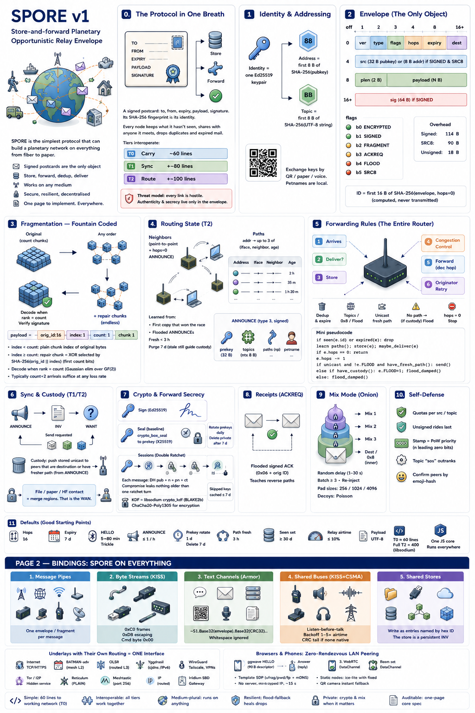

# SPORE

**S**tore-and-forward **P**lanetary **O**pportunistic **R**elay **E**nvelope — a
Rust reference implementation of the [SPORE v1 spec](docs/SPEC.md).

<p align="center">
  <a href="docs/spore-v1.png"></a>
</p>
<p align="center"><em>The entire protocol on one page — <a href="docs/spore-v1.png">open full size</a>.</em></p>

A SPORE message is a **signed postcard**: to, from, expiry, payload, signature.
Its SHA-256 fingerprint is its identity. Every node keeps postcards it hasn't
seen, hands copies to anyone it meets who wants them, and drops duplicates and
expired mail. That alone is a working planetary network — no servers, no global
namespace, no always-on internet.

The same message travels over anything that can carry bytes — the internet, a
walkie-talkie, a Bluetooth link, a long-range radio, a USB stick, a QR code, even a
person reading it aloud. The delivery rules stay exactly the same no matter which
one you use.

<details>
<summary>Deep dive: how it stays this portable</summary>

It's one small Rust library with pure-Rust cryptography (no C dependencies), so the
identical code runs on servers, phones, tiny radios, and in the browser. Each medium
is a thin **bridge** that just hands raw bytes to the router (`Node::on_rx`) and
carries out the sends it returns (`Forward`s). The router never changes from one
medium to the next — that's what makes "runs on everything" actually true.
</details>

## What's implemented

Pretty much the entire SPORE v1 spec is built and tested. In plain terms, you can:
send a message of **any size**, share **files** (like a private BitTorrent), hold a
live **back-and-forth** (like chat or a remote terminal), **broadcast** to followers
(like a news feed), keep messages **private** and hard to trace, and get a **delivery
confirmation** — all over any medium, with no servers. What's left is drivers for
specific radios, which need real hardware to test. The full list is below; the
design write-up is in [docs/DESIGN.md](docs/DESIGN.md).

<details>
<summary>Deep dive: the full feature list</summary>

- **Envelope** (§2) — the only object: encode/decode, Ed25519 sign/verify,
  content-addressed `Id`, proof-of-work priority `stamp`.
- **`send(dest, data)` of any size** — one call that fragments arbitrarily large
  payloads and reassembles + verifies them on the far side; callers never think
  about MTUs.
- **Fragmentation** (§3) — a rateless GF(2) fountain code. Decodes from any
  lossy, out-of-order, one-way subset once `count` independent chunks arrive.
- **Files** — `publish_file` mints a **magnet** (a signed manifest indexing chunk
  envelopes by content ID); peers `fetch` missing chunks via WANT and verify each
  for free, because a chunk's ID is the hash of its bytes. Past what one manifest
  can list, manifests nest into a **Merkle tree** — still one magnet, still one
  signature at the root, and no size the format cares about. BitTorrent from the
  envelope primitive.
- **Sessions** — a UDP-like datagram link keyed on a cryptographic address (so it
  survives roaming), plus a simple QUIC-style Go-Back-N reliable stream for
  SSH/git-shaped needs. Reliability is endpoint state, never a network property.
- **Double Ratchet** (§7) — forward-secret sessions: a fresh per-message key from a
  BLAKE2b chain, X25519 ratchet turns on each reply, skipped-key caching for
  out-of-order arrival, replay rejection. X25519 + ChaCha20-Poly1305.
- **Mix mode** (§9) — onion routing as nested sealed envelopes through 2–3 mixes,
  padded to size classes; sender + recipient anonymity, each mix peels one layer.
- **Receipts** (§8) — set the ACKREQ flag and the recipient floods back a signed
  receipt; `acked(id)` reports delivery, `resend_unacked` retries on backoff.
- **Congestion control** (§5.4) — reusable primitives: token bucket (≤10% airtime),
  Trickle beacon timer, exponential backoff, and a busy-byte in ANNOUNCE for
  backpressure.
- **Encrypted topics** (§7) — `topic_seal`/`topic_open` (XChaCha20-Poly1305, PSK):
  the mesh carries the traffic, only key-holders read it.
- **CSMA + CRC** (§5.5) — `Csma` damped flooding (listen-before-talk, cancel on
  overhearing) and a SHA-256[0:4] tail for buses with no native CRC.
- **Folder sync** — `foldersync::publish_dir` / `materialize`: Syncthing over SPORE,
  built on content-addressed files.
- **RPC** (L4) — `request` / `poll_requests` / `respond` / `take_response`: HTTP-shaped
  method/path/body/status, reply routed back along the path the request taught.
- **Feeds** (L5) — `subscribe` / `publish` / `poll_feed`: pub/sub over topics, with
  INV/WANT backfill for late joiners.
- **Routing** (§4–§5) — path learning ("first copy wins"), damped flood vs.
  directed unicast, dedup, store with eviction, the full `on_rx` router.
- **Sync & custody** (§6) — `ANNOUNCE` / `INV` / `WANT`.
- **Crypto** (§7) — anonymous sealed boxes to a recipient prekey; forward
  secrecy by rotating and deleting prekeys.
- **Bridges** (Page 2) — a bridge only moves envelope bytes in and out of a node;
  the router never changes. Implemented: UDP, an HTTP `/spore/{push,inv,want}` bag,
  a `<hexid>.spore` folder store, a streaming KISS framer, and `~S1.…~` armor for
  text/SMS/paper/voice. HTTP is just one bridge, no more special than a folder.
- **Language bindings** — a C ABI (`src/ffi.rs`) with autogenerated **Python, Go,
  and JS** wrappers over the core primitives (identity, signed messages, sealing,
  encrypted topics, armor). See [bindings/](bindings/).
</details>

## Build & run

```sh
cargo test              # 78 tests
cargo run               # in-memory mesh demo (A — B — C — D)
cargo run -- node.yaml  # run a real node with the bridges named in a config file
```

A node is described by a small YAML file — a name, some topics, and a list of
bridges. Every bridge shares one node and relays to the others, so one process is
a gateway between, say, a LAN, a USB stick, and a radio mesh. List as many of each
kind as you like (two folders, several TCP links, …):

```yaml
petname: riverside
topics: [news, weather]
bridges:
  - broadcast              # zero-config: the primary subnet's own broadcast
  - udp                    # or the plain 255.255.255.255 limited broadcast
  - folder: ./bag          # a shared folder (USB / Syncthing / Dropbox)
  - folder: /mnt/usb/spore # …as many folders as you want
  - tcp: 10.0.0.5:7373     # connect a TCP link (omit the value to listen)
  - meshtastic             # a Meshtastic WiFi-UDP mesh
  - http: 8088             # an HTTP bag: push / inv / want
  - audio                  # data-over-sound (f32 PCM on stdin/stdout)
  - reticulum              # RNS payload via tools/reticulum_companion.py
  - ax25: localhost:8001   # a KISS TNC over TCP (Direwolf), or a /dev/tty path
  - tor: abc…xyz.onion     # dial a peer's onion service through Tor's SOCKS proxy
  - i2p: abc…xyz.b32.i2p   # dial an I2P destination via the SAM bridge
  - copyparty: http://box:3923/bag/   # a shared HTTP/WebDAV directory
  - group: "[::]:7373 -> [ff02::7373]:7373"   # IPv6 overlay (Yggdrasil, cjdns)
  - group: "10.0.0.5:7373 -> 10.0.0.255:7373" # pin one interface (bat0, wpan0)
  - ssb: ./ssb-log         # a Secure Scuttlebutt append-only log folder
```

See [`spore.example.yaml`](spore.example.yaml). The demo (no argument) drives the
exact same `Node::on_rx` router with an in-memory "ether".

**Platforms.** The daemon is plain `std`, so one binary targets Linux, macOS,
Windows, and Android. The core also compiles to `wasm32` for the browser and runs
as a full node there — a wasm node plus JS transports (WebSocket, WebRTC, Nostr,
loopback), with a self-contained [web node](web/README.md#one-file-node) and guide under [`web/`](web/README.md)
— and to `esp-idf` for the ESP32. Adding a medium is a thin `recv`/`send` shim
(`bridge::driver::DatagramTransport`); all the routing, address resolution, and
fragmentation stay in the shared lib. See the full [bridge reference](docs/BRIDGES.md)
— an index plus a per-protocol deep dive (wire format, mapping, security, specs).

**📱 SPORE Communicator (Android)** puts a full node in your pocket — a real node
in a background service, with instant messaging (petnames), a microblog feed, and
file sharing over every bridge at once. Download links for it, the single-file
browser node, the daemon and the printable Seed Sheet are on one page:
**[Apps & daemons](docs/APPS.md)**.

```
SPORE demo — line topology  A — B — C — D

[1] ANNOUNCE round done. A learned 3 peer prekeys; has D's prekey: true
[2] PUBLIC flood from A delivered to: ["B", "C", "D"]  (4 flood sends)
[3] SEALED unicast A->D delivered to: ["D"]  (3 directed hops, 0 floods)
    D decrypts payload: Some("meet at the north pier, midnight")
[4] SEND 6000 B object -> 7 fragments; reassembled + verified by: ["B", "C", "D"]
[5] FOUNTAIN over 40% loss, one-way: 21 data chunks needed; 25 survived of 53 sent; reassembled + signature-verified: true
[6] DATAGRAM session A->D over 3 directed hops: D decrypts Some("interactive hello over a udp-like link")
[7] FILE 'field-notes.txt' (9000 B) published as magnet 8ac320df4f09…; B pulled + verified: true
[8] MIX onion A~>D via 2 mixes (B,C): D opens Some("burn the ledgers")
[9] RECEIPT: A's ACKREQ message to D acknowledged: true
[10] ENCRYPTED TOPIC: key-holder reads Some("safehouse moved"); outsider can read: false
[11] RPC A->D GET /status -> Some((200, "serving GET /status"))
[12] FEED 'alerts' published by A; received by: ["B", "C", "D"]
```

## Routing across other networks

SPORE treats a whole underlay network — a Meshtastic mesh, a Reticulum network, an
IP subnet — as a **single link**, however many hops it uses inside. To go from node
A to node B on the same mesh, A hands the envelope to that mesh (usually one
broadcast) and the mesh's *own* routing carries it to B; SPORE's hop counter drops
by just one for the entire crossing. If A and B are on *different* networks, a
gateway node that sits on both passes the envelope from one to the other — and that
is where a real SPORE hop happens. The envelope's cryptographic address says *who*
it's for (end-to-end, unchanging); each network's native addressing says *how* to
move the bytes across that one medium. So SPORE routes **between** networks and each
network routes **within** itself — not much stranger than IP over Ethernet.

<details>
<summary>Deep dive: two address spaces, gateways, and the ARP analogy</summary>

**Two independent address spaces.**
- *Who* — the SPORE address (`SHA-256(pubkey)[..8]`) or a topic. End-to-end,
  cryptographic, identical on every medium. Like an overlay/host identity.
- *How* — the underlay's native addressing: a Meshtastic node number, a Reticulum
  destination hash, an IP:port. Local to one link, meaningful only there. Like a
  MAC address.

A **bridge** owns exactly one interface (`Iface`) and translates between the two: it
turns a `Forward` from the router into an underlay send, and turns received underlay
frames into `node.on_rx(bytes, iface, nbr, now)`. The router never learns underlay
addresses — that's the bridge's job, the way an OS's ARP/neighbour table maps
IP→MAC.

**An underlay with its own routing = one SPORE interface.** Meshtastic, Reticulum,
Yggdrasil, BATMAN, Tor, plain IP — each already delivers bytes across many physical
hops. SPORE hands it *one* frame and lets it do that; the underlay's internal hops
are invisible and free. SPORE decrements `hops` exactly **once** for the whole
crossing (a point-to-point backbone link may even *restore* the hop so long hauls
don't burn the 16-hop budget).

**Same network (A and B on one mesh).** A's bridge injects the envelope as an
underlay broadcast (Meshtastic: portnum 256, dst `0xFFFFFFFF`; Reticulum: a PLAIN
`spore`/`v1` destination; UDP: multicast/broadcast). The underlay floods it to every
node; the ones running SPORE call `on_rx`, and B delivers because the `dest` matches
it (or a topic it follows, or public). One SPORE hop, N invisible mesh hops.

**Different networks (A on Meshtastic, B on Reticulum).** A **gateway** node C runs
both bridges. C receives on its Meshtastic interface and the router emits
`Forward::Flood { except: meshtastic_iface }` — send out *all other* interfaces — so
C re-injects onto Reticulum, which carries it to B. SPORE hops count the **gateways
between networks**, not the hops inside them. This is exactly IP routing: routers
between subnets, switching within them.

**Directed vs. flooded.** With no routing state (T0/T1), SPORE just floods on each
interface; dedup and expiry keep it sane, and B is reached because it's on a
reachable underlay. With paths (T2, §4 "first copy wins"), when B's signed envelope
or ANNOUNCE arrives via a given interface A records "B is reachable via *that*
interface" and sends future unicast there — the bridge may resolve it to a specific
underlay address from its own learned `SPORE-addr ↔ underlay-addr` table, or just
broadcast (dedup makes the extra reach harmless).

**The IP analogy, lined up:**

| SPORE | IP world |
|---|---|
| SPORE address (who) | IP address / hostname |
| underlay address (how) | MAC address |
| bridge (per interface) | NIC driver + ARP |
| underlay-with-routing (Meshtastic / Reticulum / IP) | one L2 segment / switched LAN / tunnel |
| gateway node (2+ interfaces) | IP router |
| SPORE hop | IP hop (router-to-router) |
| flood + dedup | broadcast + drop-duplicates |

</details>

## One resolver for every bridge

Every bridge — UDP, Meshtastic, BLE, LoRa, even a speaker playing audio — does
address translation the **same way**, through one small generic table:
`Neighbors<U>`. Here `U` is whatever *that* medium calls a peer: a `SocketAddr`, a
6-byte MAC, a Meshtastic node number, a connection handle, or nothing at all. The
bridge fills the table for free by **snooping**: every *signed* SPORE frame it hears
proves who sent it (the address is a hash of the signing key), so the bridge records
"that SPORE address lives at this underlay address" — no handshake, just like a
learning switch or an ARP cache. When the router later says "send this toward
neighbour X," the bridge resolves X to its underlay address and unicasts; if it
hasn't learned one yet, it simply broadcasts, which always works. Write the resolver
once, reuse it on every transport.

<details>
<summary>Deep dive: the shared loop</summary>

The whole per-bridge loop is identical on every medium — only `U` and the two send
primitives change:

```rust
let nbr = neighbors.snoop(&frame, underlay_src, now);   // learn: signed => bind U
let rx  = node.on_rx(&frame, iface, nbr, now);
for f in rx.forwards {
    match f {
        Forward::Flood { bytes, .. }        => underlay_broadcast(&bytes),
        Forward::Directed { nbr, bytes, .. } => match nbr.and_then(|a| neighbors.resolve(&a, now)) {
            Some(u) => underlay_unicast(u, &bytes),  // learned: save airtime
            None    => underlay_broadcast(&bytes),   // unknown: fall back, still arrives
        },
    }
}
```

What `U` is per medium, the three driver forms, and how stateless / stateful /
null-address links differ are tabulated once in
[BRIDGES.md § Bridge architecture](docs/BRIDGES.md#bridge-architecture).
</details>

## Riding a Meshtastic mesh

Meshtastic is a popular long-range radio mesh. If a Meshtastic node is on your WiFi
with its UDP feature on, it shouts every mesh message onto the local network. The
`meshtastic` bridge listens for those, pulls out SPORE messages, and shouts SPORE's
own replies back — so the radio mesh carries your traffic for miles, and SPORE just
sees "one more link." Messages are automatically chopped to fit the radio's small
packet size.

No Wi-Fi on the radio? Plug it in over USB instead — same codec, different pipe:

```sh
stty -F /dev/ttyUSB0 115200 raw -echo
spore meshtastic-serial:/dev/ttyUSB0
# …or let another tool own the port:
socat /dev/ttyUSB0,b115200,raw - | spore meshtastic-serial
```

A SPORE envelope rides **portnum 256** (`PRIVATE_APP`) and the whole LoRa mesh
counts as a single SPORE hop. Wire format, the four pipes (Wi-Fi UDP, USB serial,
Web Serial, BLE), the bulk budget, and what to confirm against your firmware
before trusting it: [BRIDGES.md § Meshtastic](docs/BRIDGES.md#meshtastic).

## Layout

| Path            | What                                               |
|-----------------|----------------------------------------------------|
| `src/lib.rs`    | the router kernel: envelope, fountain fragmentation, paths, `Node`, sealing |
| `src/*.rs`      | one file per layer: `session`, `ratchet`, `mix`, `topic` (KEYROT), `congestion`, `file`, `rpc`, `feed`, `kiss`, `armor` |
| `src/bridge/`   | one file per bridge (udp, tcp, store, meshtastic, audio, ssb, bag, …) + the `hub` that shares a node across them |
| `src/main.rs`   | the 12-step demo + a YAML config loader that runs its bridges on one node |
| `src/ffi.rs` / `src/wasm.rs` | a C ABI for the bindings, and the browser (wasm) node ABI |
| `bindings/`     | autogenerated Python / Go / JS wrappers (`generate.py` from `spec.json`) — see [bindings/README.md](bindings/README.md) |
| `web/`          | the browser stack: wasm node, JS hub + transports, and a self-contained [web node](web/build-standalone.mjs) |
| `docs/APPS.md`  | apps & daemons: what to install, with download links |
| `docs/SPEC.md`  | the SPORE v1 specification — two sides of one sheet |
| `docs/REBUILD.md` | reimplement SPORE in any language: the wire format with real worked examples |
| `reference/`    | dependency-free Tier-0 decoders (pure-Python parse + verify) + cross-language test vectors |
| `docs/BRIDGES.md` | bridge reference — status index + a deep dive per protocol (wire format, SPORE mapping, security, specs) |
| `docs/CONTINUITY.md` | SPORE as a seed: single-file node, cold-start playbooks, offline trust |
| `CONTRIBUTING.md` | the 1.0 freeze, branch/PR rules, and how docs are kept in sync with code |
| `docs/DESIGN.md`| the layers above transport: files, sessions, RPC, feeds, ratchet, mix, bridges |

## License

Public domain — released under [The Unlicense](LICENSE). No restrictions.
