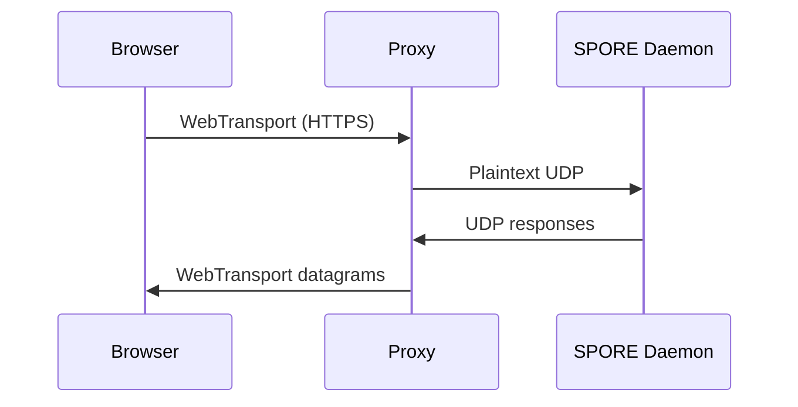

# SPORE Bridge Reference

Every medium SPORE can ride, and how to bridge it. This is both the **index** (a
compact status matrix) and the **manual** (a deep dive per protocol). A bridge is
a thin adapter between one medium and the medium-independent SPORE router; this
document is written for engineers implementing those adapters in Rust (or as a
browser `send`/`receive` shim).

- **Brief overview?** Jump to the [Bridge index](#bridge-index) — one row per
  protocol, status shown by the emoji in its name.
- **Implementing one?** Read [Bridge architecture](#bridge-architecture) once, then
  the protocol's deep-dive section. Each separates the **protocol specification**
  (the wire, as standardised elsewhere) from the **SPORE bridge mapping** (our
  recommendation for `recv`/`send`, `U`, and MTU).
- **Reference tables** live in the [Appendices](#appendices).

## Status legend

<details>
<summary>Understanding the emoji status indicators for each protocol</summary>

The emoji in each protocol's title tells you how far it is:

| Icon | Meaning |
|---|---|
| ✅ | **Implemented & tested** — a Rust bridge or JS transport with automated tests in this repo. |
| 🧪 | **Implemented, not hardware-verified** — the code exists and passes what can be tested off-device (codec roundtrips, syntax), but the real link (radio, serial, BLE, live peer) has not been exercised in CI. Treat as a template to confirm against your hardware/firmware; the repeatable procedure per path is in [Hardware verification](HARDWARE.md). |
| 🟡 | **Partial** — a codec, framer, or IP-underlay path is present, but the end-to-end runner is not finished. |
| ⚪ | **Planned** — a thin shim to write; the shared routing is already done. |

Throughout, `U` is the **underlay address type** (how a medium names a peer) and
**Form** is the driver form (`dgram` / `stream` / `store`, see below).

**Bulk budget.** Since files became manifest trees they can be arbitrarily large,
so any link can be conscripted into hauling one. Each interface may therefore
register a *bulk budget* — bytes per second of **other people's file chunks** it
is willing to relay ([`Hub::register_limited`](../src/bridge/hub.rs)) — as a
leaky bucket that accrues a few seconds of burst.

Only chunks count as bulk. Messages, announces, receipts and **manifests** always
pass, so a paced link stays a full member of the mesh: it still carries the
conversation, and still tells everyone what exists. It declines only to be the
pipe, and because chunks are named by content the fetch simply asks again and
another path answers. The default for each medium is a constant in that bridge's
module, so the number and its reasoning stay together; override at runtime with
`Hub::set_bulk_budget`. Media fast enough not to care (UDP, TCP, WebRTC, the web
overlays) set no budget at all and are unchanged.
</details>

## Bridge security — what a bridge is trusted with

<details>
<summary>Security principles: What bridges can and cannot do</summary>

**Nothing.** A bridge moves bytes; it is never trusted for authenticity, secrecy
or honesty. Envelopes are signed and sealed end to end (§2, §7), ids are content
hashes, and path learning binds only from *signed* frames. A hostile link can
drop, delay, replay or reorder — all of which the router already survives — but
it cannot forge, read a sealed payload, or make a node believe a false address.

That last one is load-bearing and was, until recently, not actually enforced.
Bridges learn `SPORE address → underlay address` by snooping, and both learning
paths — `Neighbors::snoop` and the node's own path table — accepted the `SIGNED`
**flag** as proof. A flag is one bit chosen by whoever wrote the frame. Copy a
victim's *public* key into `src`, set the bit, attach 64 zero bytes, and the
victim's address bound to your underlay address: every directed send for them
unicast to you instead. Sealed payloads stayed unreadable, so this stole no
content — it redirected delivery, which is the same guarantee by a different
door. Both paths now verify the signature, and `Src::Short` (8 bytes of address,
no key, nothing to verify *against*) teaches nothing at all. A bridge that
declines to learn falls back to broadcast, which always reaches the peer; a
bridge that learns a forged binding does not.

What a bridge **can** do wrong is spend our resources. Every bridge parses input
from something it does not control, and the failure mode is not a forged message
but an out-of-memory. So the rule for every bridge in this repo is:

> **Every read from a peer is bounded, and every length that comes off the wire
> is checked before it is believed.**

The limits, and where they live:

| Bound | Value | Why |
|---|---|---|
| `kiss_stream::MAX_FRAME` | 64 KiB | A peer that opens a KISS frame and never closes it. 46× the default MTU. |
| `bag` request header | 16 KiB | A client that never sends the header terminator → `431`. |
| `bag` request body | 8 MiB | `Content-Length` is a number the client picks → `413`. |
| `copyparty` response | 8 MiB body, 16 KiB/line, 100 headers | A share can be compromised or simply broken. |
| `i2p` control line | 8 KiB | Anything on port 7656 that streams without a newline. |
| store adoption | 1 MiB/file | A spill directory is on disk, where anything can drop a file. |
| `spool::MAX_SPOOL_FILE` | 1 MiB/file | A spool is written by someone else by definition — that is what a spool *is*. |

Two of these bounds are on a **read**, not on a size the sender declared, and the
distinction is the point:

- **`spool` stats the file and then caps the read anyway.** The size check is a
  fast reject; it is not the bound. Between the `stat` and the `read` the mover
  can replace or extend the file, so a plain `fs::read` would buffer whatever is
  there at the later moment. The cap lives on the read itself; an over-cap file is
  left for the next sweep, whose `stat` now sees the real size and clears it.
- **`reticulum::run_udp` accepts datagrams only from the companion.** It is the
  one datagram bridge that carries framing state *across* datagrams, so a frame
  may be half-assembled when the next arrives. Where `udp::run_group` can ignore a
  stranger's datagram as one bad envelope, here a stranger's bytes would interleave
  into a frame the companion is midway through — corrupting a good frame rather
  than merely adding a bad one. Single-sourcing the framer is what removes it.
</details>

Two further properties worth stating because they are easy to lose:

- **An overrun resynchronises rather than disconnecting.** A KISS frame that
  exceeds the cap is abandoned and the next delimiter starts a clean one; a
  corrupt or hostile stream costs one frame, not the link.
- **Escaping buys no extra room.** KISS escape pairs are two bytes on the wire
  and one in the buffer, and the cap counts the decoded byte — so a peer cannot
  double the memory cost by escaping everything.

Each of these is covered by a test that fails if the bound is removed.

### Deployer note: what a stamp has to cost

<details>
<summary>Understanding stamp costs and deployment considerations</summary>

`congestion::STAMP_QUOTA_BYPASS_BITS` is **16**. Mail stamped to at least that
class skips the per-source quota (§10d) and a busy peer's backpressure (§10c);
below it, mail still flows but is charged to its source's budget like anything
else, and stamp still orders eviction and TX priority (§10.3).

This was `stamp > 0`, which bounded nothing. A stamp is the leading zero bits of
the envelope id, and the id is a hash, so class 1 costs about two tries and half
of all envelopes have it by accident — measured, 12 of 20 arbitrary junk envelopes
were exempt from the quota by luck alone. SPEC is explicit that "priority is
bought, not claimed" (§2) and that a stamp is "proof of work" (§10); the exemption
has to cost something for either sentence to be true.

Consequences a deployer should know:

- **A node running this is stricter than an older one.** It throttles low-class
  stamped traffic that older relays pass. That is a local policy difference, not
  a wire incompatibility — nothing about the envelope changed, and the two
  interoperate.
- **16 bits is ~65k tries**: milliseconds on a laptop, seconds on a
  microcontroller. Affordable once for a genuinely urgent message, ruinous for a
  flooder paying it per envelope. Raise it on fast networks; lower it (or set it
  to 1) to restore the old permissive behaviour if you need bit-identical
  admission against a 1.0 relay fleet.
- **`sos` still outranks policy** by convention — that is a routing preference,
  not a quota exemption, and is unaffected.
</details>

## Bridge privacy — who sees what

<details>
<summary>Understanding privacy implications of different bridge types</summary>

A bridge cannot forge and cannot read a *sealed* payload. It can always see that
traffic happened, how big it was, and when — and on some media it can see rather
more than that. This section is per-bridge because the honest answer differs a
lot, and "SPORE is encrypted" is not a useful thing to tell an operator choosing
between a folder in someone's cloud account and a serial cable.

**The part people get wrong first: a public flood is not encrypted.** Sealing is
something a *sender* does. An envelope to `ZERO_DEST` or to a plaintext topic
carries its payload in the clear, by design — and the reason is that there is no
key to encrypt it to. A public topic's whole job is to be readable by a node that
joined afterwards, that you have never met, receiving it third-hand; anything
needing a prior key exchange is not that. (It is *not* that relays must read the
payload to route: forwarding runs entirely on the header, and sealed unicast
floods perfectly well with an opaque body.) Signed does not mean secret.

If a message must stay private on a medium anyone can watch, seal it to a
recipient prekey, or use an encrypted topic (§7) — which is a real private group,
with `topic::rotate` for forward secrecy and `topic::rekey_seal` to evict a member.
Otherwise assume it is a postcard, because it is one.

| Bridge | Who can observe | What they get beyond metadata |
|---|---|---|
| `serial`, `csma` | whoever holds the cable | everything on it; a wire is as private as the room |
| `spool` (NNCP/UUCP/USB) | the courier or mailer host | the files at rest, for as long as they hold them |
| `store` / `foldersync` | **everyone with access to that folder** — including a whole cloud account, and its provider | every envelope, plus filenames that are content ids, plus retention you do not control (versioned sync keeps deleted files) |
| `copyparty` | the share's operator and its logs | every envelope you post or fetch, plus your access pattern |
| `bag` (HTTP server) | anyone who can reach the port | whatever is in the store it serves; run it behind NAT, an onion, or auth |
| `udp` broadcast / `run_group` | **every host on the segment** | all public floods in the clear; join a multicast group and you are an observer |
| `audio` modem | anyone within earshot, and any recording | the same, and a recording replays later |
| `ax25`, `meshtastic`, LoRa | anyone with a receiver, at radio range | the same, and in most jurisdictions ham traffic is *required* to be unencrypted |
| `icmp` | every router on the path, and any IDS | payloads look like ping and are trivially logged wholesale |
| `tcp` | the peer, plus anyone on the path without a tunnel | the traffic; see the TLS section below |
| `reticulum` | the companion host and the RNS network | as much as its configured interfaces expose |
| `ssb` | the SSB feed's followers | envelopes published into a gossip log are effectively public and hard to unpublish |
| `nfc` | anyone who can hold a reader within a few centimetres | in practice nobody, which is the point: proximity *is* the access control, and the gesture is deliberate |
| `tor`, `i2p` | the introduction points | the least of any bridge here; this is what to reach for when the observer matters |

Three consequences worth stating outright:

- **A gateway links identities across media.** A node bridging Wi-Fi and LoRa tells
  anyone watching either side that those two populations are connected, and relays
  timing between them. That is the job — but it means running a gateway is not a
  neutral act, and `mix` mode exists for when it must not be inferable.
- **"Works offline" is not "works privately".** The media that need no
  infrastructure — broadcast, radio, sound — are the ones where observation is
  cheapest. A blackout does not remove eavesdroppers.
- **Mix mode is not Tor.** It nests sealed envelopes and pads to three size classes
  (`mix::SIZE_CLASSES`), which frustrates casual correlation. Nobody has analysed
  it against a global observer, and it has had no external review. Do not stake
  anything on it that Tor would be the right tool for.
</details>

## TLS — deliberately not linked in

<details>
<summary>TLS termination outside the process - Design decision</summary>

Several media on this page speak only TLS: Matrix, XMPP, e-mail, `wss://` Nostr
relays, most public HTTP shares. SPORE links **no TLS stack**, and that is a
decision rather than an omission.

**SPORE does not need TLS for security.** Envelopes are signed and sealed
end-to-end (§2, §7); a link is assumed hostile whatever it is made of. TLS here
buys exactly one thing — *permission to talk to a server that insists on it*.
Paying for that with a TLS implementation and its certificate machinery, in a
project whose premise is that one person can audit and rebuild the whole thing
from a printed spec, is a bad trade.

So TLS is terminated **outside the process**, the same way sound cards, serial
line settings and Reticulum already are:

```sh
# HTTPS share -> plaintext on localhost, then point a bridge at the tunnel
socat TCP-LISTEN:8080,fork,reuseaddr OPENSSL:files.example.org:443
spore copyparty:http://127.0.0.1:8080/bag/

# or with stunnel, which verifies certificates properly
stunnel -c -d 127.0.0.1:8080 -r files.example.org:443
```

Three consequences worth being explicit about:

- **Certificate verification is the tunnel's job.** `socat OPENSSL:` verifies by
  default; `openssl s_client` does not unless told to. Configure it as carefully
  as you would any TLS client, because SPORE cannot check it for you.
- **The plaintext hop is real.** Bind the tunnel to loopback. On a shared machine
  that hop is visible to other users — though it carries signed, sealed envelopes,
  so what leaks is traffic analysis, not content.
- **TLS alone does not deliver Matrix or XMPP.** Those also need their protocol
  (Matrix's client-server API and JSON, XMPP's XML streams). The tunnel removes
  the *transport* blocker; the protocol work is still unwritten. What it does
  unlock today is every HTTP-shaped store: copyparty, WebDAV, an HTTPS bag.

If a single-binary story ever matters more than the dependency budget, the clean
way in is an optional cargo feature that swaps the tunnel for a pure-Rust TLS
client — not a default dependency, and not something hand-rolled. **Nobody should
write their own TLS.**
</details>

## Bridge architecture

<details>
<summary>The core components of every SPORE bridge</summary>

Because the router is medium-independent, **every bridge reduces to the same three
things**, and all the shared logic already lives in `src/bridge/`:

1. **An address type `U`** — how that medium names a peer (a MAC, an `IP:port`, a
   Meshtastic node number, or `()` for broadcast-only media). Learned and resolved
   by [`bridge::Neighbors<U>`](../src/bridge/neighbors.rs) (SPORE's ARP), which is
   generic over `U`: it snoops the source of inbound frames to bind
   `spore_addr → U`, resolves a SPORE `dest` to a `U` for directed sends, and ages
   bindings out (`expire`) or drops them on disconnect (`forget`).
2. **A payload budget (MTU)** — the bridge clamps the shared node's `mtu`, and
   SPORE's fountain fragmentation (`Node::send`) auto-splits to fit. There is no
   per-medium chunking code to write.
3. **`recv` / `send`** — the *only* platform-specific part. A datagram medium
   implements [`bridge::driver::DatagramTransport`](../src/bridge/driver.rs) (just
   `recv`, `send`, optional `mtu`) and gets neighbour learning, resolution, relay,
   and MTU clamping for free from `driver::run_datagram`.

So adding a medium is: **pick `U`, set the MTU, write `recv`/`send`.** Everything
else is in the lib.
</details>

### The three driver forms

| Form | What it is | Implement | Reference bridges |
|---|---|---|---|
| **`dgram`** | fire-and-forget frames to a `U` (or broadcast) | `driver::DatagramTransport` (`recv`/`send`) | `bridge::udp` (~40 lines), `bridge::meshtastic` |
| **`stream`** | a byte stream needing framing | a reader/writer + KISS framing | `bridge::tcp`, `bridge::kiss_stream::KissStream` |
| **`store`** | a shared container polled for new items | poll + write `*.spore` items | `bridge::store` (files), `bridge::bag` (HTTP), `bridge::ssb` |

### State model (all handled by `Neighbors<U>`)

- **Stateless** (LoRa, ESP-NOW, Ethernet, most store carriers): no connection —
  hand bytes to `U`. A neighbour is "gone" only when its signed heartbeats stop and
  its binding ages out (`Neighbors::expire`).
- **Stateful** (WebSocket, BLE GATT, serial, Wi-Fi): `U` is a live connection
  object. When it drops, the bridge calls `Neighbors::forget` so the router stops
  sending into a dead handle.
- **Null** (`U = ()`: audio, raw LoRa, QR): the hardware has no target field —
  everyone in range hears everything. Every SPORE address maps to `()`, `resolve`
  trivially succeeds, and the envelope's own `dest` filters mail for others.

> **Shapes vs. forms.** The spec (Page 2) names **five medium *shapes*** — message
> pipe, byte stream, text channel, shared bus, shared store. In this reference they
> collapse to the **three driver *forms*** above, because message pipes and shared
> buses both ride the datagram driver, and text channels and shared stores both
> ride the store pattern. Tables here list the driver *form*; "shape" always means
> the five spec categories, never the forms.

## Bridge index

Status is the emoji on each name. Follow the link for the deep dive.

### 1. Direct links & radios

| Protocol | Form | `U` | MTU | One-line |
|---|---|---|---|---|
|| [UDP / IPv4 broadcast ✅](#udp) | dgram | `SocketAddr` | 1400 | LAN flood over limited or primary-subnet broadcast |
|| [WebTransport 🧪](#webtransport) | dgram | `Url` | 1400 | Browser→Native via TLS-terminating proxy |
| [Ethernet 802.3 ⚪](#ethernet) | dgram | `[u8;6]` | 1500 | raw L2 frames, EtherType-tagged |
| [Wi-Fi 802.11 ⚪](#wifi) | dgram | `[u8;6]` | 2304 | raw/monitor-mode frames |
| [Wi-Fi Direct 🟡](#wifi-direct) | dgram | `Ipv4Addr` | 1500 | UDP bridge over the P2P group interface |
| [ESP-NOW ⚪](#esp-now) | dgram | `[u8;6]` | 250 | connectionless 2.4 GHz on ESP32 |
| [BLE GATT ⚪](#ble-gatt) | stream | `[u8;6]` | ~247 | serial-over-BLE via a GATT characteristic |
| [BLE Mesh ⚪](#ble-mesh) | dgram | `u16` | 380 | managed-flood BLE mesh |
| [NFC (ISO 14443) 🧪](#nfc) | dgram | `[u8;7]` | ~255 | tap-to-transfer NDEF records (Web NFC) |
| [LiFi (802.15.7) ⚪](#lifi) | dgram | `[u8;6]` | var | visible-light modem |
| [IrDA ⚪](#irda) | dgram | `u32` | 2048 | infrared IrCOMM |
| [Zigbee ⚪](#zigbee) | dgram | `u64` | 104 | 802.15.4 mesh with APS fragmentation |
| [Z-Wave ⚪](#z-wave) | dgram | `u8` | 54 | sub-GHz home-automation mesh |
| [LoRaWAN ⚪](#lorawan) | dgram | `u32` | 51–222 | long-range via a network server |
| [LoRa P2P ⚪](#lora-p2p) | dgram | `()` | 255 | raw LoRa, no network server |
| [Ham AX.25 / KISS 🧪](#ax25) | stream | `()` | 256 | packet radio over a TNC (TCP or serial) |
| [APRS ⚪](#aprs) | dgram | call-ssid | ~200 | messages over AX.25 / APRS-IS |
| [DMR ⚪](#dmr) | dgram | `u32` | var | IP-over-DMR data |
| [goTenna ⚪](#gotenna) | dgram | `u32` | ~200 | consumer mesh radio |
| [Audio modem ✅](#audio) | dgram | `()` | 4 K/frame | data-over-sound, 16-FSK |
| [ICMP echo (ping) 🧪](#icmp) | dgram | `Ipv4Addr` | 1400 | envelopes in ping payloads (Linux raw socket) |
| [JANUS (sonar) ⚪](#janus) | dgram | `u8` | 32 | underwater acoustic (NATO STANAG 4748) |
| [QR stream 🟡](#qr) | dgram | `()` | ~1 K | armored envelopes as scanned codes |
| [Iridium SBD ⚪](#iridium) | dgram | `u32` | 340 | satellite short-burst data |

### 2. Meshtastic — one codec, several pipes

All four share the [`bridge::meshtastic`](../src/bridge/meshtastic.rs) `MeshPacket`
codec, so `U` and MTU never change. See [Meshtastic](#meshtastic).

| Pipe | Form | `U` | MTU | One-line |
|---|---|---|---|---|
| [Meshtastic — WiFi-UDP ✅](#meshtastic) | dgram | `u32` | 237 | multicast on the LAN (`bridge::meshtastic::run`) |
| [Meshtastic — USB serial 🧪](#meshtastic) | stream | `u32` | 237 | same protobuf, framed on the serial stream |
| [Meshtastic — Web Serial 🧪](#meshtastic) | stream | `u32` | 237 | browser → node over USB (`web/transports/meshtastic.mjs`) |
| [Meshtastic — Bluetooth 🧪](#meshtastic) | stream | `u32` | 237 | browser → node over BLE |

### 3. Reticulum — RNS destinations, several pipes

SPORE rides Reticulum as a payload addressed by the 16-byte RNS destination hash.
See [Reticulum](#reticulum).

| Pipe | Form | `U` | MTU | One-line |
|---|---|---|---|---|
| [Reticulum — RNS payload 🧪](#reticulum) | dgram | `[u8;16]` | 383 | envelopes on a shared RNS destination (native, via companion) |
| [Reticulum — companion TCP/UDP 🧪](#reticulum) | dgram/stream | — | 383 | reach the companion over the network, not a pipe |
| [Reticulum — RNode serial ⚪](#reticulum) | stream | `[u8;16]` | 500 | LoRa RNode over USB (native) |
| [Reticulum — Web Serial 🧪](#reticulum) | stream | `[u8;16]` | 500 | RNode over USB from a browser tab |
| [Reticulum — Bluetooth 🧪](#reticulum) | stream | `[u8;16]` | 500 | RNode over BLE (Nordic UART) |

### 4. Internet overlays

Mesh-routing and anonymity networks. Most carry IP, so the **UDP bridge rides them
unchanged** — point it at the right address on the overlay's interface.

| Overlay | Form | `U` | MTU | One-line |
|---|---|---|---|---|
| [BATMAN-adv 🧪](#batman) | dgram | `[u8;6]` | 1500 | L2 mesh; `udp::run_group` pinned to `bat0` |
| [Yggdrasil / cjdns 🧪](#yggdrasil) | dgram | `Ipv6Addr` | 1280 | IPv6 overlay; `udp::run_group` on `ff02::7373` |
| [Thread 🧪](#thread) | dgram | `Ipv6Addr` | 1280 | 6LoWPAN mesh; `udp::run_group` on the mesh iface |
| [Tor (onion service) 🧪](#tor) | stream | `.onion` | 64 K | hidden-service rendezvous via SOCKS5 |
| [I2P 🧪](#i2p) | stream | b32 dest | 1200 | garlic-routed streams via SAM v3 |
| [iroh (QUIC) 🧪](#iroh) | stream | EndpointId | var | QUIC p2p by public key; hole-punch + relay fallback (`bridge-iroh` feature) |
| [Veilid ⚪](#veilid) | dgram | node id | var | private-routed DHT |
| [libp2p (gossipsub) ⚪](#libp2p) | stream | PeerId | var | pub/sub overlay; IPFS swarm |
| [WebSocket ✅](#websocket) | stream | conn | 64 K | binary frames to a relay or peer |
| [WebTransport ⚪](#webtransport) | stream | conn | var | QUIC datagrams/streams in the browser |
| [WebRTC DataChannel 🧪](#webrtc) | stream | `String` | 16 K | direct browser P2P, serverless signaling |
| [WebTorrent swarm 🧪](#webtorrent) | stream | `String` | 16 K | tracker rendezvous, then WebRTC P2P |
| [Web Serial / USB 🧪](#web-serial) | stream | conn | var | KISS to a TNC/RNode/ESP32 from a tab |
| [Web Bluetooth 🧪](#web-bluetooth) | stream | `String` | ~247 | Nordic UART from a tab, KISS-framed |

### 5. Store-and-forward & app carriers

Systems that already store and pass on messages — the pattern SPORE *is*.

| Carrier | Form | `U` | MTU | One-line |
|---|---|---|---|---|
| [Folder / USB / Syncthing ✅](#folder) | store | — | — | `*.spore` files in a synced directory |
| [HTTP bag ✅](#http-bag) | store | conn | 64 K | pull envelopes from an HTTP endpoint |
| [Copyparty 🧪](#copyparty) | store | URL | 64 K | envelopes in a copyparty share (HTTP/WebDAV) |
| [Text armor ✅](#text-armor) | store | — | ~150 | SMS/paper/voice-safe base32 with a checksum |
| [Nostr 🟡](#nostr) | store | relay | var | events on any relay (kind-30078) |
| [SSB (Secure Scuttlebutt) 🟡](#ssb) | store | feed | var | `spore-v1` content in an append log |
| [Matrix ⚪](#matrix) | store | room id | large | envelopes as room events |
| [XMPP / Jabber ⚪](#xmpp) | stream | JID | large | message stanzas or PubSub |
| [DeltaChat (email) ⚪](#deltachat) | store | address | large | envelopes as e-mail (IMAP/SMTP) |
| [Session (Oxen) ⚪](#session) | store | session id | var | onion store-and-forward |
| [Briar ⚪](#briar) | stream | contact | var | Tor + BLE friend-to-friend |
| [Tox ⚪](#tox) | dgram | ToxID | ~1200 | P2P DHT messaging |
| [DTN / Bundle Protocol v7 ⚪](#bpv7) | store | EID | var | RFC 9171 delay-tolerant bundles |
| [NNCP 🧪](#nncp) | store | node id | var | `bridge::spool` moved by `nncp-xfer` / areas |
| [UUCP 🧪](#uucp) | store | host | var | `bridge::spool` moved by `uucp` / `uucico` |
| [Serval Rhizome ⚪](#rhizome) | store | SID | var | mesh store-and-forward |
| [Hypercore / Hyperswarm ⚪](#hypercore) | stream | key | var | append-log replication |
| [Earthstar / Willow ⚪](#willow) | store | share | var | offline-first sync protocol |

---

## Direct links & radios

<a id="udp"></a>
### UDP / IPv4 broadcast

**Summary.** UDP is the connectionless datagram service of the Internet protocol
suite: a source/dest port pair, a length, a checksum, and a payload, with no
handshake and no delivery guarantee. SPORE puts one envelope in one datagram and
broadcasts it to the LAN, so every node on the segment hears every frame — exactly
SPORE's flood model, with zero infrastructure. It is the reference datagram bridge
and the fastest way to bring a local mesh up.

| Field | Value |
|---|---|
| Driver form | `dgram` |
| `U` | `SocketAddr` |
| MTU | 1400 (leaves room under the 1500-byte Ethernet MTU) |
| State | stateless |
| Status | ✅ implemented & tested |
| Code | `bridge::udp::run` (`255.255.255.255`), `bridge::udp::run_primary` (auto subnet bcast) |

<details><summary>Deep dive</summary>

**Protocol wire format (RFC 768).** The SPORE envelope is the UDP payload verbatim
— one envelope per datagram, no extra framing.

```
 0               15 16              31
+-----------------+-----------------+
|   Source Port   | Destination Port|
+-----------------+-----------------+
|     Length      |    Checksum     |
+-----------------+-----------------+
|         data  =  SPORE envelope   |
+-----------------------------------+
```

**SPORE bridge mapping.** `send(None, env)` sends `env` to the broadcast address;
`send(Some(sa), env)` unicasts to a learned `SocketAddr`. `recv` reads one datagram
and reports the sender's `SocketAddr` as `U`, which `Neighbors<SocketAddr>` snoops
to bind `spore_addr → ip:port`. Broadcast is native: `255.255.255.255` (limited) or
the primary interface's directed broadcast (`192.168.x.255`), which `run_primary`
derives from the interface netmask for zero-config LAN. MTU is clamped to 1400 so
the fountain fragmenter splits larger objects into datagram-sized chunks. No
connection lifecycle — a neighbour ages out when its heartbeats stop.

**Security.** UDP itself has no authentication or encryption (its checksum is
integrity-only and optional on IPv4). SPORE does not rely on the medium: every
envelope carries its own Ed25519 signature and an optional sealed-box payload, so a
forged or replayed datagram is rejected by the router (`hops=0` content-ID dedup +
signature check), not by UDP. On open Wi-Fi, treat the segment as public.

**References.** [RFC 768](https://www.rfc-editor.org/rfc/rfc768) (UDP);
[RFC 919](https://www.rfc-editor.org/rfc/rfc919) / [RFC 922](https://www.rfc-editor.org/rfc/rfc922)
(broadcasting datagrams).
</details>

<a id="ethernet"></a>
### Ethernet 802.3

**Summary.** The dominant wired L2. A bridge would send raw frames under a private
EtherType so SPORE rides the segment below IP — useful where there is no IP
configuration at all (a crossover cable, a dumb switch, a field patch).

| Field | Value |
|---|---|
| Driver form | `dgram` |
| `U` | `[u8;6]` (MAC) |
| MTU | 1500 (or 9000 jumbo) |
| State | stateless |
| Status | ⚪ planned |
| Code | raw `AF_PACKET`/`BPF` socket per OS |

<details><summary>Deep dive</summary>

**Protocol wire format (IEEE 802.3).** `dest MAC(6) · src MAC(6) · EtherType(2) ·
payload(46–1500) · FCS(4)`. The bridge picks an unregistered EtherType (e.g.
`0x88B5`/`0x88B6`, reserved for experimental use) and places the SPORE envelope in
the payload; frames shorter than 46 bytes are zero-padded (SPORE ignores the pad —
the envelope carries its own length).

**SPORE bridge mapping.** `U = [u8;6]`; `recv` yields the source MAC,
`Neighbors<[u8;6]>` snoops it, and broadcast is `ff:ff:ff:ff:ff:ff`. Needs
`CAP_NET_RAW` (Linux) or a BPF device (macOS/BSD); belongs in a platform crate, not
the portable core.

**Security.** None at L2; rely on the envelope signature. VLAN/segment isolation is
the only medium-level boundary.

**References.** [IEEE 802.3](https://standards.ieee.org/ieee/802.3/10422/);
EtherType registry (IEEE RA).
</details>

<a id="wifi"></a>
### Wi-Fi 802.11

**Summary.** Wi-Fi in raw/monitor mode can send action or data frames without
association, letting nearby devices exchange SPORE frames with no access point — a
true ad-hoc broadcast medium.

| Field | Value |
|---|---|
| Driver form | `dgram` |
| `U` | `[u8;6]` (MAC) |
| MTU | 2304 (802.11 MSDU) |
| State | stateful (monitor/IBSS setup) |
| Status | ⚪ planned |
| Code | monitor-mode inject/capture per OS/driver |

<details><summary>Deep dive</summary>

**Protocol.** 802.11 MAC frames carry up to four address fields and a payload; a
bridge would use a data or vendor-specific action frame with the envelope as the
frame body. In practice most deployments run **IP over Wi-Fi and reuse the [UDP
bridge](#udp)** — raw injection is only worth it for AP-less operation and needs a
card/driver that supports monitor mode + injection.

**Security.** WPA2/WPA3 secure the link when associated; raw/ad-hoc frames are
open. SPORE's signature is the trust anchor either way.

**References.** [IEEE 802.11](https://standards.ieee.org/ieee/802.11/7028/).
</details>

<a id="wifi-direct"></a>
### Wi-Fi Direct

**Summary.** Wi-Fi Direct (P2P) forms a group with one device as a soft-AP,
giving the group an IP subnet with no infrastructure. Because it is just IP, the
existing UDP bridge rides it unchanged.

| Field | Value |
|---|---|
| Driver form | `dgram` |
| `U` | `Ipv4Addr` |
| MTU | 1500 |
| State | stateful (group lifecycle) |
| Status | 🧪 implemented — `udp::run_group` pinned to the P2P interface's address |
| Code | `bridge::udp::run_primary` pointed at the `p2p0` interface |

<details><summary>Deep dive</summary>

**SPORE bridge mapping.** Bring up the P2P group with the platform API
(`wpa_supplicant` `p2p_connect`, Android `WifiP2pManager`), then run the UDP
broadcast bridge on the group interface's directed broadcast. No SPORE-specific
code is needed beyond selecting the interface.

**References.** [Wi-Fi Alliance — Wi-Fi Direct](https://www.wi-fi.org/discover-wi-fi/wi-fi-direct)
(specification is member-gated); relies on IEEE 802.11 P2P.
</details>

<a id="esp-now"></a>
### ESP-NOW

**Summary.** Espressif's connectionless 2.4 GHz protocol: short, low-latency frames
between ESP32/ESP8266 devices with no association or IP stack — ideal for cheap,
battery-friendly sensor meshes.

| Field | Value |
|---|---|
| Driver form | `dgram` |
| `U` | `[u8;6]` (peer MAC) |
| MTU | 250 bytes/frame |
| State | stateless |
| Status | ⚪ planned |
| Code | `esp-idf` shim (`esp_now_send`/`esp_now_recv_cb`) |

<details><summary>Deep dive</summary>

**Protocol.** A vendor action frame carries up to 250 bytes of payload to a unicast
peer MAC or the broadcast MAC. The SPORE envelope is that payload; larger objects
fountain-fragment to ≤250 bytes.

**SPORE bridge mapping.** `U = [u8;6]`; register a receive callback that feeds
`hub.on_rx` and snoops the source MAC; `send(None, …)` uses the broadcast peer.
Runs on the ESP32 core build (`esp-idf`), not the desktop daemon.

**References.** [ESP-NOW User Guide (Espressif)](https://www.espressif.com/sites/default/files/documentation/esp-now_user_guide_en.pdf).
</details>

<a id="ble-gatt"></a>
### BLE GATT

**Summary.** Bluetooth Low Energy exposes a serial-like pipe through a GATT
service with a write characteristic (host→device) and a notify characteristic
(device→host). It is the near-universal way phones and hobby boards talk over short
range. (The browser side is implemented — see [Web Bluetooth](#web-bluetooth); this
row is the native per-OS driver.)

| Field | Value |
|---|---|
| Driver form | `stream` |
| `U` | `[u8;6]` (device address) |
| MTU | ~247 (ATT MTU − 3; often 20 before negotiation) |
| State | stateful (GATT connection) |
| Status | ⚪ planned (native); 🧪 in the browser |
| Code | `bridge::kiss_stream` over a per-OS BLE stack |

<details><summary>Deep dive</summary>

**Protocol.** GATT writes/notifications carry opaque bytes capped at the negotiated
ATT MTU. There is no framing, so a stream framer is required: SPORE uses **KISS**
(`bridge::kiss_stream`), matching the serial bridge, and chunks each frame to the
characteristic size. The de-facto profile is the **Nordic UART Service** (NUS,
`6e400001-…`) with RX `…0002` and TX `…0003`.

**SPORE bridge mapping.** `U` is the connected device; on disconnect call
`Neighbors::forget`. Discovery is the platform scan/pair flow. See
[`web/transports/webbluetooth.mjs`](../web/transports/webbluetooth.mjs) and
[`kiss.mjs`](../web/transports/kiss.mjs) for a complete, byte-compatible reference.

**Security.** BLE pairing (LE Secure Connections) encrypts the link; SPORE's
signature holds regardless of pairing mode.

**References.** [Bluetooth Core Specification](https://www.bluetooth.com/specifications/specs/core-specification/)
(GATT/ATT, Vol 3); Nordic UART Service (Nordic Semiconductor docs).
</details>

<a id="ble-mesh"></a>
### BLE Mesh

**Summary.** A managed-flooding mesh layered on BLE advertising, addressing nodes
by 16-bit unicast/group addresses — designed for many-hop building-scale networks.

| Field | Value |
|---|---|
| Driver form | `dgram` |
| `U` | `u16` (element address) |
| MTU | ~380 (segmented access payload) |
| State | stateless (managed flood) |
| Status | ⚪ planned |
| Code | vendor model over a BLE-Mesh stack |

<details><summary>Deep dive</summary>

**Protocol.** SPORE would ride a **vendor model** message; the stack handles
segmentation/reassembly and relay. `U = u16`; group address = broadcast.

**Security.** BLE Mesh has its own network/app keys; SPORE's signature is
independent.

**References.** [Bluetooth Mesh Protocol Specification](https://www.bluetooth.com/specifications/specs/mesh-protocol/).
</details>

<a id="nfc"></a>
### NFC (ISO/IEC 14443)

**Summary.** Tap-to-transfer at a few centimetres. An envelope becomes an NDEF
record, moved by touching two phones or a phone to a tag — a deliberate, physical
"hand it over" gesture ideal for seeding a device.

| Field | Value |
|---|---|
| Driver form | `dgram` (one shot) |
| `U` | `[u8;7]` (UID) or `()` |
| MTU | ~130 B (NTAG213) … ~850 B (NTAG216); phone-to-phone larger |
| State | stateful (field present) |
| Status | 🧪 NDEF codec implemented + tested; the tap itself needs a phone |
| Code | [`web/transports/webnfc.mjs`](../web/transports/webnfc.mjs) |

<details><summary>Deep dive</summary>

**Protocol.** An NDEF message wraps the envelope in a MIME record
(`application/x-spore`). `encodeNdef` emits the short-record form whenever the
payload fits in a byte — the common case for a fragment — and the 4-byte length
field beyond that. Larger objects span multiple taps as fountain fragments, and
any ~K of N suffice, so a mistimed tap costs a repeat rather than a restart.

**Why the browser and not the daemon.** A Rust NFC bridge needs `libnfc` or
PC/SC — a C library. That is the one thing the bridge selection rule excludes, and
it is the same rule that kept TLS out (see the TLS section). Web NFC needs no
dependency at all, and the realistic gesture — two phones touching — is a phone
scenario anyway. There is therefore no Rust twin and nothing for
`web/codec-test.mjs` to check parity *against*; it tests the codec on its own.

**Verification, honestly.** The codec is pure and covered by twelve checks in
`web/codec-test.mjs`: short and long records round-trip, and a URL tag, a foreign
MIME type, a length that runs past the buffer, and every truncation of a valid
message are all refused. The `NDEFReader` plumbing is *not* tested — Web NFC is
Chrome on Android over HTTPS with a user gesture, and there is no headless way to
present a tag. Same split as the ICMP bridge: the framing is tested, the hardware
loop is the operator's.

**Bounded like every other bridge.** A tag is written by whoever held it last, so
the decoder checks every declared length against what actually arrived rather than
believing it. Outbound envelopes queue until a tag enters the field, and that queue
is capped (`MAX_QUEUED`, oldest dropped) — a phone in a pocket must not accumulate
a backlog because nothing has been tapped for an hour.

**Security.** Proximity is the channel; the envelope signature authenticates. The
range is the honest guarantee here — a few centimetres is a real access-control
property in a way no radio bridge can claim.

**References.** [ISO/IEC 14443](https://www.iso.org/standard/73597.html);
[NFC Forum NDEF](https://nfc-forum.org/build/specifications); [W3C Web NFC](https://w3c.github.io/web-nfc/).
</details>

<a id="lifi"></a>
### LiFi (IEEE 802.15.7)

**Summary.** Visible-light communication — data modulated onto an LED, received by
a photodiode or camera. Air-gapped and directional; useful where RF is jammed,
forbidden, or monitored.

| Field | Value |
|---|---|
| Driver form | `dgram` |
| `U` | `[u8;6]` or `()` |
| MTU | variable |
| State | stateless |
| Status | ⚪ planned |
| Code | VLC modem shim (like the audio modem, over light) |

<details><summary>Deep dive</summary>

**SPORE bridge mapping.** Conceptually identical to the [audio modem](#audio):
modulate the envelope to a symbol stream, demodulate on the far side; `U = ()`
(broadcast, directional). A software approach can reuse the FSK framing over an LED
driver and a camera/photodiode.

**References.** [IEEE 802.15.7](https://standards.ieee.org/ieee/802.15.7/6533/).
</details>

<a id="irda"></a>
### IrDA

**Summary.** Infrared point-to-point (IrCOMM emulates a serial port). Legacy, but
still present on some industrial and embedded gear; a short-range, line-of-sight
link with no RF footprint.

| Field | Value |
|---|---|
| Driver form | `dgram`/`stream` |
| `U` | `u32` (device address) |
| MTU | 2048 |
| State | stateful |
| Status | ⚪ planned |
| Code | IrCOMM as a serial stream + KISS |

<details><summary>Deep dive</summary>

**SPORE bridge mapping.** Treat IrCOMM as a byte stream: KISS-frame envelopes as on
[Web Serial](#web-serial). `U` = the discovered device address.

**References.** [IrDA specifications (archived)](https://web.archive.org/web/20160305013244/http://www.irda.org/);
IrLAP/IrLMP/IrCOMM.
</details>

<a id="zigbee"></a>
### Zigbee

**Summary.** An 802.15.4 low-power mesh common in home automation; small frames,
many hops. A bridge rides application-layer (APS) messages with APS fragmentation.

| Field | Value |
|---|---|
| Driver form | `dgram` |
| `U` | `u64` (IEEE address) or `u16` (network) |
| MTU | ~104 (with APS fragmentation, larger) |
| State | stateful (network join) |
| Status | ⚪ planned |
| Code | vendor cluster over a Zigbee stack/coordinator |

<details><summary>Deep dive</summary>

**Protocol.** 802.15.4 MAC (127-byte PHY) → NWK → APS. SPORE rides a manufacturer-
specific cluster; APS fragmentation carries envelopes over the tiny MTU (the
fountain fragmenter also helps). `U = u64`; broadcast = `0xFFFF` network address.

**References.** [IEEE 802.15.4](https://standards.ieee.org/ieee/802.15.4/7029/);
[Zigbee/Matter specs (CSA)](https://csa-iot.org/all-solutions/zigbee/).
</details>

<a id="z-wave"></a>
### Z-Wave

**Summary.** A sub-GHz home-automation mesh with a small, fixed frame and a serial
controller. Low bandwidth but excellent building penetration.

| Field | Value |
|---|---|
| Driver form | `dgram` |
| `U` | `u8` (node id) |
| MTU | ~54 |
| State | stateful (controller) |
| Status | ⚪ planned |
| Code | serial controller (Z-Wave Serial API) |

<details><summary>Deep dive</summary>

**SPORE bridge mapping.** Talk to the controller over serial; send/receive raw
application payloads. The ~54-byte MTU makes fountain fragmentation essential.
`U = u8` node id; broadcast node = `0xFF`.

**References.** [Z-Wave specifications (Silicon Labs / Z-Wave Alliance)](https://z-wave.silabs.com/specifications);
ITU-T G.9959 (PHY/MAC).
</details>

<a id="lorawan"></a>
### LoRaWAN

**Summary.** Long-range, low-power WAN: devices reach gateways that forward to a
network server. Great range and battery life, but duty-cycle-limited and mediated
by a server — best for sparse, infrequent envelopes.

| Field | Value |
|---|---|
| Driver form | `dgram` |
| `U` | `u32` (DevAddr) |
| MTU | 51–222 (data-rate dependent) |
| State | stateful (session) |
| Status | ⚪ planned |
| Code | via a network server's app API (MQTT/HTTP) |

<details><summary>Deep dive</summary>

**Protocol.** Envelopes ride the application payload of confirmed/unconfirmed
uplinks/downlinks. Because a network server sits in the path, the bridge is really
a **store/queue client** of that server (e.g. The Things Network MQTT). Respect the
region's duty cycle; keep envelopes tiny and rare.

**References.** [LoRaWAN L2 1.0.4 / 1.1 (LoRa Alliance)](https://lora-alliance.org/resource_hub/lorawan-specification-v1-1/).
</details>

<a id="lora-p2p"></a>
### LoRa P2P

**Summary.** Raw LoRa radio with no network server — chirp-spread-spectrum frames
between SX127x/SX126x modems in range. This is the medium Reticulum's RNode and
Meshtastic use underneath; a direct SPORE bridge would broadcast envelopes with no
addressing at all.

| Field | Value |
|---|---|
| Driver form | `dgram` |
| `U` | `()` (broadcast-only) |
| MTU | ~255 (SF/BW dependent) |
| State | null |
| Status | ⚪ planned (raw); see [Reticulum](#reticulum)/[Meshtastic](#meshtastic) for framed radios |
| Code | SPI to an SX127x, or via an RNode ([Reticulum](#reticulum)) |

<details><summary>Deep dive</summary>

**SPORE bridge mapping.** `U = ()`: every modem in range hears every frame, so
`resolve` is trivial and the envelope `dest` filters. Set MTU from the modem's
configured SF/BW/CR. Instead of driving the SX127x directly, the practical path is
an **RNode in host mode** — already implemented as
[`web/transports/reticulum.mjs`](../web/transports/reticulum.mjs).

**Security.** Raw LoRa is unencrypted broadcast; the envelope signature is the
trust anchor.

**References.** [Semtech SX1276 datasheet](https://www.semtech.com/products/wireless-rf/lora-connect/sx1276);
LoRa PHY is proprietary to Semtech.
</details>

<a id="ax25"></a>
### Ham AX.25 / KISS

**Summary.** AX.25 is the amateur-radio packet protocol; KISS is the minimal framing
between a host and a Terminal Node Controller (TNC). Together they move data over HF/
VHF/UHF radio across regional distances with no infrastructure — the classic
off-grid long-haul link. A TNC speaks KISS, which is already SPORE's stream
framing, so the bridge is only a matter of reaching one: over TCP (Direwolf's
`KISSPORT`, most networked TNCs) or over a serial port (hardware TNCs on USB).

| Field | Value |
|---|---|
| Driver form | `stream` (KISS) |
| `U` | `()` — the TNC decides who hears it |
| MTU | 256 (typical AX.25 paclen) |
| Bulk budget | **0 B/s** — 1200-baud packet is ~150 B/s shared; carries messages, not files |
| State | stateful (the TNC link) |
| Status | 🧪 implemented — `run_tcp` / `run_serial`, not hardware-verified here |
| Code | `bridge::ax25` (+ `bridge::kiss_stream::KissStream`) |

<details><summary>Deep dive</summary>

**Protocol wire format.** SPORE rides an **AX.25 UI (unnumbered information)**
frame, and the host↔TNC link uses **KISS**:

```
AX.25 UI frame:
  Flag(0x7E) · Dest addr(7) · Src addr(7) [· digipeaters…] · Control(0x03=UI) ·
  PID(0xF0=no L3) · Info(= SPORE envelope) · FCS(2) · Flag(0x7E)

KISS host↔TNC frame (bytes on the serial line):
  FEND(0xC0) · cmd(0x00=data, port 0) · …payload, 0xC0/0xDB escaped… · FEND(0xC0)
```

`bridge::kiss_stream::KissStream` and [`web/transports/kiss.mjs`](../web/transports/kiss.mjs)
implement the KISS layer **byte-for-byte** (`src/kiss.rs` is the source of truth).

**SPORE bridge mapping.** The TNC does the AX.25 framing/FCS; the bridge speaks KISS
to the TNC over serial/TCP. `U = ()` for a broadcast beacon channel, or the sender's
call-ssid string if you parse the AX.25 header. UI frames are stateless — fit
SPORE's flood directly. Keep paclen ≤256; fountain-fragment above it.

**Security.** FCC/most regulators **forbid encryption on amateur bands** — so send
**signed but unencrypted** envelopes here (SPORE's `SIGNED` flag without
`ENCRYPTED`). The signature still authenticates; no message secrecy on-air by law.

**References.** [AX.25 v2.2 (TAPR)](https://www.tapr.org/pdf/AX25.2.2.pdf);
[KISS TNC protocol](http://www.ax25.net/kiss.aspx).
</details>

<a id="aprs"></a>
### APRS

**Summary.** The Automatic Packet Reporting System layers position, telemetry, and
short **messages** on AX.25 (and the APRS-IS internet backbone). Its addressed
message format is a ready-made carrier for small signed envelopes.

| Field | Value |
|---|---|
| Driver form | `dgram` |
| `U` | call-ssid |
| MTU | ~200 (message text) |
| State | stateless |
| Status | ⚪ planned |
| Code | APRS message frames over [AX.25](#ax25) / APRS-IS |

<details><summary>Deep dive</summary>

**Protocol.** An APRS message is `:ADDRESSEE :text{msgNo`. Base-91/base-64 the
envelope into the text (tiny — expect heavy fragmentation), or attach as a chunked
payload. Rides the [AX.25](#ax25) KISS path on RF, or a TCP socket to APRS-IS.

**Security.** Same amateur-band no-encryption rule as AX.25 — sign, don't encrypt.

**References.** [APRS Protocol Reference 1.0.1](http://www.aprs.org/doc/APRS101.PDF).
</details>

<a id="dmr"></a>
### DMR

**Summary.** Digital Mobile Radio (ETSI TS 102 361) is a common commercial/ham
digital voice standard with a data plane. IP-over-DMR or short data services can
carry envelopes over DMR repeaters and networks.

| Field | Value |
|---|---|
| Driver form | `dgram` |
| `U` | `u32` (DMR ID) |
| MTU | variable (short data) |
| State | stateless |
| Status | ⚪ planned |
| Code | IP-over-DMR or DMR short-data via a modem/hotspot |

<details><summary>Deep dive</summary>

**Protocol.** DMR carries data in confirmed/unconfirmed short-data or packet-data
services; a hotspot (MMDVM) exposes it. `U = u32` DMR ID. Bandwidth is small — keep
envelopes minimal.

**Security.** Amateur DMR: no encryption (sign only). Commercial DMR may encrypt at
the radio layer.

**References.** [ETSI TS 102 361](https://www.etsi.org/deliver/etsi_ts/102300_102399/10236101/)
(DMR Air Interface, parts 1–4).
</details>

<a id="gotenna"></a>
### goTenna

**Summary.** A consumer LoRa-based mesh radio paired to a phone over BLE. Popular
for off-grid group messaging; a bridge would relay envelopes through its SDK.

| Field | Value |
|---|---|
| Driver form | `dgram` |
| `U` | `u32` (GID) |
| MTU | ~200 |
| State | stateless |
| Status | ⚪ planned |
| Code | goTenna SDK over the phone's BLE link |

<details><summary>Deep dive</summary>

**Protocol.** Proprietary — **no public on-air wire format.** The practical bridge
is through the vendor SDK on a paired phone: send/receive app payloads carrying the
envelope. `U = u32` GID; group messages = broadcast.

**References.** [goTenna developer SDK](https://github.com/gotenna) (vendor
documentation; the radio protocol itself is closed).
</details>

<a id="audio"></a>
### Audio modem

**Summary.** Data-over-sound: the envelope is modulated to an audio tone stream and
played through a speaker, then demodulated from a microphone. Two laptops on a
table, a radio's speaker into another radio's mic, a phone across a room — an
air-gapped, human-audible link that needs no radio licence and no network. Fully
implemented and tested, with a browser twin bit-compatible with the native modem.

| Field | Value |
|---|---|
| Driver form | `dgram` |
| `U` | `()` (broadcast-only) |
| MTU | 4 KB/frame |
| Bulk budget | **0 B/s** — carries messages, announces and manifests; refuses file chunks |
| State | null |
| Status | ✅ implemented & tested |
| Code | `bridge::audio` (native), [`web/transports/audio.mjs`](../web/transports/audio.mjs) (browser twin) |

<details><summary>Deep dive</summary>

**Wire format (SPORE-defined).** A 16-tone FSK modem, 4 bits/symbol, 48 kHz,
1024 samples/symbol:

```
per frame:  SYNC(6 symbols) · LEN(2 bytes) · PAYLOAD(LEN bytes) · CRC(4 bytes)
  SYNC   = [15,0,15,0,12,3]           (fixed sync word)
  bytes  = high nibble then low nibble, one 4-bit tone each
  tone f = (32 + 4·symbol) · 48000/1024  Hz   (1500 … 4312.5 Hz)
  CRC    = SHA-256(LEN‖PAYLOAD)[0..4]
```

The Rust and JS implementations are **byte-identical**: the browser twin's SHA-256
CRC and tone plan were verified against the native modem, and frames roundtrip
under noise. So a browser tab and a native `spore-audio` pipe exchange real
envelopes over the air.

**Throughput and what it means for files.** 16 tones × 4 bits at ~47 symbols/s is
about **23 bytes per second**, so a single 1336-byte file chunk would occupy the
channel for a minute. Hence a bulk budget of zero: a sound link relays messages,
announces and manifests at full speed — telling the mesh you exist and what you
have, which is what an audio link is *for* — and declines to haul chunks. Because
chunks are content-addressed, whoever wants them asks again and a faster path
answers; nothing fails, it just routes around.

**SPORE bridge mapping.** `U = ()`, broadcast-only; the streaming demodulator scans
for the sync word at sub-symbol resolution to tolerate lead-in silence and timing
offset. Native I/O is deliberately sound-card-agnostic: `bridge::audio::run_pipe`
reads/writes `f32` PCM on stdin/stdout so any backend (`sox`, `ffmpeg`, `pw-cat`)
supplies the samples. The browser uses a `ScriptProcessor` on the mic and an
`AudioBufferSource` to the speakers.

**Security.** The channel is public (anyone in earshot). Confidentiality, if needed,
comes from an encrypted envelope payload; authenticity always from the signature.

**References.** SPORE-native; see `src/bridge/audio.rs` and the ggwave project for
prior art in data-over-sound.
</details>

<a id="icmp"></a>
### ICMP echo (ping)

**Summary.** Every IP host answers ping and almost every firewall passes it, so
the echo payload is a carrier that reaches where a new port cannot: a captive
portal that allows only "diagnostics", a host you can reach but not connect to.
An envelope rides in the echo payload; a one-byte marker keeps the world's
ordinary pings out of the router.

| Field | Value |
|---|---|
| Driver form | `dgram` |
| `U` | `Ipv4Addr` |
| MTU | 1400 (one echo payload, no IP fragmentation) |
| State | stateless |
| Status | 🧪 codec tested; raw-socket runner is a Linux `CAP_NET_RAW` template |
| Code | `bridge::icmp` |

<details><summary>Deep dive: the covert-channel family (ping, DHCP, ARP, …)</summary>

`bridge::icmp` is the worked example of a broader idea: **any protocol with a
field that holds arbitrary bytes is a carrier.** SPORE only needs to move bytes,
and it assumes every link is hostile, so smuggling those bytes through a protocol
never meant for data costs nothing in security — the envelope is still signed and
sealed.

The module is split so the honest part is verifiable: the **codec**
(`encode_echo` / `decode_echo`, checksum and all) is pure and unit-tested,
including the odd-length and rejected-ordinary-ping cases; the **runner** needs a
raw socket, which needs `CAP_NET_RAW` and Linux, and cannot be exercised in CI —
so it is a template whose framing is tested and whose socket call is not. Grant it
without root: `sudo setcap cap_net_raw+ep ./spore`.

One detail the template gets right because it is easy to get wrong: a raw
`IPPROTO_ICMP` socket hands back the **IP header**, and that header is 20 bytes
only when it carries no options. `ipv4_payload_offset` reads the IHL field instead
of assuming 20 — otherwise every packet carrying record-route or timestamp options
(exactly what a "diagnostics only" network is prone to adding, which is the kind of
network this bridge exists for) would decode from four bytes off and fail the
checksum, invisibly. IHL is also a number chosen by whoever sent the packet, so it
is range-checked against the datagram rather than trusted as an index.

The same pattern extends to the rest of the family, each differing only in *which*
field carries the bytes, and each a raw-socket (often L2, often root) runner over
a tested codec:

- **DHCP** — a vendor/private option (e.g. 224–254) on the broadcast that every
  LAN already floods; no association needed.
- **ARP** — the sparest carrier: a broadcast that crosses no router, with only the
  frame's minimum-length padding to hide in (~18 bytes), so a fountain fragment at
  a time.
- **DNS** — a query name (base32 label) to a resolver you don't control, the
  classic egress from a filtered network.

These share one caution beyond the usual: they are **conspicuous**. A covert
channel is a transport, not a cloak — traffic analysis sees a host that pings a
lot. Use them to get *out* of somewhere restrictive, not to hide that you are
communicating; §9 mix mode is the tool for the latter.
</details>

<a id="janus"></a>
### JANUS (underwater sonar)

**Summary.** JANUS is the NATO standard for underwater acoustic communication —
the only practical way to move bits through water, where RF does not propagate.
Extremely low bandwidth, high latency; for a beacon-sized signed envelope.

| Field | Value |
|---|---|
| Driver form | `dgram` |
| `U` | `u8` or `()` |
| MTU | ~32 bytes |
| State | stateless |
| Status | ⚪ planned |
| Code | acoustic modem shim |

<details><summary>Deep dive</summary>

**SPORE bridge mapping.** Like the audio modem but through a water-coupled
transducer at JANUS symbol rates. The ~32-byte MTU means only the smallest
envelopes (or fountain fragments of them) fit.

**References.** [NATO STANAG 4748 / JANUS](https://www.januswiki.com/);
ANEP-87.
</details>

<a id="qr"></a>
### QR stream

**Summary.** Envelopes rendered as QR codes and read back by a camera — an
optical, air-gapped, one-way channel that crosses a screen-to-camera or
paper-to-camera boundary with no electronics in common. SPORE's text armor (the
payload) is implemented; the camera/screen animation runner is the remaining glue.

| Field | Value |
|---|---|
| Driver form | `dgram` (one-way) |
| `U` | `()` |
| MTU | ~1 KB/code (version/ECC dependent) |
| State | null |
| Status | 🟡 partial — `armor` present, animated runner TODO |
| Code | `armor::wrap`/`unwrap` + a QR encoder/decoder |

<details><summary>Deep dive</summary>

**Wire format.** `armor::wrap` renders the envelope to checksummed base32 text
(SMS/paper-safe), which is then encoded into one or more QR symbols; a long
envelope becomes an **animated sequence** of fountain fragments the camera
reassembles. `armor::unwrap` validates the checksum and recovers the bytes.

**SPORE bridge mapping.** `U = ()`, one-way broadcast (screen → camera). No
addressing: the reader takes whatever it can decode and hands it to the router,
which dedups by content-ID. Pair with the [Seed Sheet](CONTINUITY.md) for the
printed, fountain-coded variant.

**References.** [ISO/IEC 18004](https://www.iso.org/standard/62021.html) (QR Code);
SPORE `armor` module for the text layer.
</details>

<a id="iridium"></a>
### Iridium SBD

**Summary.** Short Burst Data over the Iridium satellite constellation — global
coverage, including the poles and mid-ocean, in small messages via a gateway. The
last-resort long-haul link when nothing terrestrial is reachable.

| Field | Value |
|---|---|
| Driver form | `dgram` |
| `U` | `u32` (IMEI-derived) |
| MTU | 340 bytes (MO), 270 (MT) |
| State | stateless |
| Status | ⚪ planned |
| Code | SBD via a modem (AT commands) or the gateway API |

<details><summary>Deep dive</summary>

**Protocol.** A mobile-originated SBD message carries up to 340 bytes; the envelope
(or a fountain fragment) is the payload, delivered through the Iridium gateway to an
email/HTTP endpoint — so the far side is effectively a [store carrier](#http-bag).
Costly per message; use sparingly.

**References.** [Iridium SBD Developers Guide](https://www.iridium.com/services/iridium-sbd/)
(vendor); modem AT command set per manufacturer.
</details>

---

## Meshtastic

<a id="meshtastic"></a>
### Meshtastic — one codec, four pipes

**Summary.** Meshtastic is an open LoRa mesh firmware for cheap ESP32/nRF boards,
widely used for off-grid group text over kilometres. SPORE rides it by wrapping an
envelope in a Meshtastic `MeshPacket` on a private application port; the firmware
then floods it across the LoRa mesh like any other packet, and unwraps arriving
packets back into envelopes. **One `MeshPacket` codec serves all four pipes** — LAN
Wi-Fi-UDP, USB serial, browser Web Serial, and Bluetooth — so `U` (`u32` node
number) and MTU (237) never change; only the transport under the codec differs.

| Field | Value |
|---|---|
| Driver form | `dgram` (UDP) / `stream` (serial, BLE) |
| `U` | `u32` (Meshtastic node number) |
| MTU | 237 bytes (LoRa payload budget) |
| Bulk budget | 32 B/s (conservative default; raise per region/preset) |
| State | stateless (UDP) / stateful (serial, BLE) |
| Status | ✅ WiFi-UDP (`bridge::meshtastic::run`) · 🧪 USB serial (`run_serial` / `run_pipe`) · 🧪 Web Serial & BLE |
| Code | `bridge::meshtastic` (codec + UDP), [`web/transports/meshtastic.mjs`](../web/transports/meshtastic.mjs) |

<details><summary>Deep dive</summary>

**Protocol wire format (`mesh.proto`, hand-rolled protobuf).** The envelope rides a
`Data` sub-message on **portnum 256 (PRIVATE_APP)** inside a `MeshPacket`:

```
MeshPacket {                       Data (field 4, "decoded") {
  1: from      (varint, u32)         1: portnum  = 256   (varint)
  2: to        (varint, u32)         2: payload  = SPORE envelope (bytes)
  4: decoded   (Data, bytes)       }
  6: id        (fixed32)
  9: hop_limit (varint)
}
Serial pipe adds a stream frame:  0x94 0xC3 <len:u16 BE> <ToRadio|FromRadio proto>
  host→device:  ToRadio  { 1: packet = MeshPacket }
  device→host:  FromRadio{ 2: packet = MeshPacket }
BLE pipe: write ToRadio to the ToRadio characteristic; read FromRadio on a
  FromNum notification. Service 6ba1b218-…; ToRadio f75c76d2-…; FromRadio 2c55e69e-….
```

The `MeshPacket` encode/decode is a **JS port of `bridge::meshtastic`**, verified
byte-identical (a roundtrip in Node reproduces the exact Rust field layout: `0x08`
from-varint, `0x22` decoded-len, `0x08 0x80 0x02` portnum=256, then the payload).

**SPORE bridge mapping.** `U = u32`; broadcast is node `0xFFFFFFFF`. On Wi-Fi-UDP
the packet is a bare `MeshPacket` in a multicast datagram (`224.0.0.69:4403`), so it
uses the datagram driver directly; on serial/BLE it is wrapped in ToRadio/FromRadio
and framed as above. The node number is derived from the first four bytes of the
SPORE address. MTU 237 forces fountain fragmentation for anything larger. On serial/
BLE the connection is stateful — drop the neighbour on disconnect.

**Security.** This bridge handles only the **unencrypted `decoded` variant**; an
encrypted Meshtastic channel puts ciphertext in field 5 (AES-CTR with the channel
key), which the bridge would need that key to open — **use an unencrypted channel**,
and rely on SPORE's own signature/encryption inside the payload. Field numbers
follow `mesh.proto`; confirm against the firmware you target.

**References.** [Meshtastic `mesh.proto`](https://github.com/meshtastic/protobufs/blob/master/meshtastic/mesh.proto);
[Meshtastic developer docs](https://meshtastic.org/docs/development/);
serial [stream API](https://meshtastic.org/docs/development/device/client-api/).
</details>

---

## Reticulum

<a id="reticulum"></a>
### Reticulum (RNS) — RNode host mode

**Summary.** Reticulum (RNS) is a cryptography-first networking stack that runs over
almost any medium and addresses peers by a 16-byte destination hash, with its own
end-to-end encryption and no dependence on IP or authorities. SPORE can ride
Reticulum two ways: **as an RNS payload** addressed to a destination (the native
interfaces, planned), or — implemented today — by driving an **RNode LoRa modem in
host/KISS mode** directly, putting each envelope in a raw LoRa DATA frame. The RNode
path is an honest radio driver, not a full RNS transport node: it moves envelopes
over the same LoRa air Reticulum uses, but does not route RNS packets.

| Field | Value |
|---|---|
| Driver form | `dgram` (IP iface) / `stream` (RNode serial/BLE) |
| `U` | `[u8;16]` (RNS destination) or `()` (raw RNode broadcast) |
| MTU | 500 (RNS) / ~255 (LoRa PHY) |
| Bulk budget | 32 B/s (conservative default; the slowest interface on the path is what suffers) |
| State | stateless (RNS) / stateful (serial, BLE) |
| Status | 🧪 RNS payload (`bridge::reticulum` + companion, via stdio/TCP/UDP) · 🧪 Web Serial & BLE (RNode host mode) |
| Code | `bridge::reticulum` + [`tools/reticulum_companion.py`](../tools/reticulum_companion.py); [`web/transports/reticulum.mjs`](../web/transports/reticulum.mjs) |

<details><summary>Deep dive</summary>

**Two models.**

- **RNS payload (implemented, via companion).** SPORE rides Reticulum as data on a
  shared **PLAIN** destination `spore.mesh` — a broadcast bus every SPORE-over-RNS
  node listens on (a PLAIN destination's hash derives only from its name+aspects, so
  everyone computes the same one and hears every packet). RNS provides transport,
  path-finding, and every interface it is configured with (LoRa, TCP, I2P, packet
  radio). Because Reticulum's canonical implementation is the Python `rns` library
  and its packet/crypto format is defined by that code, the bridge is split: the
  **portable half** (`bridge::reticulum::run_pipe`) exchanges KISS-framed envelopes
  on stdin/stdout exactly like the [audio modem](#audio), and a small **companion**
  ([`tools/reticulum_companion.py`](../tools/reticulum_companion.py)) does the real
  RNS work with the library — so nothing security-critical is re-implemented. The
  node's MTU is clamped to a single RNS packet (383 B); larger objects fountain-
  fragment. `U` is effectively `()` (the bus is broadcast; the envelope `dest`
  filters). Verified off-network at the framing layer (the companion's KISS matches
  `src/kiss.rs` byte-for-byte); the live RNS path needs a Reticulum network to
  exercise, hence 🧪.
- **RNode host mode (implemented).** An RNode is a LoRa modem speaking a **KISS**
  host protocol. Configure the radio, then every SPORE envelope is a KISS DATA
  frame:

  ```
  KISS host frame:  0xC0 <cmd> …payload (0xC0/0xDB escaped)… 0xC0
    cmd 0x00 = DATA         payload = SPORE envelope
    cmd 0x01 = FREQUENCY    (u32 BE, Hz)     cmd 0x04 = SPREADING FACTOR (u8)
    cmd 0x02 = BANDWIDTH    (u32 BE, Hz)     cmd 0x05 = CODING RATE      (u8)
    cmd 0x03 = TX POWER     (u8, dBm)        cmd 0x06 = RADIO STATE      (u8, 1=on)
  ```

  A dedicated de-framer keeps the command byte and surfaces only DATA (0x00) frames
  as inbound envelopes; status frames are ignored. Over BLE the same frames ride the
  **Nordic UART Service**.

**SPORE bridge mapping.** For RNode, `U = ()` (broadcast — every modem in range
hears the DATA frame; the envelope `dest` filters). The radio must be brought up
first (`configure()` sends FREQUENCY/BANDWIDTH/SF/CR/TXPOWER then RADIO_STATE=1) —
so the bridge exposes those as parameters; match your region and the other radios.
The connection is stateful (serial/BLE); drop the neighbour on disconnect. MTU
tracks the LoRa PHY (SF/BW dependent).

**Security.** RNS provides its own strong end-to-end encryption on the payload path;
the RNode host path is a raw radio pipe with no medium encryption, so SPORE's
signature (and optional encrypted payload) is the trust anchor. Either way the
envelope is self-authenticating.

**References.** [Reticulum Manual & protocol spec](https://reticulum.network/manual/);
[RNS reference implementation](https://github.com/markqvist/Reticulum);
[RNode firmware](https://github.com/markqvist/RNode_Firmware) (host/KISS command set).
</details>

---

## Internet overlays

These deliver packets over (or instead of) IP. **The key insight: most carry IP, so
the [UDP bridge](#udp) rides them unchanged** — you only point it at the right
address on the overlay's interface. Only the non-IP or browser-native ones need
their own shim.

<a id="batman"></a>
### BATMAN-adv

**Summary.** B.A.T.M.A.N.-adv is a Linux kernel L2 mesh: nodes join a virtual switch
(`bat0`) that spans many radio hops as if it were one Ethernet segment. SPORE floods
it with the existing UDP broadcast bridge on `bat0`.

| Field | Value |
|---|---|
| Driver form | `dgram` |
| `U` | `[u8;6]` |
| MTU | 1500 |
| State | stateless |
| Status | 🧪 implemented — `udp::run_group` bound to `bat0`'s address |
| Code | `bridge::udp::run_primary` bound to `bat0` |

<details><summary>Deep dive</summary>

**SPORE bridge mapping.** BATMAN-adv presents a normal L2 interface, so directed or
limited broadcast over UDP floods the whole mesh. No SPORE-specific code — select
the `bat0` interface. `U` is the batman node MAC as seen by UDP.

**References.** [batman-adv (Open Mesh)](https://www.open-mesh.org/projects/batman-adv/wiki);
[BATMAN V protocol](https://www.open-mesh.org/projects/batman-adv/wiki/BATMAN_V).
</details>

<a id="yggdrasil"></a>
### Yggdrasil / cjdns

**Summary.** End-to-end encrypted IPv6 overlays where your address is derived from
your public key, self-organising into a global mesh. Because they present a normal
IPv6 `tun`, SPORE's UDP bridge rides them directly.

| Field | Value |
|---|---|
| Driver form | `dgram` |
| `U` | `Ipv6Addr` |
| MTU | 1280 |
| State | stateless |
| Status | 🧪 implemented — `udp::run_group` binds the tun and floods `ff02::7373` |
| Code | `bridge::udp` on the Yggdrasil/cjdns interface |

<details><summary>Deep dive</summary>

**SPORE bridge mapping.** Send UDP to peers' overlay IPv6 addresses (multicast/
link-local for discovery). The crypto-address means `U` is already key-bound at the
overlay layer, but SPORE still authenticates with its own signature. Keep to the
1280-byte IPv6 minimum MTU.

**References.** [Yggdrasil](https://yggdrasil-network.github.io/);
[cjdns / Hyperboria](https://github.com/cjdelisle/cjdns).
</details>

<a id="thread"></a>
### Thread

**Summary.** Thread is a low-power 802.15.4 mesh presenting IPv6 (6LoWPAN) — common
in smart-home devices. Envelopes ride UDP over the Thread network.

| Field | Value |
|---|---|
| Driver form | `dgram` |
| `U` | `Ipv6Addr` |
| MTU | 1280 (IPv6; fragmented over 802.15.4) |
| State | stateless |
| Status | 🧪 implemented — `udp::run_group` on the mesh interface (IPv6 multicast) |
| Code | `bridge::udp` over the Thread interface |

<details><summary>Deep dive</summary>

**SPORE bridge mapping.** UDP to Thread mesh-local or link-local addresses; the
border router bridges to wider IP if present. 802.15.4's tiny frames mean heavy
6LoWPAN fragmentation beneath — keep envelopes small.

**References.** [Thread Specification (Thread Group)](https://www.threadgroup.org/ThreadSpec)
(membership-gated); [OpenThread](https://openthread.io/).
</details>

<a id="tor"></a>
### Tor (onion service)

**Summary.** Tor onion services give a location-hidden, end-to-end encrypted
rendezvous reachable by a `.onion` address with no public IP. A bridge would run a
SPORE relay behind an onion service so distant peers reach it without exposing a
network location.

| Field | Value |
|---|---|
| Driver form | `stream` |
| `U` | `.onion` address |
| MTU | 64 K (stream) |
| State | stateful |
| Status | 🧪 implemented — dial-out via SOCKS5 (reconnecting); inbound is a `torrc` onion service in front of `bridge::tcp` |
| Code | `bridge::tor` |

<details><summary>Deep dive</summary>

**SPORE bridge mapping.** Treat it as a byte stream: run the [WebSocket](#websocket)
or a TCP bridge, but dial through Tor's SOCKS5 port and publish an onion service for
inbound. `U` = the peer's `.onion`. Framing is KISS or length-prefix as for any
stream.

**Security.** Tor provides transport anonymity and encryption; SPORE's signature is
still required for authenticity.

**References.** [Tor Rendezvous Spec v3](https://spec.torproject.org/rend-spec-v3);
[Tor SOCKS extensions](https://spec.torproject.org/socks-extensions).
</details>

<a id="i2p"></a>
### I2P

**Summary.** The Invisible Internet Project: a garlic-routed anonymity overlay with
its own datagram service (via SAM). A natural fit for SPORE's datagram model over an
anonymous network.

| Field | Value |
|---|---|
| Driver form | `stream` (KISS over a SAM stream) |
| `U` | b32 destination |
| MTU | 1200 |
| State | stateful (SAM session + stream) |
| Status | 🧪 implemented — `STREAM CONNECT` out, `STREAM ACCEPT` in, reconnecting |
| Code | `bridge::i2p` |

<details><summary>Deep dive</summary>

**SPORE bridge mapping.** Open a SAM v3 `DATAGRAM` session; `send`/`recv` map
directly to I2P repliable datagrams, and the sender's b32 destination is `U`.
Fountain-fragment above ~1200 bytes.

**References.** [I2P SAM v3](https://geti2p.net/en/docs/api/samv3);
[I2P datagrams](https://geti2p.net/en/docs/api/datagrams).
</details>

<a id="iroh"></a>
### iroh (QUIC)

**Summary.** [iroh](https://github.com/n0-computer/iroh) gives QUIC connections
between endpoints identified by a public key, with hole punching and **relay
fallback** when a direct path can't be found. That fills the gap between LAN UDP and
Tor/I2P: internet-reachable peer paths without a stable public IP. Envelopes are
KISS-framed on one bi-directional QUIC stream, exactly like the TCP/serial bridges.

| Field | Value |
|---|---|
| Driver form | `stream` (KISS over a QUIC bi stream) |
| `U` | iroh `EndpointId` (a public key) |
| MTU | large (QUIC stream); fountain-fragment applies as everywhere |
| State | stateful (endpoint + connection, reconnecting) |
| Status | 🧪 implemented — two-endpoint localhost round-trip in CI (`iroh` workflow); real NAT paths not yet exercised |
| Code | `bridge::iroh`, behind the `bridge-iroh` Cargo feature |

**Enable it.** Off by default. Build with `--features bridge-iroh` (needs Rust ≥ 1.91;
it is off the MSRV and default matrices and has its own CI job). Config lines:

```yaml
bridges:
  - iroh                              # listen; relay + discovery on, so NATed peers reach you
  - iroh: <endpoint-id>               # dial that peer, letting relay/discovery find it
  - iroh: <endpoint-id>@127.0.0.1:5000  # dial with an explicit address, relay+discovery OFF (LAN)
```

The endpoint id is printed on start.

<details><summary>Deep dive</summary>

**SPORE bridge mapping.** An iroh `Endpoint` is bound once; the dialer opens a bi
stream to the peer's id, the listener accepts one, and the same
[`stream_link`](#the-three-driver-forms) KISS framing and best-effort store-and-forward
semantics apply as on TCP. iroh is async (tokio); the seam is a private multi-thread
runtime whose stream halves are wrapped as blocking `Read`/`Write`, so the shared pump
drives them without knowing they are async. A dropped link reconnects with backoff; the
outbound queue drains when it returns.

**Trust — read before pointing this at the internet.**
- **`EndpointId` is not a SPORE address.** iroh authenticates the *transport* peer;
  SPORE's own seal/sign authenticates the *message*. Keep the layers separate — do not
  derive one identity from the other.
- **Relays are a phone-home.** In the default (non–direct-only) mode the endpoint uses
  the n0 relay + discovery infrastructure to hole-punch and to fall back to relaying.
  A relay sees **ciphertext only** (envelopes are already sealed) but still sees your
  IP, your peer's, and traffic timing. If that metadata matters, use `Tor`/`I2P`
  instead, run your own relay, or use the direct-only `id@addr` form on a trusted LAN.
- **Not a substitute for the mesh.** iroh is for when *both* ends can reach the
  network. Offline peers still use store-and-forward; iroh just injects envelopes into
  the same hub once a path exists.

**References.** [iroh](https://github.com/n0-computer/iroh);
[iroh discovery & relays](https://www.iroh.computer/docs).
</details>

<a id="veilid"></a>
### Veilid

**Summary.** A newer private-routed P2P framework (from the Cult of the Dead Cow)
with a DHT and encrypted app-to-app messaging, designed for privacy without servers.

| Field | Value |
|---|---|
| Driver form | `dgram` |
| `U` | node/route id |
| MTU | variable |
| State | stateless |
| Status | ⚪ planned |
| Code | Veilid app-message API |

<details><summary>Deep dive</summary>

**SPORE bridge mapping.** Use Veilid private routes for `send`/`recv`; the route or
node id is `U`. Veilid encrypts and anonymises the path; SPORE authenticates.

**References.** [Veilid documentation](https://veilid.com/);
[Veilid source](https://gitlab.com/veilid/veilid).
</details>

<a id="libp2p"></a>
### libp2p (gossipsub)

**Summary.** The modular P2P stack behind IPFS and Ethereum. Its **gossipsub**
pub/sub protocol is a ready-made flood/mesh overlay: publish to a topic, every
subscriber receives it — very close to SPORE's own model.

| Field | Value |
|---|---|
| Driver form | `stream` (transports) / pub-sub |
| `U` | `PeerId` |
| MTU | variable |
| State | stateful |
| Status | ⚪ planned |
| Code | rust-libp2p gossipsub behaviour |

<details><summary>Deep dive</summary>

**SPORE bridge mapping.** Map a SPORE topic to a gossipsub topic and publish
envelopes as messages; inbound messages feed the router. libp2p handles peer
discovery (mDNS/DHT), transport (TCP/QUIC/WebRTC), and multiplexing. `U = PeerId`.
Because gossipsub already dedups and floods, this is one of the cleaner overlay
fits.

**References.** [libp2p specs](https://github.com/libp2p/specs);
[gossipsub v1.1](https://github.com/libp2p/specs/blob/master/pubsub/gossipsub/gossipsub-v1.1.md);
[rust-libp2p](https://github.com/libp2p/rust-libp2p).
</details>

<a id="websocket"></a>
### WebSocket

**Summary.** WebSocket upgrades an HTTP connection to a bidirectional binary frame
channel — the lingua franca for browser-to-server real-time links, and reachable
from Node and native clients too. SPORE's browser transport uses it to reach a relay
or a peer, and it is the most-tested non-loopback link.

| Field | Value |
|---|---|
| Driver form | `stream` |
| `U` | connection handle |
| MTU | 64 K (practical frame) |
| State | stateful |
| Status | ✅ implemented & tested (JS; native shim TODO) |
| Code | [`web/transports/websocket.mjs`](../web/transports/websocket.mjs) |

<details><summary>Deep dive</summary>

**Protocol wire format (RFC 6455).** After the HTTP `Upgrade` handshake, each
message is a framed record: `FIN+opcode(1) · MASK+len(1) · [ext len 2/8] ·
[mask key 4] · payload`. SPORE uses **one binary message (opcode 0x2) per
envelope** — no additional framing, since WebSocket messages are already delimited.

**SPORE bridge mapping.** `U` is the socket; outbound queues until `open`, inbound
messages feed `hub._rx`. A relay is just a server that rebroadcasts each message to
the other sockets; a direct peer is a single socket. On close, forget the neighbour.
Tested end-to-end in `web/test.mjs` (loopback) and `web/ws-test.mjs` (a real `ws`
relay, A→relay→B).

**Security.** `wss://` gives TLS transport security; SPORE's signature authenticates
the sender independent of the relay, so a malicious relay can drop or reorder but
not forge.

**References.** [RFC 6455](https://www.rfc-editor.org/rfc/rfc6455) (WebSocket);
[WHATWG WebSocket API](https://websockets.spec.whatwg.org/).
</details>

<a id="webtransport"></a>
### WebTransport

**Summary.** A newer browser API over HTTP/3 (QUIC) offering both reliable streams
and **unreliable datagrams** — the closest browser match to SPORE's datagram model,
with lower latency and no head-of-line blocking.

| Field | Value |
|---|---|
| Driver form | `dgram` (datagrams) / `stream` |
| `U` | connection/session |
| MTU | ~1200 (QUIC datagram) |
| State | stateful |
| Status | ⚪ planned |
| Code | browser `WebTransport` shim |

<details><summary>Deep dive</summary>

**SPORE bridge mapping.** Use the datagram API for a true datagram bridge (envelope
per datagram) or a bidirectional stream with KISS framing. Needs an HTTP/3 server
endpoint. `U` is the session.

**Note on references.** WebTransport is **not** a numbered RFC yet — it is a **W3C
Working Draft** plus IETF drafts, transported over HTTP/3. (Do not confuse it with
RFC 9297, *Proxying UDP in HTTP*, which is a different mechanism.)

**References.** [W3C WebTransport](https://www.w3.org/TR/webtransport/);
[draft-ietf-webtrans-http3](https://datatracker.ietf.org/doc/draft-ietf-webtrans-http3/);
[RFC 9000](https://www.rfc-editor.org/rfc/rfc9000) (QUIC).
</details>

<a id="webrtc"></a>
### WebRTC DataChannel

**Summary.** WebRTC gives browsers a direct, encrypted peer-to-peer data channel
after an out-of-band signaling handshake — no server in the path once connected.
SPORE uses it for serverless links: two people exchange a short offer/answer blob by
any channel (chat, QR, voice) and get a direct pipe.

| Field | Value |
|---|---|
| Driver form | `stream` |
| `U` | channel label / peer id |
| MTU | 16 K (safe SCTP message) |
| State | stateful |
| Status | 🧪 implemented, not automated-tested (needs a live peer) |
| Code | [`web/transports/webrtc.mjs`](../web/transports/webrtc.mjs) (`manualOffer`/`manualAnswer`) |

<details><summary>Deep dive</summary>

**Protocol wire format (RFC 8831).** A data channel is **SCTP over DTLS over ICE/
UDP**. SPORE sends one binary message per envelope on an unordered, unreliable
channel (`{ordered:false}`) — matching flood semantics — capped at a safe SCTP
message size (~16 K; fountain-fragment above it). Signaling uses SDP offer/answer
(JSEP), which SPORE packs into a base64 blob for manual exchange; ICE is gathered
non-trickle so a single blob carries every candidate.

**SPORE bridge mapping.** `U` is the peer/channel; queue sends until `open`, feed
inbound to the hub, forget on close/failure. STUN (`stun.l.google.com:19302`) is
used for NAT traversal; no signaling server is required. The [standalone node](../web/README.md)
also drives a [WebTorrent](#webtorrent) swarm which negotiates WebRTC channels
automatically via trackers.

**Security.** DTLS-SRTP encrypts the channel; the DTLS fingerprint is exchanged in
the SDP. SPORE's signature authenticates the application payload regardless.

**Browser only, deliberately — there is no daemon WebRTC bridge.** This is the
most-asked-for missing bridge, so the answer is recorded here rather than
rediscovered. A native Rust WebRTC stack means ICE, DTLS and SCTP; none of those
are small, and the lightest credible option (a sans-IO crate such as `str0m`) is
still the largest dependency this project would have taken. That is the same
budget that keeps TLS out of the tree and put [NFC](#nfc) in the browser, and it is
the rule that selected every bridge on this page. Spending it here was considered
and declined.

What you lose is NAT traversal between two daemons with no reachable address. What
you have instead: [Tor](#tor) and [I2P](#i2p) both traverse NAT and do it with
better metadata properties, and either is a `torrc`/SAM config away.

**The path to a native half is QUIC, not WebRTC.** The one place a native WebRTC
bridge would matter is *browser ↔ native node* — a browser has WebRTC but a daemon
does not, so the two cannot speak directly today. That gap is better closed with
[WebTransport](#webtransport) (QUIC datagrams in the browser) on the browser side
and the **iroh QUIC** path already merged in the core (`src/direct/iroh.rs`,
`bridge-iroh`) on the native side: the browser's QUIC becomes one more Direct
medium rather than a special case that pulls in an ICE/DTLS/SCTP stack. Native
WebRTC is therefore declined outright; a native WebTransport/QUIC adapter is the
planned answer to the browser↔native conformance gap (see [Roadmap](ROADMAP.md)
M2). Until that adapter exists, the SPEC page-2 "native nodes run ice-lite" line
reads as more than the tree does, and says so.

The browser and the Android WebView keep WebRTC because there it costs nothing —
the platform ships the stack. Note that the Android app does not currently *load*
this transport (its WebView is given `websocket`, `nostr` and `webtorrent`), though
WebRTC demonstrably works there, since `webtorrent` negotiates data channels
itself. What is missing on Android is not the runtime but signaling: this transport
takes an already-open `RTCDataChannel`, and there is no human present to paste an
offer into a headless WebView.

**References.** [RFC 8831](https://www.rfc-editor.org/rfc/rfc8831) (data channels);
[RFC 8832](https://www.rfc-editor.org/rfc/rfc8832) (DCEP);
[RFC 8829](https://www.rfc-editor.org/rfc/rfc8829) (JSEP);
[W3C WebRTC](https://www.w3.org/TR/webrtc/).
</details>

<a id="webtorrent"></a>
### WebTorrent swarm

**Summary.** WebTorrent is BitTorrent for the browser: peers find each other through
WebSocket trackers and connect over WebRTC. SPORE reuses exactly that discovery to
join a **named swarm** and gossip envelopes P2P — no torrent file, just a shared name
hashed to an "infohash", and the same public trackers WebTorrent uses.

| Field | Value |
|---|---|
| Driver form | `stream` |
| `U` | peer id / channel |
| MTU | 16 K (WebRTC message) |
| State | stateful |
| Status | 🧪 implemented, not automated-tested (needs trackers + peers) |
| Code | [`web/transports/webtorrent.mjs`](../web/transports/webtorrent.mjs) |

<details><summary>Deep dive</summary>

**Protocol.** The **bittorrent-tracker WebSocket protocol**: `announce` with a batch
of WebRTC offers under a 20-byte infohash + peer id; the tracker relays a remote
peer's `offer`/`answer` between browsers; on data-channel open the peers exchange
SPORE envelopes over [WebRTC](#webrtc) directly. The infohash is `SHA-256(name)[..20]`
so any two nodes naming the same swarm meet; it will not collide with real torrents.

**SPORE bridge mapping.** Each open data channel is one neighbour; `send` broadcasts
an envelope to all channels, inbound feeds the hub. Peer discovery touches the
trackers, but traffic is peer-to-peer, so the swarm survives a tracker going down.
Default trackers: `tracker.openwebtorrent.com`, `tracker.webtorrent.dev`.

**Security.** WebRTC (DTLS) encrypts each link; the tracker only introduces peers.
SPORE's signature authenticates.

**References.** [WebTorrent](https://webtorrent.io/);
[bittorrent-tracker (ws protocol)](https://github.com/webtorrent/bittorrent-tracker);
[BEP 3 (BitTorrent)](https://www.bittorrent.org/beps/bep_0003.html); [RFC 8831](https://www.rfc-editor.org/rfc/rfc8831).
</details>

<a id="web-serial"></a>
### Web Serial / USB

**Summary.** The Web Serial API lets a browser tab open a USB/serial port with the
user's permission — so a page can drive a physical TNC, RNode, or ESP32 with no
native app. SPORE frames envelopes with KISS, identical to the native serial bridge.

| Field | Value |
|---|---|
| Driver form | `stream` |
| `U` | port / connection |
| MTU | variable (KISS frame) |
| State | stateful |
| Status | 🧪 implemented, not hardware-tested |
| Code | [`web/transports/webserial.mjs`](../web/transports/webserial.mjs) + [`kiss.mjs`](../web/transports/kiss.mjs) |

<details><summary>Deep dive</summary>

**Wire format.** KISS (`0xC0 0x00 …escaped… 0xC0`), **byte-for-byte with
`src/kiss.rs`**, so a browser tab and a physical board interoperate. See
[AX.25 / KISS](#ax25) for the frame detail. (Meshtastic and RNode use their own
serial framings — see [Meshtastic](#meshtastic) and [Reticulum](#reticulum).)

**SPORE bridge mapping.** A stateful stream: a `KissDeframer` reassembles frames
across reads; `U` is the open port; closing the port forgets the neighbour. The user
gesture (`navigator.serial.requestPort()`) is required to open, so it cannot
auto-reconnect silently.

**References.** [W3C Web Serial API](https://wicg.github.io/serial/);
[KISS](http://www.ax25.net/kiss.aspx).
</details>

<a id="web-bluetooth"></a>
### Web Bluetooth

**Summary.** Web Bluetooth lets a tab talk to a BLE device over GATT. SPORE targets
the Nordic UART Service — the de-facto serial-over-BLE profile on hobby radios — and
KISS-frames envelopes, chunked to the BLE payload size.

| Field | Value |
|---|---|
| Driver form | `stream` |
| `U` | device / connection |
| MTU | ~247 (chunked to ~20 pre-negotiation) |
| State | stateful |
| Status | 🧪 implemented, not hardware-tested |
| Code | [`web/transports/webbluetooth.mjs`](../web/transports/webbluetooth.mjs) |

<details><summary>Deep dive</summary>

**Wire format.** KISS over the **Nordic UART Service** (`6e400001-…`, RX `…0002`
write, TX `…0003` notify); frames are chunked to ≤20 bytes and reassembled by the
`KissDeframer`. See [BLE GATT](#ble-gatt) for the GATT detail.

**SPORE bridge mapping.** `U` is the connected device; notifications deliver inbound
frames, writes carry outbound (serialised, chunked). Requires a user gesture to pair;
disconnect forgets the neighbour.

**References.** [W3C Web Bluetooth](https://webbluetoothcg.github.io/web-bluetooth/);
[Bluetooth GATT](https://www.bluetooth.com/specifications/specs/core-specification/).
</details>

---

## Store-and-forward & app carriers

Systems that already store a message and pass it on — the pattern SPORE *is*. An
envelope becomes a file, an event, a chat message, or a bundle; the container
replicates it, and the other side unwraps it. These compose especially cleanly
because SPORE's content-addressing dedups whatever the carrier duplicates.

<a id="folder"></a>
### Folder / USB / Syncthing

**Summary.** The simplest carrier: write each envelope as a `*.spore` file in a
directory, and let anything that replicates directories — Syncthing, a shared drive,
a USB stick carried between machines ("sneakernet") — move them. Delay-tolerant,
infrastructure-free, and works across an air gap.

| Field | Value |
|---|---|
| Driver form | `store` |
| `U` | — (no addressing) |
| MTU | — (whole envelopes as files) |
| State | store |
| Status | ✅ implemented & tested |
| Code | `bridge::store` |

<details><summary>Deep dive</summary>

**Wire format.** One envelope per file, named by its content-ID (`<id>.spore`); the
file body is the raw envelope bytes. No framing — the filesystem delimits.

**SPORE bridge mapping.** Poll the directory for new files → feed the router;
write outbound forwards as new files. There is no `U` and no MTU: a whole envelope
is one file. Deduplication is free (content-ID = filename), so re-syncing the same
folder never reprocesses. Syncthing/rsync/Dropbox/a USB stick are all just
"the directory replicator".

**Security.** Filesystem permissions bound access; the envelope signature
authenticates. An encrypted payload keeps contents private on a shared drive.

**References.** SPORE-native (`bridge::store`); [Syncthing](https://docs.syncthing.net/)
as one replicator.
</details>

<a id="http-bag"></a>
### HTTP bag

**Summary.** A "bag" is an HTTP endpoint that holds a pile of envelopes; nodes pull
what they don't have. Any web host, object store, or static file server becomes a
SPORE drop-box — trivial to deploy and to reach through firewalls that only allow
HTTP.

| Field | Value |
|---|---|
| Driver form | `store` |
| `U` | connection |
| MTU | 64 K |
| State | stateful (per request) |
| Status | ✅ implemented & tested |
| Code | `bridge::bag` |

<details><summary>Deep dive</summary>

**Protocol.** Plain HTTP: `GET` the bag to list/fetch envelopes, `POST`/`PUT` to
deposit. Each envelope is an opaque blob keyed by content-ID, so a static file
server (one file per id) or a tiny dynamic endpoint both work. Pull-based: a node
fetches ids it lacks (mirroring SPORE's INV/WANT sync).

**SPORE bridge mapping.** `store` form — poll the bag, diff against the local store,
fetch missing, deposit new. No addressing beyond the URL. Combine with the
content-ID dedup so repeated pulls are cheap.

**Security.** `https://` for transport; the signature authenticates each envelope.
A public bag is a public channel — encrypt payloads that need privacy.

**References.** [RFC 9110](https://www.rfc-editor.org/rfc/rfc9110) (HTTP semantics);
SPORE-native (`bridge::bag`).
</details>

<a id="copyparty"></a>
### Copyparty

**Summary.** Copyparty is a portable file server with HTTP/WebDAV upload, a browser
UI, and no database. Pointed at a share, it becomes a self-hosted [HTTP bag](#http-bag)
with a nice UI and resumable uploads.

| Field | Value |
|---|---|
| Driver form | `store` |
| `U` | URL |
| MTU | 64 K |
| State | stateless (poll + `PUT`) |
| Status | 🧪 implemented — `http://` shares; put TLS in a tunnel (see below) |
| Code | `bridge::copyparty` |

<details><summary>Deep dive</summary>

**SPORE bridge mapping.** Identical to the HTTP bag, using copyparty's upload/list
endpoints (or WebDAV). Envelopes are files in the share.

**References.** [copyparty](https://github.com/9001/copyparty).
</details>

<a id="text-armor"></a>
### Text armor (SMS / paper / voice)

**Summary.** When the only channel is text a human can copy — an SMS, a printed
page, a read-aloud string — an envelope is rendered as checksummed base32 that
survives transcription. The lowest-tech carrier there is, and the substrate for the
[QR stream](#qr) and the printed [Seed Sheet](CONTINUITY.md).

| Field | Value |
|---|---|
| Driver form | `store` (one-shot text) |
| `U` | — |
| MTU | ~150 chars (SMS-friendly) |
| State | null |
| Status | ✅ implemented & tested |
| Code | `armor::wrap` / `armor::unwrap` |

<details><summary>Deep dive</summary>

**Wire format.** `armor::wrap` emits the envelope as base32 with a short checksum
and human-readable delimiters; `armor::unwrap` validates and recovers the bytes.
Long envelopes split into numbered fountain fragments so several SMS / lines / cards
reassemble. Chosen to be case- and whitespace-tolerant for voice/paper transcription.

**SPORE bridge mapping.** No addressing; the reader hands whatever it decodes to the
router (content-ID dedups). This is the `store` pattern degenerated to a single text
blob.

**Security.** The channel is whatever carried the text (often public); the checksum
guards transcription errors, the signature guards authenticity.

**References.** SPORE-native (`armor` module); base32 [RFC 4648](https://www.rfc-editor.org/rfc/rfc4648).
</details>

<a id="nostr"></a>
### Nostr

**Summary.** Nostr is a minimal relay-based protocol: clients publish signed JSON
events to relays, and subscribers pull them by filter. Any relay becomes a SPORE
drop-box, and there are hundreds of open ones — a low-friction public carrier. The
browser transport is implemented (inbound works with no key; outbound needs a
signer).

| Field | Value |
|---|---|
| Driver form | `store` |
| `U` | relay |
| MTU | variable |
| State | stateless |
| Status | 🧪 implemented (JS), not live-tested against relays |
| Code | [`web/transports/nostr.mjs`](../web/transports/nostr.mjs) |

<details><summary>Deep dive</summary>

**Protocol (NIP-01).** A SPORE envelope is base64'd into the `content` of a
**kind-30078** (parameterised replaceable app-data) event tagged `d: spore-v1`;
`["REQ", …, {kinds:[30078], "#d":["spore-v1"]}]` subscribes, `["EVENT", …]`
publishes. Any relay that accepts kind-30078 works.

**SPORE bridge mapping.** `store` form over a WebSocket to the relay. Inbound needs
no key (just subscribe and unwrap the base64); outbound requires a Nostr **signer**
(NIP-07 `window.nostr`, or a local key) to sign the wrapping event — the envelope's
own SPORE signature is separate and inside. `U` is the relay.

**Security.** The wrapping Nostr event is signed by the poster's Nostr key; the SPORE
envelope inside is signed by the SPORE identity. A public relay is a public channel.

**References.** [NIP-01](https://github.com/nostr-protocol/nips/blob/master/01.md);
[NIP-78 (app data, kind 30078)](https://github.com/nostr-protocol/nips/blob/master/78.md);
[NIP-07 (signer)](https://github.com/nostr-protocol/nips/blob/master/07.md).
</details>

<a id="ssb"></a>
### SSB (Secure Scuttlebutt)

**Summary.** SSB is an offline-first social protocol built on per-identity **append-
only logs** that gossip peer-to-peer (and via pubs/rooms). It is delay-tolerant and
authority-free by design — a natural SPORE carrier. The codec and a folder-log runner
are implemented.

| Field | Value |
|---|---|
| Driver form | `store` |
| `U` | feed id |
| MTU | variable |
| State | stateless |
| Status | 🟡 partial — `bridge::ssb` codec + folder-log runner |
| Code | `bridge::ssb` |

<details><summary>Deep dive</summary>

**Protocol.** Each envelope becomes a message with `spore-v1` typed content appended
to the local feed; SSB's gossip replicates the log to peers, who extract the
envelope. `U` is the feed id.

**SPORE bridge mapping.** `store` form: append outbound envelopes to the log, scan
inbound messages of type `spore-v1` for envelopes to feed the router. The folder-log
runner reads/writes an on-disk log so it works without a full SSB stack.

**Security.** SSB messages are signed and hash-chained by the feed identity; the
SPORE envelope carries its own signature independently.

**References.** [SSB Protocol Guide](https://ssbc.github.io/scuttlebutt-protocol-guide/);
[SSB specs](https://github.com/ssbc).
</details>

<a id="matrix"></a>
### Matrix

**Summary.** Matrix is a federated real-time messaging protocol; a room is a
replicated event log across homeservers. Envelopes ride as custom room events,
reaching anyone in the room across the federation.

| Field | Value |
|---|---|
| Driver form | `store` |
| `U` | room id |
| MTU | large |
| State | stateless |
| Status | ⚪ planned |
| Code | Client-Server API against a homeserver |

<details><summary>Deep dive</summary>

**SPORE bridge mapping.** Send a custom event type (e.g. `m.spore`) with the base64
envelope as content via `PUT /rooms/{id}/send/...`; sync to receive. `U` is the room
id. The homeserver stores and federates.

**References.** [Matrix Client-Server API](https://spec.matrix.org/latest/client-server-api/);
[Matrix specification](https://spec.matrix.org/).
</details>

<a id="xmpp"></a>
### XMPP / Jabber

**Summary.** The long-standing federated messaging standard. Envelopes ride message
stanzas (or PubSub nodes) between accounts across any XMPP servers.

| Field | Value |
|---|---|
| Driver form | `stream` |
| `U` | JID |
| MTU | large |
| State | stateful |
| Status | ⚪ planned |
| Code | XMPP client (stanzas or PEP/PubSub) |

<details><summary>Deep dive</summary>

**SPORE bridge mapping.** Base64 the envelope into a `<message>` body or a custom
child element, or publish to a PubSub node for one-to-many. `U` is the JID. The
XMPP server stores-and-forwards to offline contacts (MAM/offline storage).

**References.** [RFC 6120](https://www.rfc-editor.org/rfc/rfc6120) (XMPP Core);
[RFC 6121](https://www.rfc-editor.org/rfc/rfc6121) (IM);
[XEP-0060 PubSub](https://xmpp.org/extensions/xep-0060.html).
</details>

<a id="deltachat"></a>
### DeltaChat (email)

**Summary.** DeltaChat turns ordinary e-mail (IMAP/SMTP) into a chat network with
Autocrypt end-to-end encryption. Riding it means envelopes travel as e-mail — the
most universally deployed store-and-forward system on Earth.

| Field | Value |
|---|---|
| Driver form | `store` |
| `U` | e-mail address |
| MTU | large |
| State | stateless |
| Status | ⚪ planned |
| Code | IMAP/SMTP client (or the DeltaChat core) |

<details><summary>Deep dive</summary>

**SPORE bridge mapping.** Attach the envelope (or base64 it in the body) to a mail
with a marker header/subject; poll IMAP for incoming, send via SMTP. `U` is the
address. Mail servers provide global store-and-forward and offline delivery.

**References.** [DeltaChat](https://delta.chat/en/help);
[Autocrypt](https://autocrypt.org/level1.html);
[RFC 5321 SMTP](https://www.rfc-editor.org/rfc/rfc5321) / [RFC 3501 IMAP](https://www.rfc-editor.org/rfc/rfc3501).
</details>

<a id="session"></a>
### Session (Oxen)

**Summary.** Session is an anonymous messenger routing through the Oxen service-node
network with onion routing and offline storage — no phone number, no central server.

| Field | Value |
|---|---|
| Driver form | `store` |
| `U` | session id |
| MTU | variable |
| State | stateless |
| Status | ⚪ planned |
| Code | Session/Oxen storage-server client |

<details><summary>Deep dive</summary>

**SPORE bridge mapping.** Store envelopes to a recipient's swarm via the storage
server API; poll to receive. `U` is the session id (a public key). Onion routing
anonymises; SPORE authenticates.

**References.** [Session protocol / whitepaper](https://getsession.org/whitepaper);
[Oxen docs](https://docs.oxen.io/).
</details>

<a id="briar"></a>
### Briar

**Summary.** Briar is a censorship-resistant messenger that syncs directly between
contacts over Tor, Wi-Fi, or Bluetooth — no servers at all. Its friend-to-friend
sync is a SPORE carrier that works even in a blackout.

| Field | Value |
|---|---|
| Driver form | `stream` |
| `U` | contact |
| MTU | variable |
| State | stateful |
| Status | ⚪ planned |
| Code | Briar transport plugin |

<details><summary>Deep dive</summary>

**SPORE bridge mapping.** Ride Briar's contact sync as a client (or a custom
transport plugin), moving envelopes between mutually-added contacts over whichever
link (Tor/Wi-Fi/BLE) is available. `U` is the contact.

**References.** [Briar](https://briarproject.org/);
[Bramble protocols](https://code.briarproject.org/briar/briar/-/wikis/home).
</details>

<a id="tox"></a>
### Tox

**Summary.** Tox is a serverless, encrypted P2P messenger over a DHT. Friends
connect directly; a bridge would carry envelopes over Tox lossless packets.

| Field | Value |
|---|---|
| Driver form | `dgram` |
| `U` | ToxID |
| MTU | ~1200 |
| State | stateful |
| Status | ⚪ planned |
| Code | toxcore client (custom lossless packets) |

<details><summary>Deep dive</summary>

**SPORE bridge mapping.** Send envelopes as custom lossless packets to connected
friends; `U` is the ToxID. The DHT handles discovery and NAT traversal.

**References.** [toxcore](https://github.com/TokTok/c-toxcore);
[Tox spec (archived)](https://toktok.ltd/spec.html).
</details>

<a id="bpv7"></a>
### DTN / Bundle Protocol v7

**Summary.** The Delay/Disruption-Tolerant Networking Bundle Protocol is the IETF
standard for networks with long delays and no end-to-end path — designed for deep
space and disaster zones. It is store-carry-forward at the network layer, so SPORE
maps onto it almost exactly.

| Field | Value |
|---|---|
| Driver form | `store` |
| `U` | EID (endpoint id) |
| MTU | variable (bundles) |
| State | stateless |
| Status | ⚪ planned |
| Code | a BPv7 agent (e.g. ION, µD3TN) client |

<details><summary>Deep dive</summary>

**Protocol.** A **bundle** carries a primary block (source/destination EID, lifetime,
timestamps) plus payload and extension blocks (CBOR-encoded). SPORE puts the envelope
in the **payload block**; the DTN agent handles custody transfer and forwarding
across intermittent links. `U` is the destination EID.

**SPORE bridge mapping.** `store` form over a bundle agent's API: submit envelopes as
bundle payloads, register to receive. SPORE's own expiry maps onto bundle lifetime;
its content-ID dedups replays. This is arguably the most natural fit in the whole
matrix — two store-carry-forward systems stacked.

**References.** [RFC 9171](https://www.rfc-editor.org/rfc/rfc9171) (Bundle Protocol v7);
[RFC 9172](https://www.rfc-editor.org/rfc/rfc9172) (BPSec);
[RFC 4838](https://www.rfc-editor.org/rfc/rfc4838) (DTN architecture).
</details>

<a id="nncp"></a>
### NNCP

**Summary.** NNCP (Node-to-Node Copy) is a modern suite for secure, offline
store-and-forward: encrypted packets moved by any transport (files, USB, email,
online) between named nodes. A clean, security-first carrier.

| Field | Value |
|---|---|
| Driver form | `store` (spool) |
| `U` | node id |
| MTU | variable |
| State | stateless |
| Status | 🧪 via `bridge::spool` — the SPORE side is tested; the NNCP wiring is config |
| Code | `bridge::spool` |

<details><summary>Deep dive</summary>

SPORE writes outbound envelopes into a `tx/` directory and consumes inbound ones
from `rx/` ([`bridge::spool`](../src/bridge/spool.rs)); NNCP is what carries `tx`
to the peer and fills `rx`. That split is exactly NNCP's own model, so the wiring
is NNCP config, not code:

```sh
# outbound: package the tx directory to a node, on a schedule or when it fills
nncp-file ./spool/tx/ node:spore-in
# inbound: nncp-toss unpacks received packets into the peer's rx directory
spore "spool: ./spool/tx -> ./spool/rx"
```

`nncp-xfer` (USB), `nncp-daemon`/`nncp-caller` (online) or `nncp-file` over any
medium then move the packets. NNCP adds its own strong crypto on top of SPORE's,
and the spool bridge validates every inbound file against its content id, so a
tampered packet is dropped rather than trusted.

**References.** [NNCP](http://www.nncpgo.org/).
</details>

<a id="uucp"></a>
### UUCP

**Summary.** The original Unix-to-Unix Copy — the store-and-forward system that ran
early e-mail and Usenet over dial-up. Still runnable, and a fittingly robust,
low-tech carrier.

| Field | Value |
|---|---|
| Driver form | `store` (spool) |
| `U` | host name |
| MTU | variable |
| State | stateless |
| Status | 🧪 via `bridge::spool` — the SPORE side is tested; the UUCP wiring is config |
| Code | `bridge::spool` |

<details><summary>Deep dive</summary>

The same [`bridge::spool`](../src/bridge/spool.rs) as NNCP, moved by UUCP instead:
`uucp` the `tx/` files to the peer's `rx/`, over serial, TCP or sneakernet.

```sh
# outbound: copy tx to the peer (a cron, or uucico on a schedule)
uucp ./spool/tx/* peer!~/spore-in/
spore "spool: ./spool/tx -> ./spool/rx"
```

`U` is the UUCP host name. The spool bridge is medium-blind — it never learns
whether UUCP moved the files over a modem or a fibre, which is the point.

**References.** [Taylor UUCP](https://www.gnu.org/software/uucp/uucp.html).
</details>

<a id="rhizome"></a>
### Serval Rhizome

**Summary.** Rhizome is the store-and-forward layer of the Serval Project's mesh
(for phones without infrastructure): bundles propagate opportunistically as devices
meet. Purpose-built for the same scenarios SPORE targets.

| Field | Value |
|---|---|
| Driver form | `store` |
| `U` | SID (Serval identity) |
| MTU | variable |
| State | stateless |
| Status | ⚪ planned |
| Code | Rhizome bundle store client |

<details><summary>Deep dive</summary>

**SPORE bridge mapping.** Publish envelopes as Rhizome bundles (manifest + payload);
the mesh carries them device-to-device. `U` is the SID. Content-addressing lines up
with SPORE's own.

**References.** [Serval Project — Rhizome](http://developer.servalproject.org/dokuwiki/doku.php?id=content:rhizome).
</details>

<a id="hypercore"></a>
### Hypercore / Hyperswarm

**Summary.** Hypercore is a secure append-only log with peer-to-peer replication over
Hyperswarm's DHT (the "Dat"/Holepunch stack). A SPORE feed maps neatly onto a
Hypercore log.

| Field | Value |
|---|---|
| Driver form | `stream` |
| `U` | public key |
| MTU | variable |
| State | stateful |
| Status | ⚪ planned |
| Code | Hypercore append + Hyperswarm replication |

<details><summary>Deep dive</summary>

**SPORE bridge mapping.** Append each envelope as a Hypercore block; replicate over
Hyperswarm to subscribers who read the log. `U` is the core's public key. The log's
integrity is built-in; SPORE adds sender authenticity.

**References.** [Hypercore (Holepunch)](https://docs.pears.com/building-blocks/hypercore);
[Hyperswarm](https://docs.pears.com/building-blocks/hyperswarm).
</details>

<a id="willow"></a>
### Earthstar / Willow

**Summary.** Willow (and its predecessor Earthstar) is an offline-first sync protocol
with fine-grained capabilities and eventual consistency — data lives in "shares"
that peers reconcile when they meet. A modern, privacy-conscious store carrier.

| Field | Value |
|---|---|
| Driver form | `store` |
| `U` | share / namespace |
| MTU | variable |
| State | stateless |
| Status | ⚪ planned |
| Code | Willow/Earthstar replica sync |

<details><summary>Deep dive</summary>

**SPORE bridge mapping.** Write envelopes as documents in a share; peers reconcile
the share on contact and extract them. `U` is the share/namespace. Willow's range-
based set reconciliation is efficient for large stores.

**References.** [Willow Protocol](https://willowprotocol.org/);
[Earthstar](https://earthstar-project.org/).
</details>

---

## Appendices

<a id="appendices"></a>

### A. MTU reference

The bridge clamps the node's `mtu` to this; SPORE's fountain fragmenter splits
larger objects automatically. Values are the practical per-frame budget.

| MTU | Media |
|---|---|
| ~32 B | JANUS (underwater) |
| 51–222 B | LoRaWAN |
| ~54 B | Z-Wave |
| ~104 B | Zigbee |
| ~200 B | APRS, goTenna |
| ~247 B | BLE GATT / Web Bluetooth |
| 250 B | ESP-NOW |
| ~255 B | LoRa P2P, NFC |
| 256 B | AX.25 (paclen) |
| 237 B | Meshtastic |
| 340 B | Iridium SBD |
| 380 B | BLE Mesh |
| 500 B | Reticulum |
| ~1200 B | I2P, Tox, QUIC datagrams (WebTransport) |
| 1280 B | Yggdrasil, cjdns, Thread (IPv6 minimum) |
| 1400 B | UDP (SPORE default under Ethernet) |
| 1500 B | Ethernet, BATMAN-adv, Wi-Fi Direct |
| 2304 B | Wi-Fi 802.11 |
| 4 KB/frame | Audio modem |
| 16 K | WebRTC, WebTorrent |
| 64 K | WebSocket, HTTP bag, Tor |
| — (whole file) | Folder, and most store carriers |

### B. Address-type (`U`) reference

`U` is what `Neighbors<U>` snoops and resolves. Null `()` media skip resolution
entirely (broadcast; the envelope `dest` filters).

| `U` type | Media |
|---|---|
| `()` (null) | Audio, LoRa P2P, QR, RNode broadcast, LiFi |
| `SocketAddr` | UDP |
| `Ipv4Addr` | Wi-Fi Direct |
| `Ipv6Addr` | Yggdrasil, cjdns, Thread |
| `[u8;6]` (MAC) | Ethernet, Wi-Fi, ESP-NOW, BLE GATT, BATMAN-adv |
| `[u8;7]` | NFC (UID) |
| `[u8;16]` | Reticulum (RNS destination) |
| `u8` | Z-Wave, JANUS |
| `u16` | BLE Mesh |
| `u32` | Meshtastic, IrDA, DMR, goTenna, LoRaWAN, Iridium |
| `u64` | Zigbee |
| `String` / id | AX.25, APRS, WebRTC, WebTorrent, PeerId, JID, `.onion`, b32, feed/room/session ids |
| connection | WebSocket, WebTransport, Web Serial, HTTP bag, TCP, Tor |
| — | Folder, Text armor (no addressing) |

### C. Driver form comparison

| | `dgram` | `stream` | `store` |
|---|---|---|---|
| **Delivery** | fire-and-forget frames | ordered byte stream | shared container |
| **Framing** | one envelope per frame | needs a framer (KISS) | one envelope per item/file |
| **Implement** | `DatagramTransport` (`recv`/`send`) | reader/writer + framing | poll + write |
| **Neighbour** | snoop source `U` | live connection, `forget` on close | none (content-ID dedup) |
| **Broadcast** | native (`send(None, …)`) | per-connection fan-out | everyone reads the container |
| **Reference** | `bridge::udp`, `bridge::meshtastic` | `bridge::tcp`, `kiss_stream` | `bridge::store`, `bridge::bag`, `bridge::ssb` |
| **Best for** | radios, LAN, mesh | connections, tunnels, serial | delay-tolerant, offline, app carriers |

### D. Protocol specification index

Authoritative references, grouped. (Where a protocol has no public wire spec, the
canonical implementation is linked in its section instead.)

| Protocol | Specification |
|---|---|
| UDP | [RFC 768](https://www.rfc-editor.org/rfc/rfc768) |
| Ethernet | [IEEE 802.3](https://standards.ieee.org/ieee/802.3/10422/) |
| Wi-Fi | [IEEE 802.11](https://standards.ieee.org/ieee/802.11/7028/) |
| ESP-NOW | [Espressif ESP-NOW guide](https://www.espressif.com/sites/default/files/documentation/esp-now_user_guide_en.pdf) |
| Bluetooth (GATT/Mesh) | [Bluetooth Core](https://www.bluetooth.com/specifications/specs/core-specification/) · [Mesh](https://www.bluetooth.com/specifications/specs/mesh-protocol/) |
| NFC | [ISO/IEC 14443](https://www.iso.org/standard/73597.html) · [NDEF](https://nfc-forum.org/build/specifications) · [Web NFC](https://w3c.github.io/web-nfc/) |
| LiFi | [IEEE 802.15.7](https://standards.ieee.org/ieee/802.15.7/6533/) |
| Zigbee | [IEEE 802.15.4](https://standards.ieee.org/ieee/802.15.4/7029/) · [CSA](https://csa-iot.org/) |
| Z-Wave | [Silicon Labs / ITU-T G.9959](https://z-wave.silabs.com/specifications) |
| LoRaWAN | [LoRa Alliance L2](https://lora-alliance.org/resource_hub/lorawan-specification-v1-1/) |
| LoRa PHY | [Semtech SX1276](https://www.semtech.com/products/wireless-rf/lora-connect/sx1276) |
| AX.25 / KISS | [AX.25 v2.2](https://www.tapr.org/pdf/AX25.2.2.pdf) · [KISS](http://www.ax25.net/kiss.aspx) |
| APRS | [APRS 1.0.1](http://www.aprs.org/doc/APRS101.PDF) |
| DMR | [ETSI TS 102 361](https://www.etsi.org/deliver/etsi_ts/102300_102399/10236101/) |
| JANUS | [NATO STANAG 4748](https://www.januswiki.com/) |
| QR | [ISO/IEC 18004](https://www.iso.org/standard/62021.html) |
| Meshtastic | [`mesh.proto`](https://github.com/meshtastic/protobufs/blob/master/meshtastic/mesh.proto) |
| Reticulum | [RNS manual](https://reticulum.network/manual/) · [RNode firmware](https://github.com/markqvist/RNode_Firmware) |
| BATMAN-adv | [Open Mesh](https://www.open-mesh.org/projects/batman-adv/wiki) |
| Yggdrasil / cjdns | [Yggdrasil](https://yggdrasil-network.github.io/) · [cjdns](https://github.com/cjdelisle/cjdns) |
| Thread | [Thread Group](https://www.threadgroup.org/ThreadSpec) · [OpenThread](https://openthread.io/) |
| Tor | [rend-spec-v3](https://spec.torproject.org/rend-spec-v3) |
| I2P | [SAM v3](https://geti2p.net/en/docs/api/samv3) |
| libp2p | [libp2p specs](https://github.com/libp2p/specs) · [gossipsub](https://github.com/libp2p/specs/blob/master/pubsub/gossipsub/gossipsub-v1.1.md) |
| WebSocket | [RFC 6455](https://www.rfc-editor.org/rfc/rfc6455) |
| WebTransport | [W3C WD](https://www.w3.org/TR/webtransport/) · [draft-ietf-webtrans-http3](https://datatracker.ietf.org/doc/draft-ietf-webtrans-http3/) · [QUIC RFC 9000](https://www.rfc-editor.org/rfc/rfc9000) |
| WebRTC | [RFC 8831](https://www.rfc-editor.org/rfc/rfc8831) · [RFC 8829 JSEP](https://www.rfc-editor.org/rfc/rfc8829) · [W3C WebRTC](https://www.w3.org/TR/webrtc/) |
| WebTorrent | [bittorrent-tracker](https://github.com/webtorrent/bittorrent-tracker) · [BEP 3](https://www.bittorrent.org/beps/bep_0003.html) |
| Web Serial | [W3C Web Serial](https://wicg.github.io/serial/) |
| Web Bluetooth | [W3C Web Bluetooth](https://webbluetoothcg.github.io/web-bluetooth/) |
| HTTP bag | [RFC 9110](https://www.rfc-editor.org/rfc/rfc9110) |
| Nostr | [NIP-01](https://github.com/nostr-protocol/nips/blob/master/01.md) · [NIP-78](https://github.com/nostr-protocol/nips/blob/master/78.md) |
| SSB | [Protocol Guide](https://ssbc.github.io/scuttlebutt-protocol-guide/) |
| Matrix | [Client-Server API](https://spec.matrix.org/latest/client-server-api/) |
| XMPP | [RFC 6120](https://www.rfc-editor.org/rfc/rfc6120) · [RFC 6121](https://www.rfc-editor.org/rfc/rfc6121) |
| DeltaChat | [Autocrypt](https://autocrypt.org/level1.html) · [RFC 5321](https://www.rfc-editor.org/rfc/rfc5321) |
| Bundle Protocol v7 | [RFC 9171](https://www.rfc-editor.org/rfc/rfc9171) · [RFC 9172](https://www.rfc-editor.org/rfc/rfc9172) |
| NNCP | [nncpgo.org](http://www.nncpgo.org/) |
| Hypercore | [Holepunch docs](https://docs.pears.com/building-blocks/hypercore) |
| Willow / Earthstar | [Willow](https://willowprotocol.org/) · [Earthstar](https://earthstar-project.org/) |

### E. Bridge implementation checklist

<details>
<summary>Step-by-step guide for building a new bridge</summary>

Building a new bridge? Work down this list:

1. **Pick the form.** Frames → `dgram`; byte stream → `stream`; shared container →
   `store`. (See [Driver form comparison](#c-driver-form-comparison).)
2. **Pick `U`.** How does the medium name a peer? Use `()` if it is broadcast-only.
3. **Set the MTU.** The per-frame payload budget; the fountain fragmenter handles
   the rest. (See [MTU reference](#a-mtu-reference).)
4. **Write `recv`/`send`** — the only platform-specific code. `dgram`: implement
   `driver::DatagramTransport` and hand it to `driver::run_datagram`. `stream`: add
   framing (reuse `kiss_stream`). `store`: poll + write items.
5. **Handle state.** Stateful media call `Neighbors::forget` on disconnect; stateless
   media rely on `expire`.
6. **Never re-implement routing, dedup, fragmentation, signing, or encryption** —
   they live in the shared node and run identically on every medium.
7. **Respect medium law.** On amateur bands, send signed-but-unencrypted envelopes.
8. **Document it here.** Add an index row and a deep-dive section to this file, with
   the correct status emoji and a real specification reference — the docs-sync guard
   (`scripts/check_docs_sync.py`) checks that every implemented bridge appears here
   and that every file/module this doc cites exists.
</details>

---

*This reference is kept in sync with the code by `scripts/check_docs_sync.py`
(run in CI): every transport in `web/transports/` and every runnable bridge in
`src/bridge/` must be documented here, and every path or `bridge::` module this
document cites must exist. A bridge and its description cannot drift apart without
failing the build.*


#### WebTransport

<details>
<summary>WebTransport bridge - Browser API for HTTP/3 communication</summary>

**Status**: 🟢 implemented (browser side)

WebTransport is a browser API for sending and receiving data over HTTP/3. SPORE uses it to connect browsers to native nodes via a proxy that terminates TLS and forwards UDP.

##### Bridge mapping
- **Form**: Datagram (`dgram`)
- **Underlay address (`U`)**: `Url` (the WebTransport URL)
- **MTU**: 1400 bytes (same as UDP)

##### Implementation
The browser-side implementation is in `web/transports/webtransport.mjs`. It:
1. Opens a WebTransport session to the proxy URL
2. Uses the datagram API for bidirectional communication
3. Bridges datagrams to the SPORE hub interface

The native side requires a proxy that:
- Terminates TLS (Caddy/Nginx)
- Forwards WebTransport datagrams to UDP port 7439
- Runs on port 443 (browser requirement)



See [Proxy setup](../docs/PROXY_SETUP.md) for sample configurations.
</details>