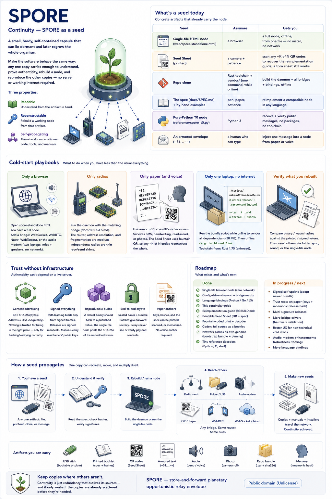

# Continuity — SPORE as a seed

  

<em>Poster summary —
<a href="spore-continuity.png">full size</a>. The story cards and sections below
are the living text; the poster can lag.</em>

A **spore** is a small capsule that can regrow the whole organism from one
survivor. This page is about the *software* doing the same: one HTML file, one
printout, or one offline bundle is enough to understand, verify, and run a node —
without depending on the same infrastructure the mesh is meant to outlast.

This page is about a *node* surviving. [Rebuild](rebuild.html) is its companion
for the *protocol* surviving even this codebase.

## The pieces of "outlives us"

| Piece | Answers | Lives at |
|---|---|---|
| **Continuity** | If I lose this device, this app, this website — does *my* node come back? | This page |
| **Rebuild** | If this codebase disappeared, could someone who has never seen it write a compatible node? | [`REBUILD.md`](REBUILD.md) |
| **Reference decoders** | Can I check a real envelope against something I need not trust — no crypto library, no dependency? | [`reference/`](https://github.com/sloev/spore/tree/master/reference) |
| **Release artifacts** | Can I get a working node *and* the means to rebuild it from one download, with no live infrastructure? | Every [release](https://github.com/sloev/spore/releases) carries `spore-standalone.html` and `spore-offline-bundle.tar.gz` beside the APK — [`APPS.md`](APPS.md) |
| **The frozen contract** | Will a node built from any of the above still speak to one built today? | `tests/api_freeze.rs` + `reference/vectors.json`, held by [`CONTRIBUTING.md`](CONTRIBUTING.md)'s freeze rules |
| **Public domain** | Is there a license, company or maintainer this depends on outliving? | [`LICENSE`](../LICENSE) — no |

A surviving copy — a phone, a saved HTML file, a printed Seed Sheet, a clone, a
release tarball — carries everything needed to keep working, verify it is
genuine, and regrow the rest.

<strong>Three properties</strong>

Readable · Reconstructable · Self-propagating

Why “every copy is a seed” is a constraint

Most software assumes a registry, CDN, or app store. SPORE’s job is moving
messages when that infrastructure is degraded — so getting SPORE must not depend
on it. Understanding, verifying, and rebuilding travel <em>with</em> the node:
dependency-light core, a spec independent of Rust, paper-friendly formats, and
the network able to carry its own installer.

<strong>What’s a seed today</strong>

From one browser file to paper QR to a vendored offline build.

Artifact table

<table>
  <thead><tr><th>Seed</th><th>Assumes</th><th>Gets you</th></tr></thead>
  <tbody>
    <tr><td><strong>Single-file HTML</strong></td><td>a browser</td><td>full node offline, zero network</td></tr>
    <tr><td><strong>Seed Sheet</strong></td><td>camera + patience</td><td>any ~K of N QR → reimplementation guide</td></tr>
    <tr><td><strong>Offline bundle</strong></td><td>Rust toolchain</td><td>daemon + bridges, <code>cargo build --offline</code> immediately — every release carries the source with dependencies pre-vendored, or run <code>make-offline-bundle.sh</code> on a clone yourself</td></tr>
    <tr><td><strong>SPEC + by-hand examples</strong></td><td>pen, paper</td><td>reimplement in any language</td></tr>
    <tr><td><strong>Pure-Python T0</strong></td><td>Python 3</td><td>receive + verify public mail, no packages</td></tr>
    <tr><td><strong>Armored envelope</strong></td><td>typing</td><td>inject one message from paper or voice</td></tr>
  </tbody>
</table>

Links and build commands: <a href="apps.html">Apps &amp; daemons</a>.

<strong>Cold-start playbooks</strong>

Only a browser · only radios · only paper · only one laptop offline.

Only a browser

Open <code>spore-standalone.html</code>. Add a bridge from the page (WebSocket, WebRTC,
Nostr, WebTorrent) or the <strong>audio modem</strong> so two laptops pair with no network.
Get the file from <a href="apps.html">Apps</a>.

Only radios

Daemon + matching bridge (<a href="bridges.html">BRIDGES</a>). Router and fragmentation
are medium-independent; the radio is a thin send/recv shim.

Only paper (and voice)

Armor form <code>~S1.&lt;base32&gt;.&lt;checksum&gt;~</code> survives SMS, handwriting, or a
read-aloud. Seed Sheet fountain QR recovers bulk guides from a partial print.

Only one laptop, no internet

Simplest: grab <code>spore-offline-bundle.tar.gz</code> from any
<a href="https://github.com/sloev/spore/releases">release</a> before you go offline — every
one carries this source tree with dependencies already vendored in, so
<code>cargo build --offline</code> works the moment you unpack it. No release artifact handy?
Clone + vendor it yourself while still online:

<pre><code>./scripts/make-offline-bundle.sh
./scripts/make-offline-bundle.sh --tar</code></pre>

MSRV is enforced by CI (see Cargo.toml / security findings for the floor).
<code>Cargo.lock</code> pins versions; <code>vendor/</code> carries the sources. HTML node, printed
spec, and Seed Sheet need no vendor step.

<strong>Trust without infrastructure</strong>

Hash is identity. Signatures bind path learning. Seed ≠ full inbox backup.

Anchors

<ul>
  <li><strong>Content addressing</strong> — envelope ID is the hash of its bytes; node address is the hash of its key.</li>
  <li><strong>Signed everything</strong> — path learning from signed frames; releases as signed manifests.</li>
  <li><strong>Seed restores identity, not the prekey ring</strong> — carrying the ring keeps old sealed mail readable and lengthens the theft window. Continuity of identity and forward secrecy of content pull opposite ways; you choose.</li>
  <li><strong>Reproducible builds</strong> — compare hashes offline; the single-file node prints the wasm SHA-256 in its footer.</li>
</ul>

## Roadmap

What exists and what’s next:

- [x] **Single-file browser node** — zero network, CI-checked
- [x] **Config-driven daemon + bridge matrix**
- [x] **Language bindings** — Python / Go / JS from one C ABI
- [x] **This continuity guide** with cold-start playbooks
- [x] **Reimplementation guide** ([Rebuild](rebuild.html))
- [x] **Printable Seed Sheet** + fountain-coded QR
- [x] **Tiny reference decoders** (Python, C, shell)
- [◑] **Network carries its own genome** — bootstrap bundle on a well-known topic; still open: signed self-update of the binary
- [ ] **Codex** — full source as hash-stamped booklet
- [ ] **Trust roots on paper** — multi-signature release anchors

## Help re-seed

Keep a copy somewhere the others aren’t: offline disk, phone HTML, printed sheet,
another host. Continuity is redundancy that outlives its sources — and it only
works if the copies are already scattered before they’re needed.
