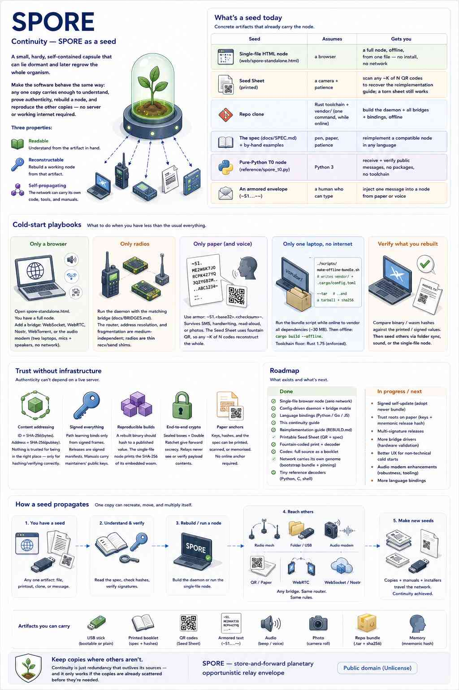

# Continuity — SPORE as a seed

A **spore** is a small capsule that can regrow the whole organism from one
survivor. This page is about the *software* doing the same: one HTML file, one
printout, or one offline bundle is enough to understand, verify, and run a node —
without depending on the same infrastructure the mesh is meant to outlast.

This page is about a *node* surviving. [Rebuild](rebuild.html) is its companion
for the *protocol* surviving even this codebase.

<p align="center">
  <a href="spore-continuity.png"></a>
</p>

<p align="center"><em>Poster summary, for a quick visual overview —
<a href="spore-continuity.png">full size</a>. The text on this page is the
living source; the poster can lag it.</em></p>

## The pieces of "outlives us"

| Piece | Answers | Lives at |
|---|---|---|
| **Continuity** | If I lose this device, this app, this website — does *my* node come back? | This page |
| **Rebuild** | If this codebase disappeared, could someone who has never seen it write a compatible node? | [Rebuild guide](REBUILD.md) |
| **Reference decoders** | Can I check a real envelope against something I need not trust — no crypto library, no dependency? | [`reference/`](https://github.com/sloev/spore/tree/master/reference) |
| **Release artifacts** | Can I get a working node *and* the means to rebuild it from one download, with no live infrastructure? | Every [release](https://github.com/sloev/spore/releases) carries `spore-standalone.html` and `spore-offline-bundle.tar.gz` beside the APK — [Apps](APPS.md) |
| **The frozen contract** | Will a node built from any of the above still speak to one built today? | `tests/api_freeze.rs` + `reference/vectors.json`, held by [Contributing](CONTRIBUTING.md)'s freeze rules |
| **Public domain** | Is there a license, company or maintainer this depends on outliving? | [`LICENSE`](../LICENSE) — no |

A surviving copy — a phone, a saved HTML file, a printed Seed Sheet, a clone, a
release tarball — carries everything needed to keep working, verify it is
genuine, and regrow the rest.

## Three properties

**Readable · Reconstructable · Self-propagating.** Most software assumes a
registry, CDN, or app store. SPORE's job is moving messages when that
infrastructure is degraded — so getting SPORE must not depend on it.
Understanding, verifying, and rebuilding travel *with* the node:
dependency-light core, a spec independent of Rust, paper-friendly formats, and
the network able to carry its own installer.

## What's a seed today

| Seed | Assumes | Gets you |
|---|---|---|
| **Single-file HTML** | a browser | full node offline, zero network |
| **Seed Sheet** | camera + patience | any ~23 of 39 QR → reimplementation guide |
| **Offline bundle** | Rust toolchain | daemon + bridges, `cargo build --offline` immediately — every release carries the source with dependencies pre-vendored, or run `make-offline-bundle.sh` on a clone yourself |
| **SPEC + by-hand examples** | pen, paper | reimplement in any language |
| **Pure-Python T0** | Python 3 | receive + verify public mail, no packages |
| **Armored envelope** | typing | inject one message from paper or voice |

Links and build commands: [Apps & daemons](apps.html) and the
[Dev guide](dev-guide.html)'s "Install & verify a release."

## Cold-start playbooks

**Only a browser.** Open `spore-standalone.html`. Add a bridge from the page
(WebSocket, WebRTC, Nostr, WebTorrent) or the **audio modem** so two laptops
pair with no network. Get the file from [Apps](apps.html).

**Only radios.** Daemon + matching bridge ([Bridges](bridges.html)). Router
and fragmentation are medium-independent; the radio is a thin send/recv shim.

**Only paper (and voice).** Armor form `~S1.<base32>.<checksum>~` survives
SMS, handwriting, or a read-aloud. Seed Sheet fountain QR recovers bulk guides
from a partial print.

**Only one laptop, no internet.** Simplest: grab `spore-offline-bundle.tar.gz`
from any [release](https://github.com/sloev/spore/releases) before you go
offline — every one carries this source tree with dependencies already
vendored in, so `cargo build --offline` works the moment you unpack it. No
release artifact handy? Clone + vendor it yourself while still online:

```sh
./scripts/make-offline-bundle.sh
./scripts/make-offline-bundle.sh --tar
```

MSRV is enforced by CI (see `Cargo.toml` / security findings for the floor).
`Cargo.lock` pins versions; `vendor/` carries the sources. HTML node, printed
spec, and Seed Sheet need no vendor step.

## Trust without infrastructure

**Hash is identity. Signatures bind path learning. Seed ≠ full inbox backup.**

- **Content addressing** — envelope ID is the hash of its bytes; node address is the hash of its key.
- **Signed everything** — path learning from signed frames; releases as signed manifests.
- **Seed restores identity, not the prekey ring** — carrying the ring keeps old sealed mail readable and lengthens the theft window. Continuity of identity and forward secrecy of content pull opposite ways; you choose.
- **Reproducible builds** — compare hashes offline; the single-file node prints the wasm SHA-256 in its footer.

## Roadmap

What exists and what's next:

- [x] **Single-file browser node** — zero network, CI-checked
- [x] **Config-driven daemon + bridge matrix**
- [x] **Language bindings** — Python / Go / JS from one C ABI
- [x] **This continuity guide** with cold-start playbooks
- [x] **Reimplementation guide** ([Rebuild](rebuild.html))
- [x] **Printable Seed Sheet** + fountain-coded QR
- [x] **Tiny reference decoders** (Python, C, shell)
- [◑] **Network carries its own genome** — bootstrap bundle on a well-known topic; still open: signed self-update of the binary
- [ ] **Codex** — full source as hash-stamped booklet
- [ ] **Trust roots on paper** — multi-signature release anchors

## Help re-seed

Keep a copy somewhere the others aren't: offline disk, phone HTML, printed sheet,
another host. Continuity is redundancy that outlives its sources — and it only
works if the copies are already scattered before they're needed.
