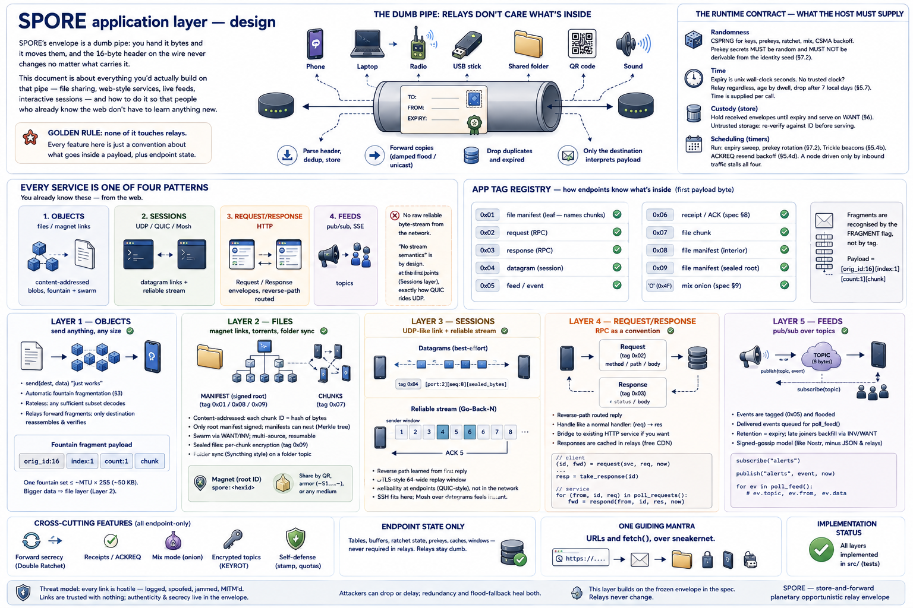

# SPORE application layer — design

<p align="center">
  <a href="spore-design.png"></a>
</p>

<p align="center"><em>Poster summary —
<a href="spore-design.png">full size</a>. The sections below are the living text;
the poster can lag.</em></p>

**The one rule this document is built on: nothing here touches relays.** Every
feature below is a payload convention plus endpoint state — never a change to what
a relay must understand.

That is what keeps a 200-byte LoRa packet, a QR code, or a human reading armor
aloud a first-class peer: a relay parses the fixed header, dedups, stores and
forwards, and nothing else. A feature requiring relay support would have to be
rolled out to every medium in lockstep.

So the application layer has exactly two ingredients:

1. **payload conventions** — bytes the destination knows how to interpret;
2. **endpoint state** — tables and buffers kept by sender and receiver.

The wire format itself is [`SPEC.md`](SPEC.md); it is frozen, and nothing here
changes it.

This document has two parts. **Part 1** is the application layer — what you build
on the envelope. **Part 2** is where the core runs and what a host owes it. They
are different concerns and are kept apart below.

# Part 1 — the application layer

## Every service is one of four patterns

Every service maps onto one of four patterns, each already a mechanism or a
payload convention. Distinct from the five medium *shapes* a bridge binds to,
below.

<details>
<summary>Deep dive: the four service patterns and their web analogues</summary>

| Pattern | Web analogue | SPORE mechanism | State |
|---|---|---|---|
| **Objects** | files / magnet links | content-addressed blobs, fountain + swarm | ✅ implemented |
| **Sessions** | UDP / QUIC / Mosh | datagram links + reliable stream | ✅ implemented |
| **Request/response** | HTTP | `Request`/`Response` envelopes, reverse-path routed | ✅ implemented |
| **Feeds** | pub/sub, SSE | topics | ✅ implemented |

Note what is deliberately *absent*: a raw reliable byte-stream offered *by the
network*. The spec lists "no stream semantics" as a feature, because a stream
assumes a live, low-latency, bidirectional path — the one thing an opportunistic
network can't promise. Reliability still exists, but as an **endpoint** concern
(the Sessions layer), exactly the way QUIC builds reliability on top of UDP
without the network knowing.
</details>

## How endpoints tell payloads apart: the app tag

The frozen header has no port or content-type field. The first payload byte is
the **app tag**, read only by the destination.

<details>
<summary>Deep dive: the tag registry</summary>

| Tag | Meaning | Status |
|---|---|---|
| `0x01` | file manifest (leaf — names chunks) | ✅ implemented |
| `0x02` | request (RPC) | ✅ implemented |
| `0x03` | response (RPC) | ✅ implemented |
| `0x04` | datagram (session) | ✅ implemented |
| `0x05` | feed/event | ✅ implemented |
| `0x06` | receipt/ACK (spec §8) | ✅ implemented |
| `0x07` | file chunk | ✅ implemented |
| `0x08` | file manifest (interior — names manifests) | ✅ implemented |
| `0x09` | file manifest (sealed root — per-chunk encryption) | ✅ implemented |
| `'O'` (0x4F) | mix onion (spec §9) | ✅ implemented |

Fragments are the one exception: they're recognised by the `FRAGMENT` header flag,
not a tag, and their payload is `[orig_id:16][index:1][count:1][chunk]`. The chunk
they carry is a slice of an ordinary, already-tagged inner envelope, so tags and
fragmentation compose cleanly.
</details>

## Layer 1 — objects: send anything, any size  ✅ implemented

`send(dest, data)` takes any size. Under the MTU it is one envelope; over it,
fountain-fragmented and reassembled by the destination, signature-checked before
the app sees it.

<details>
<summary>Deep dive: fountain coding and relay behaviour</summary>

`Node::send(dest, data, now)` builds and signs one inner envelope. If its wire form
fits `Node::mtu` it ships as-is; otherwise it's fountain-fragmented (§3):

- **Rateless push:** the sender can mint endless distinct repair chunks, so the
  object decodes from *any* sufficient subset — simplex radio, CW, and paper tape
  work with no back-channel at all.
- **Relays stay dumb:** each fragment is an ordinary flooded envelope with its own
  ID. A relay forwards fragments but never buffers or reassembles an object that
  isn't addressed to it — only the destination reassembles.
- **Cap:** one fountain set is ≤ ~`mtu`×255 (≈ 50 KB at defaults). Larger data is
  the file layer's job (below), where a tree of manifests carries any size.

Implemented in `src/lib.rs` (`Node::send`, `Fountain`, the `ingest` reassembly
path) and covered by tests for single-envelope sends, large-object
fragment/reassembly, and relay-forwards-without-reassembling.
</details>

## Layer 2 — files: magnet links, torrents, and folder sync  ✅ implemented

A **manifest** is a signed envelope naming a file's size and its chunks' content
IDs. Its own ID is the shareable magnet. Chunks are fetched from whoever has them
and each verifies itself on arrival. The same machinery over a folder is folder
sync.

<details>
<summary>Deep dive: content-addressed chunks, swarming, and folders</summary>

A file is split into chunks; each chunk is an ordinary envelope
`[0x07][file_id:16][index:4][bytes]`, so it has its own content ID (the hash of its
bytes). The **manifest** is a signed envelope listing those chunk IDs in order:

```
manifest = SIGNED [0x01][file_id:16][chunk_size:4][count:4][total_len:8][name][chunk_id:16 × count]
```

The manifest's own 16-byte ID is the **magnet** — shareable as `spore:<hexid>`, as
`~S1.…~` armor, or as a QR.

**Manifest trees.** A manifest is one envelope, so a single one can only name so
many chunks — about **93 KB** of file at a 1400-byte MTU. Past that the chunk IDs
are grouped under **interior manifests**, and those grouped again, until what
remains fits the signed root. An interior node is the same object one level up:

```
interior = UNSIGNED [0x08][depth:1][file_id:16][chunk_size:4][count:4][total_len:8][name_len:2][id:16 × count]
```

At `depth == 0` the IDs name chunks; at `depth > 0` they name manifests of
`depth - 1`. Capacity multiplies by the interior fan-out (~84) per level, to a
cap of `MAX_DEPTH = 4`:

| depth | capacity at MTU 1400 |
|---|---|
| 0 (one manifest) | 94 KB |
| 1 | 8.1 MB |
| 2 | 679 MB |
| 3 | 57 GB |
| 4 | 4.8 TB |

A file that fits one manifest still encodes exactly as it did before trees
existed — same `0x01` tag, same bytes — so nothing that already works changes.

- **Integrity is free.** The root is signed, so its ID list is authentic; and every
  ID below it — chunk or sub-manifest alike — *is* the hash of the bytes it names.
  A node counts a part as present only when its store holds an envelope whose ID
  matches the one its parent named, so a forged or corrupt part simply never
  matches. **Only the root is signed**: the hash chain covers the rest, which is
  why interior nodes need no signature and no source key, buying back ~96 bytes of
  fan-out each. The magnet is a genuine Merkle root.
- **Swarming is just WANT.** Only the small root floods; everything else is pulled.
  `fetch(magnet)` emits a WANT for the IDs it lacks, and any peer holding them
  answers from its store (the existing §6 machinery, untouched). A sub-manifest is
  an ordinary stored envelope named by content, so it needs no new message type.
  Multi-source and resumable, because parts are named by content, not by origin.
- **It resolves top-down.** A WANT frame holds ~86 IDs, and the deeper levels are
  not even *nameable* until the levels above arrive — so `fetch` returns one
  frame's worth per call and is called until complete. Interior nodes surface
  before the chunks beneath them, so the tree fills in as it goes.

Implemented in `src/lib.rs` as `publish_file` / `absorb_manifest` (auto-called on
delivery) / `fetch` / `fetch_n` / `missing` / `has_file` / `file_bytes` /
`write_file_to`, covered by publish → flood → pull → verify tests at one level and
at several.

```rust
let (magnet, forwards) = node.publish_file("photo.jpg", bytes, dest, now);
// … peer learns the root manifest, then, until has_file:
let forwards = node.fetch(&magnet);   // one frame of WANT; verify on arrival
let file = node.file_bytes(&magnet);  // Some(bytes) once complete
node.write_file_to(&magnet, &mut f)?; // …or stream it, one chunk in memory
```

**Sealing to one recipient.** `publish_file_sealed` encrypts **each chunk on its
own** under a per-file key, and seals that key — with the real file name — into
the root manifest's header:

```
sealed root = SIGNED [0x09][depth:1][hdr_len:2][hdr][file_id:16][chunk_size:4][count:4][total_len:8][name_len:2]["sealed"][id:16 × count]
        hdr = seal([key:32][name_len:2][name], recipient prekey)
      chunk = [0x07][file_id:16][index:4][ XChaCha20-Poly1305(key, nonce = index, plaintext) ]
```

The key is fresh per file, so the chunk index is a safe nonce and costs 24 bytes
less than a random one — leaving only the 16-byte tag, which the chunk size
already had room for. **A sealed chunk therefore rides exactly the frame an open
one does.** The recipient decrypts a chunk at a time straight to disk, so a
sealed file costs one chunk of memory rather than all of it, and `total_len`
stays the plaintext length so progress means what it says. Relays carrying the
chunks learn neither the contents nor the name; interior manifests carry nothing
but hashes, so they are never sealed. Files sealed the older whole-blob way still
open — `open_file` keeps that path.

**What bounds a file now.** Not the wire format. Every chunk lives in the store, so
the practical ceiling is `max_storable_file_bytes()` — half the store budget,
leaving the other half to relay with — and beneath that, whatever the slowest
bridge on the path is willing to carry.

**What a link agrees to carry.** Unbounded files mean a link can be conscripted
into hauling somebody's gigabyte, and an audio modem at ~23 bytes/s would do
nothing else for a week. So each interface may register a **bulk budget**
(`Hub::register_limited`): bytes per second of *other people's file chunks* it
will relay, as a leaky bucket that accrues a few seconds of burst.

Only chunks count as bulk. Messages, announces, receipts and **manifests** always
pass, so a paced link stays a full member of the mesh — it still carries the
conversation, and still tells everyone what exists. It simply declines to be the
pipe, and because chunks are content-addressed the fetch just asks again and
another path answers. Defaults live with each bridge: `audio` refuses bulk
outright (0 B/s), `meshtastic` and `reticulum` default to a conservative 32 B/s
that a deployment can raise with `Hub::set_bulk_budget`.

This is a **local policy**, not a wire change — nothing about it is negotiated,
and nothing in the frozen contract moves.

**Folder sync (Syncthing) ✅ implemented:** `bridge::foldersync::publish_dir` turns
each file in a directory into a manifest on a folder-topic; a subscriber `fetch_all`s
the chunks and `materialize`s the completed files back to disk (newest manifest per
name wins, path-traversal guarded). An **encrypted folder** is sealed manifests
behind a pre-shared-key topic (§7). Tested end-to-end: publish → flood → pull →
materialise.

**Custody and the store.** Parts live in the ordinary store, which evicts under
pressure (lowest-stamp → largest → oldest). A file still being assembled is
pinned — interior manifests included, since losing one would hide its whole
subtree and strand the transfer with no way to name what went missing.

Given a directory (`Node::set_spill_dir`) the store is **write-through**: every
envelope lands on disk as it arrives, and memory is a cache in front of it. Past
`set_mem_budget` the coldest resident copies are dropped, not lost, so a node
carries what its *disk* holds rather than what its RAM does — which is what lets
a file actually reach the sizes the manifest tree allows. Two things fall out:

- **A restart resumes.** Whatever was on disk is adopted, and the manifests among
  it re-learned, so an interrupted transfer continues instead of starting over.
  Adoption is safe because an id *is* the hash of its bytes: a file whose name
  disagrees with its content is discarded, so a tampered spill directory cannot
  inject anything.
- **No directory, no disk.** Nothing is written and the store behaves exactly as
  the in-memory map it replaced — the right answer on the web, and anywhere else
  without a filesystem.
</details>

## Layer 3 — sessions: a UDP-like link, and SSH over it  ✅ implemented

Sometimes you want a live back-and-forth, not a one-shot message — a chat, a
remote shell, a game. The session layer gives you a **UDP-like link** between two
addresses: fire packets, they arrive best-effort, either side can talk. Because the
"address" is a cryptographic identity rather than an IP, the link doesn't break
when you switch WiFi to cellular — it just keeps going, the way Mosh survives
roaming. On top of that link you can turn on a **reliable, in-order stream** when
you need one (for SSH, git, file copies) — that reliability lives entirely at the
two ends, so the network stays dumb.

<details>
<summary>Deep dive: datagrams, replay protection, and Go-Back-N reliability</summary>

**Datagram (`tag 0x04`).** A datagram is an ordinary unicast envelope whose payload
is `[0x04][port:2][seq:8][sealed_bytes]`, signed by the sender and sealed to the
peer's prekey. `Node::dial(peer, port)` returns a `Session` — pure local state, no
handshake, because identity *is* the address. `dg_send` emits one; `dg_recv`
verifies the sender (its key must hash to the session peer), decrypts, and runs a
DTLS-style 64-wide replay window. The first datagram floods to discover a route;
the signed reply teaches the reverse path (§5's "first copy wins"), so the rest go
directed. Roaming and NAT rebinding stop being special cases — the address is
unchanged, the path just re-learns.

**Reliable stream (QUIC-style, kept simple).** `Node::reliable(session)` wraps a
session in a **Go-Back-N** ARQ:

- the sender streams `[F_DATA][offset:8][len:2][bytes]` frames within a fixed
  window and, on an ACK-progress timeout (`poll(now)`), rewinds to the last acked
  offset and resends;
- the receiver accepts only in-order bytes and cumulatively ACKs the next offset it
  needs (`[F_ACK][recv_next:8]`).

No AIMD, no fancy congestion control — a fixed window and a fixed retransmit
timeout, on purpose. It's enough to carry an ordered byte stream, and it's
**endpoint state only**, so it never reintroduces stream semantics into relays —
exactly how QUIC rides UDP.

**SSH specifically.** Stock `ssh` needs a reliable byte stream, so it rides the
reliable shim directly (great on a good link, slow on a bad one — physics, not a
bug). The better fit is the **Mosh model**: use SSH only for the initial key
exchange, then run the interactive session as *state-sync* over raw datagrams —
roaming, loss-tolerant, and instant-feeling with local/predictive echo.

**The honest limit.** Interactivity tracks the real path RTT. On a LAN, WireGuard
tunnel, or direct radio link it's Mosh-grade; over a multi-hop opportunistic path
the datagrams still flow but degrade to store-and-forward. The abstraction is
uniform; the *experience* follows the physics of the link. That's the right
behaviour: interactive when it can be, still delivering when it can't.

Implemented in `src/lib.rs` (`session::Session`, `session::Reliable`,
`Node::dial`/`dg_send`/`dg_recv`/`reliable`) with tests for datagram
roundtrip/replay/wrong-recipient and a reliable stream reassembling across 30%
loss.
</details>

## Layer 4 — request/response: RPC as a convention  ✅ implemented

Sometimes you want to ask a question and get an answer — a lookup, a form
submission, an API call. That's just two messages with a convention: a request
envelope carrying `method`/`path`/`body`, and a response envelope carried back
along the path the request came in on. It resembles HTTP because request/response
*is* that shape — but HTTP itself is only a bridge (below), never part of this. The
pattern is transport-agnostic: the same request works over LoRa, a folder, or a QR
code.

<details>
<summary>Deep dive: the request/response convention and its free CDN</summary>

- A **service** is a topic or address a node serves.
- A **request** (`tag 0x02`) carries `method`, `path`, `body`, sealed to the
  service's prekey with a request-id nonce; a **response** (`tag 0x03`) goes back to
  the requester's address along the reverse path SPORE learned when the request
  arrived (§5, "first copy wins"). Large bodies ride Layer 1.
- **Build it like a normal handler.** A service is a `(request) -> response`
  function; the SPORE side is a thin adapter, so nobody learns a new programming
  model. To reach the *existing* web, run an HTTP bridge that proxies a SPORE
  request to a local `http://…` service and the reply back — the bridge moves
  bytes, the web app is untouched.
- **Free CDN.** Responses are content-addressed envelopes every relay stores. Mark
  a read-only response cacheable and any node that carried it can answer a later
  identical request — the store is the cache, INV/WANT is the cache-fill.

Implemented in `src/lib.rs`: the router auto-queues delivered requests and matches
responses to their pending nonce, so the app loop stays tiny. Tested with a
request → response round-trip.

```rust
// client
let (id, forwards) = node.request(service, rpc::Request { method, path, body }, now);
// … later, after the reply is delivered:
let resp = node.take_response(id);               // Some(Response { status, body })

// service
for (from, id, req) in node.poll_requests() {
    let forwards = node.respond(from, id, rpc::Response { status: 200, body }, now);
}
```
</details>

## Layer 5 — feeds: pub/sub  ✅ implemented

A feed is just a topic. Whoever wants to broadcast sends to the topic; whoever
cares follows it and gets everything. It's the signed-gossip model behind Nostr,
minus the JSON, the dedicated relays, and the always-on internet.

<details>
<summary>Deep dive: subscribe / publish / poll, retention and backfill</summary>

`subscribe(topic)` follows a feed, `publish(topic, event)` floods a tagged event
(`0x05`), and the router auto-queues delivered events for `poll_feed` to drain as
`(topic, from, data)`. Retention is just message expiry, and a late joiner backfills
history from any peer's store via INV/WANT — no special infrastructure; a feed is
emergent from topics plus the store-and-sync the router already does. Tested with a
publish reaching a subscriber.

```rust
node.subscribe("alerts");
let forwards = node.publish("alerts", event, now);
for ev in node.poll_feed() { /* ev.topic, ev.from, ev.data */ }
```
</details>

## Forward-secret sessions — Double Ratchet  ✅ implemented

The sealed box (§7 baseline) already gives you privacy, but if a device is seized
its prekey can read every message sent to it that week. The Double Ratchet fixes
that: each message uses a brand-new key that's thrown away immediately, and the
whole key schedule "turns" every time the other side replies. Crack one message and
you learn nothing about the ones before it or after the next turn.

<details>
<summary>Deep dive: chains, turns, and out-of-order handling</summary>

Two chains and a root. A BLAKE2b **chain KDF** produces one message key per message
and then advances, so every message key is unique and deleted after use (forward
secrecy within a chain). When a message carries a new **X25519 ratchet public** in
its header, both sides run the **root KDF** over a fresh DH — a *ratchet turn* that
reseeds the chains with new entropy (recovery from compromise). The wire form is the
spec's `[dh_pub:32][n:2][pn:2][ct]`, with `ct = ChaCha20-Poly1305(mk, nonce=n,
ad=header)`.

Out-of-order arrival is normal in SPORE, so a receiver caches the keys it skips
(bounded by `MAX_SKIP`) and opens the stragglers when they arrive; a replay of an
already-consumed message is refused. In `src/lib.rs` as
`ratchet::Ratchet::{init_alice, init_bob, encrypt, decrypt}`, tested through a DH
turn, out-of-order delivery, and a rejected replay. In practice the root bootstraps
from the first sealed message and each device keeps its own ratchet key — never
share one ratchet across devices.
</details>

## Anonymity — mix mode  ✅ implemented

If you need to hide *who is talking to whom* (not just the contents), wrap your
message in an onion: layers of encryption addressed to a chain of volunteer relays
("mixes"). Each mix can peel only its own layer, learning just the next hop, so no
single relay sees both ends. Make the innermost layer public and everyone carries it
while only the true recipient can open it.

<details>
<summary>Deep dive: onion construction, padding, and what it defeats</summary>

An onion is nested sealed envelopes. Each layer is a DATA envelope addressed to one
mix, its payload sealed to that mix as `'O' ‖ next_full_envelope`. `mix::onion_wrap`
builds it inside-out through 2–3 mixes (learned from ANNOUNCEs on topic `mix`) and
pads each layer to a **256 / 1024 / 4096-byte size class** so onion depth never
shows on the wire. A mix runs `Node::onion_peel` — open, check the `'O'` marker,
re-inject the inner envelope as its own traffic.

- **Sender anonymity:** outer layers are left unsigned.
- **Recipient anonymity:** the innermost `dest` is `0x00..00` and its payload is
  sealed to the recipient — every node carries it, one node opens it.

Honest limits (from the spec): this beats local observers and any subset of mixes,
but a *global* passive observer is only defeated while cover traffic flows. The
batching core is implemented — `mix::Batch` holds peeled inner envelopes and
releases them only once a minimum batch has gathered *and* each item's delay has
elapsed, breaking the arrival/re-send timing link. The remaining timing policy
(Poisson delays, decoy onions) is the mix *runner's* job. Tested: the onion peels
cleanly through two mixes, and the batch queue holds until full-and-due.
</details>

## Prekey ring (§7)  ✅ implemented

Sealing a one-shot message needs the recipient's X25519 **prekey**. If that prekey
never changes, seizing a device reads every message ever sent to it. The ring is
what bounds that: a node mints a fresh prekey every 24 h, advertises the newest in
its ANNOUNCE, and deletes any secret older than 7 days.

<details>
<summary>Deep dive: why the seed and the prekey secrets must be different things</summary>

The first version of this derived the prekey from the identity seed —
`SHA-256(seed ‖ "spore/prekey/v1")` — which is elegant and completely defeats the
purpose. `Node::seed` is persisted so an identity can be restored; anything derived
from it is therefore permanent, and "deleting the private prekey" deletes nothing.
The docs claimed the seven-day property anyway. That was S-022, and it is the
sharpest example in this repo of a security property existing only in prose.

So the ring's secrets are **random**, and that asymmetry is the whole design:

| Asset | What a restore recovers |
|---|---|
| identity seed | address, signing key, the ability to mint *new* prekeys |
| prekey ring | the ability to open mail sealed to prekeys that still exist |
| a deleted prekey secret | **nothing — by construction** |

Consequences, stated plainly because each one is a cost:

- **`Node::seed()` is no longer sufficient to restore a node.** Persist
  `Node::prekey_ring()` beside it. A node restored from the seed alone keeps its
  address and gets one bootstrap prekey; it has no forward secrecy and cannot read
  mail sealed to anything it had rotated to. The browser node and the Android app
  both persist the ring for this reason.
- **Mail sealed to an expired prekey is unreadable by everyone, including you.**
  That is not data loss to be fixed; it is the feature.
- **A backup of the ring defeats the seven-day window**, exactly as it would for
  any forward-secret keystore. Cloud-syncing it would quietly undo the property.
- Opening tries every live entry newest-first, so a sender working from a stale
  ANNOUNCE still reaches you until that secret expires. The nonce mixes the
  *recipient's* public key, so each entry stores both halves — a secret can only be
  tried against the public key it belongs to.

The bootstrap prekey is the one seed-derived entry, kept so an existing node
upgrades without becoming unreachable. It has `born = 0` because its true age is
unknowable; the first rotation stamps it, and it ages out normally from there.

What this does **not** give you: sessions already had forward secrecy from the
Double Ratchet, and this does not change them. It also does not protect a message
whose recipient never rotates — a node that never runs its sweep never deletes
anything, which is why rotation is driven from the router rather than left to the
embedder to remember.
</details>

## Encrypted topics (§7)  ✅ implemented

A public topic is readable by anyone who follows it. An *encrypted* topic adds a
shared password: members seal every message under a pre-shared key, so the mesh
still carries and stores the traffic but only key-holders can read it. This is the
shape a private group takes — the same one Signal and WhatsApp arrive at, where a
symmetric group key is handed to each member over a pairwise channel and rotated
when the membership changes.

<details>
<summary>Deep dive: topic seal/open, the epoch ratchet, and membership rekey</summary>

`topic_seal(msg, psk)` / `topic_open(ct, psk)` use XChaCha20-Poly1305 with a 32-byte
pre-shared key and a random 24-byte nonce prefixed to the ciphertext (spec §7). The
envelope rides a normal topic with `ENCRYPTED` set; relays are oblivious, endpoints
with the key decrypt.

`topic.rs` implements the three reasons a key has to change:

- **Time.** `rotate(key)` advances one epoch, `next = SHA-256(key ‖ domain)`. Keep
  only the current key and a leak of it cannot open past traffic, because hashing
  does not run backwards. `seal`/`open` tag each message with a 4-byte epoch so a
  receiver picks the right key and a stale epoch simply fails to open.
- **Membership.** To remove someone, choose a fresh random key and hand it to each
  *remaining* member with `rekey_seal` — a sealed box to their prekey. The departed
  member holds no prekey that opens any of those boxes and never learns the new
  key. This is exactly the pairwise distribution step Signal's sender keys use.
- **Compromise.** `contribute`/`absorb` — below.

### Healing: why `rotate` alone is not enough

Rotation gives forward secrecy and *only* forward secrecy. It is a hash chain:
whoever copies the current key computes every key after it, so rotating faster does
not help — the attacker rotates too. A group in that state stays compromised until
a human notices, which is precisely what cannot be relied on.

`contribute` draws 32 fresh random bytes, seals a copy to every member's prekey,
and everyone folds it into the key with `mix`:

```text
new = SHA-256("spore-topic-mix-v1" ‖ current ‖ contribution)
```

An attacker holding the entire chain cannot compute that, because the contribution
never travels in a form it can open. The group **heals by operating** — no
detection, no intervention. That is post-compromise security, and it is the
property a plain hash ratchet does not have.

Three details that are load-bearing:

- **Mix, never replace.** The result depends on the old key *and* the new entropy.
  So a contribution can only add entropy, and an attacker able to sign as a member
  cannot cancel an honest contribution by following it with one of its own — it
  appends steps it knows to a chain that one step it cannot read has already made
  unknowable. (`rekey_seal` replaces outright; that is right for eviction, where you
  *want* the old key to stop mattering, and wrong for healing.)
- **No recipient hints.** Every box is 80 bytes and unlabelled; a member
  trial-decrypts until one opens. That keeps the message from enumerating the group
  to an interceptor, at the cost of one X25519 per box — hence the 256 cap, so a
  forged message cannot become a CPU sink.
- **`key_id`** = `SHA-256(domain ‖ key)[..4]`, carried in the clear, so a receiver
  holding several candidate keys knows which one a message used.

Tested: rotation is deterministic and one-way; an epoch-tagged message opens only
under its own epoch's key; a rekey box opens for the member and not an outsider; an
attacker who has followed the chain for ten rotations is locked out by one
contribution it cannot absorb; an injected contribution does not undo an honest
one; and `absorb` rejects every truncation and bit-flip of a contribution message
without panicking.

**What is still not solved.** Two things separate this from a messenger's group
chat, and neither is a cryptography problem:

1. **There is no roster and no arbiter of one.** Signal has a server that gives
   every member the same view of who is in the group. A partitioned mesh does not:
   two halves can disagree about membership, and a rekey that reaches only one half
   splits the conversation into two that can no longer read each other. `key_id`
   makes that divergence *visible* instead of a silent decryption failure, but
   visible is not solved. Key management is the application's, and
   `Node::subscribe`/`publish` cover plaintext topics only — an encrypted group
   composes `topic::seal` with `publish`.
2. **A stolen prekey secret still follows along.** Contributions are sealed to
   members' prekeys, so someone holding a member's prekey secret opens every
   contribution addressed to it. Healing against *that* needs the prekey to move,
   which is the daily prekey rotation in §7, not this module. What `contribute`
   recovers from is a stolen **group key** — the copy that gets backed up, synced
   between devices, and left behind on old ones.
</details>

## Delivery receipts (§8)  ✅ implemented

Flood-and-forget is fine for most mail, but sometimes you want to *know* it arrived.
Set one flag and the recipient automatically floods a tiny signed receipt back to
you; when it returns, your node marks the message delivered. If no receipt comes,
the sender re-floods on a backoff schedule until one does or it gives up.

<details>
<summary>Deep dive: the ACKREQ round-trip and backoff resend</summary>

`originate_ackreq(dest, payload)` sends a unicast DATA with the `ACKREQ` flag and
remembers it. When such a message is delivered to one of our own addresses, the
router floods a signed receipt — `[0x06][orig_id:16]` — back to the sender; being a
signed envelope it also teaches reverse paths (§4). The sender absorbs the receipt,
`acked(id)` flips true, and the pending entry clears.

`resend_unacked(now)` re-floods any still-unacked message whose `Backoff` timer has
elapsed (§5.6: flooding *is* route discovery, so a resend can find a path a
blackhole was hiding), giving up after `Backoff::MAX`. Tested with an end-to-end
ACKREQ → receipt round-trip. Known simplification: a *lost receipt* isn't re-
requested — a duplicate of the original is deduped before it could re-trigger one.
</details>

## Congestion control (§5.4)  ✅ implemented

The one hard feature that touches traffic, kept as four small independent knobs the
originator and bridges apply — the router itself stays dumb. Cap how much you relay,
slow your beacons when nothing's new, back off when a peer is swamped, and retry
lost mail with growing gaps.

<details>
<summary>Deep dive: the four knobs</summary>

All four live in `congestion` as plain primitives:

- **(a) Token bucket** (`TokenBucket`, `ten_percent`) — caps relayed bytes to a
  sustained rate; on ISM bands the law is ≤ 10 % airtime, and dedup makes a dropped
  relay harmless. The TCP bridge gates every relay through one.
- **(b) Trickle** (`Trickle`) — the HELLO/ANNOUNCE interval doubles from 5→80 min
  while nothing new is heard and snaps back to the minimum on novelty, so a quiet
  mesh goes quiet. The TCP bridge paces its beacon with one.
- **(c) Backpressure** (`admit`) — a peer advertises a `busy` byte (store fill) in
  its ANNOUNCE; neighbours admit sends with probability (255−busy)/255 and let
  *mined* mail through regardless — at least `STAMP_QUOTA_BYPASS_BITS` (16) leading
  zero bits, not merely a non-zero stamp, since class 1 is about two hashes' work
  and would let anyone ignore a busy peer for free. `Node::busy` produces the byte,
  `peer_busy` reads a neighbour's.
- **(d) Exponential backoff** (`Backoff`) — FLOOD retries at 30 s, doubling, capped
  at 1 h, at most 5 attempts; powers receipt resend above.

Tested as primitives; (a) and (b) are wired live into the TCP bridge, (c) into the
ANNOUNCE busy byte, (d) into receipts.
</details>

### What "relays never verify" does and does not mean

SPEC §2 says: "**SRC8** only toward peers that provably hold your key; relays never
verify — endpoints do." That sentence is about the cost of *forwarding*: a relay
moves bytes it cannot read toward a destination it is not, and making it check an
Ed25519 signature on every envelope in transit would tax the smallest nodes for a
guarantee the endpoint provides anyway. That still holds. Forwarding does not
verify.

It is not a licence to write unauthenticated claims into local state. A relay keeps
three tables that an attacker would like to choose the contents of:

| Table | What a forged entry buys |
|---|---|
| Neighbour bindings (`Neighbors`) | directed sends for a victim unicast to the attacker |
| Path table (`Paths`) | a victim's address bound to the attacker's interface |
| Quota attribution (`Quotas`) | a victim's byte budget drained by an attacker's junk |

All three once accepted the `SIGNED` **flag** as proof, and a flag is one bit
chosen by whoever wrote the frame — so all three were forgeable with a copied
public key and 64 zero bytes (see S-002, S-004 in
[`SECURITY_FINDINGS.md`](SECURITY_FINDINGS.md)). The rule is therefore narrower
than "relays verify" and wider than "relays never verify":

> **Verify before binding trust state; do not verify to forward.**

The cost is bounded on purpose. The check runs once per envelope, reused across all
three tables, and only *after* the dedup and expiry checks — so replays and stale
mail are dropped before any crypto, and a duplicate never pays twice. What remains
is one verify per newly-seen signed envelope, which on an ESP32 relaying LoRa is a
real per-envelope cost and was accepted knowingly: a relay that can be told a false
address is worse than a relay that is slower. If profiling shows it dominating on
constrained hardware, the next lever is caching "id → verified" for the `seen`
lifetime, trading memory for CPU rather than trading away the check.

# Part 2 — where the core runs

## The spore and the soil

The **core** is one implementation of the protocol — the same bytes on every
machine, carrying nothing about where it landed. Anything that hosts it is a
**runtime**: a language binding, a daemon, a browser worker, a microcontroller
firmware. Runtimes vary enormously; what they have to provide does not. A runtime
supplies **five nutrients**, and the core supplies everything else. Four of them
are normative in [`SPEC.md`](SPEC.md)'s runtime contract, which counts transport
separately as a bridge concern; *storage* there is called **custody**, the duty,
where this names the mechanism.

*The image, once, because it is the whole idea: the core is a spore and a runtime
is the soil it lands in. Past this paragraph the docs use the plain words —* core,
runtime, nutrient *— per the legend below.*

<details>
<summary>Legend: the seven words, and the ones they replace</summary>

One noun per concept. Synonyms were retired because six words for "the thing that
hosts the core" is six chances to think they are different things.

| Word | Means | Retired synonyms |
|---|---|---|
| **core** | the protocol implementation (`src/`) — frozen wire, no OS in it | *seed*, *spore* (as a name for the code) |
| **runtime** | anything that hosts a core and supplies its nutrients | *soil*, *vessel*, *platform* |
| **daemon** | a runtime that is a long-running process | — a *kind* of runtime, not a synonym |
| **nutrient** | one of the five things a runtime provides the core | *supply*, *capability* |
| **bridge** | one transport implementation — how the transport nutrient is supplied | *transport* in prose |
| **façade** | an app-protocol layer on top: communicator, IMAP, SIP, `spore://` (MISSION pillar 3) | *extension* |
| **binding** | a language binding (`bindings/`) — the thinnest runtime there is | — |

Two words are reserved and mean something else in these docs:

- **seed** always means the 32-byte signing seed (`Node::from_seed`, the Seed
  Sheet, "seed → new device"). It never means the core.
- **spore** is the protocol's name, and the metaphor above. `transports/` and the
  `DatagramTransport` trait keep their names — those are code, not prose.
</details>

<details>
<summary>Deep dive: the five nutrients, the runtimes, and which ones already work this way</summary>

| Nutrient | What the core needs it for | How it gets it today |
|---|---|---|
| **Randomness** | keys, nonces | The wasm build's *single* import is `env.spore_fill_random`; native uses `OsRng`. Already a contract, not a call. |
| **Time** | expiry, dedup windows, ratchet TTL | `now: u32` is a parameter on `send` / `on_rx` / `open_dm`. The protocol layers never read a clock — the host decides what time it is. |
| **Transport** | bytes in, bytes out | Bridges (next section). The router never learns which medium carried it. |
| **Storage** | spilling the envelope store past a memory budget | The `SpillBackend` trait; `FsSpill` is the filesystem implementation. A runtime with other storage supplies its own. |
| **Scheduling** | expiry sweep, prekey rotation, resend | `Node::tick`, called on a timer. Without it a node only maintains itself when traffic happens to arrive. |

All five are now contracts rather than assumptions, which is why the same core
compiles to a daemon, to a `.so` behind a Python import, and to a
`wasm32-unknown-unknown` module with exactly one import. What a runtime owes the
core is a closed list, and every item on it is something the core asks for rather
than reaches for.

**Runtimes vary; nutrients do not.** That is the whole discipline, and it is what
keeps the platforms comparable. An ESP32 firmware, a desktop daemon and a browser
worker are not three architectures — they are three runtimes filling the same five
holes, richly or thinly. Where a runtime cannot supply a nutrient it says so
rather than pretending: no disk means no spill, and the honest consequence (a
smaller store) is surfaced, not hidden.

The runtimes that exist or are planned:

| Runtime | What it supplies |
|---|---|
| **Language binding** | A Python or Go program using [`bindings/`](../bindings/README.md) *is* a runtime — the thinnest one there is. If the nutrient contract is awkward from Python, the contract is wrong. |
| **CLI daemon** | `src/cli/` — config-driven bridges, disk store, OS clock |
| **Desktop app** | The same daemon plus a UI surface |
| **Android** | The same core under a foreground service |
| **Browser / worker** | wasm; no disk, and no background life once the last tab closes |
| **Embedded (ESP32)** | Little memory, no filesystem, one or two bridges |

**Façades attach to the runtime, not to the core.** A communicator — threads,
rooms, feed, library, public folder — is a façade that declares which nutrients it
needs. It is one client of the core, never part of it. That is why the chat UI is
replaceable and the protocol is not.

One place the metaphor lies, worth saying plainly: soil is passive and a runtime
is not. The runtime owns `main()`, drives the tick, and decides when to flush. It
hosts the core; it does not merely surround it.
</details>

## Bridges & bindings — SPORE rides everything

A bridge is *not part of the protocol*. It only moves envelope bytes in and out of
a node. Every medium on Earth has one of five shapes (spec Page 2), and you bind by
shape — the router never changes. HTTP, a serial cable, a folder on a USB stick are
all bridges, none more special than another.

<details>
<summary>Deep dive: the five shapes, and where the detail lives</summary>

| Shape | Examples | Binding |
|---|---|---|
| 1. Message pipe | UDP, WebRTC, LoRa, Meshtastic | one envelope per message |
| 2. Byte stream | TCP, serial, RFCOMM, KISS TNCs | KISS framing (`bridge::kiss_stream`) |
| 3. Text channel | SMS, email, Usenet, paper, voice | `~S1.…~` armor (`armor::wrap`) |
| 4. Shared bus | walkie-talkie, CB, ham FM | KISS + CSMA + CRC tail |
| 5. Shared store | folder/USB/Syncthing, HTTP bag, BBS | `bridge::store`, `bridge::bag` |

In this implementation those five collapse to **three driver forms** — `dgram`,
`stream`, `store` — because a message pipe and a shared bus differ only in whether
you listen before talking, and a text channel is a byte stream with an armor codec.

Which media are implemented, at what status, with wire formats, security notes and
the underlying specs, is the bridge reference: [`BRIDGES.md`](BRIDGES.md). It is
generated against the code — CI fails if a runnable bridge is undocumented or a
documented one stops existing — so it is the one place worth trusting on this.

Two properties are worth stating here because they are *design*, not reference:

- **`Neighbors<U>`** is the shared address resolver every bridge uses — SPORE's
  ARP. `U` is whatever the medium calls a peer; bindings are learned by snooping
  *signed* frames, since a signed envelope proves its own sender and no handshake
  is needed. A stale binding is harmless: flood-fallback routes around it.
- **A bulk budget** lets a link say what it will relay of other people's file
  chunks. Messages, announces and manifests always pass, so a slow link stays a
  full member of the mesh and declines only to be the pipe for a large transfer.

Underlays with their own routing (an IP network, Reticulum, a VPN) count as *one*
interface: decrement hops once and let them handle their own delivery.
</details>

## Status at a glance

The transport and the first pieces of the application layer exist and are tested;
the rest is designed and slots into the same tag/endpoint model.

<details>
<summary>Deep dive: what's built vs. next</summary>

| Layer | State |
|---|---|
| Transport (envelope, router, sync, seal, KISS, armor) | ✅ in `src/lib.rs` |
| L1 objects — `send()` auto-fragment + reassembly | ✅ implemented |
| L2 files — manifest, magnet, swarm-by-WANT, folder sync | ✅ implemented |
| L3 sessions — datagram link + reliable stream | ✅ implemented |
| L4 request/response — RPC convention | ✅ implemented |
| L5 feeds — pub/sub over topics | ✅ implemented |
| §7 crypto — Double Ratchet + encrypted topics | ✅ implemented (KEYROT: epoch ratchet + membership rekey in `topic.rs`; the group *roster* is the app's) |
| §8 receipts — ACKREQ + signed receipt + backoff resend | ✅ implemented |
| §9 anonymity — mix-mode onion + batch timing | ✅ implemented (Poisson/decoys = runner policy) |
| §5.4 congestion — backoff, Trickle, token bucket, busy-byte | ✅ implemented |
| Bridges — see [`BRIDGES.md`](BRIDGES.md) for the per-medium status index | ✅ implemented (radio runners need hardware) |

Every layer is additive and endpoint-only. The transport underneath never learns
they exist — which is exactly why a 200-byte LoRa link, a QR code, or a human
reading armor aloud remains a first-class peer for all of them.
</details>
