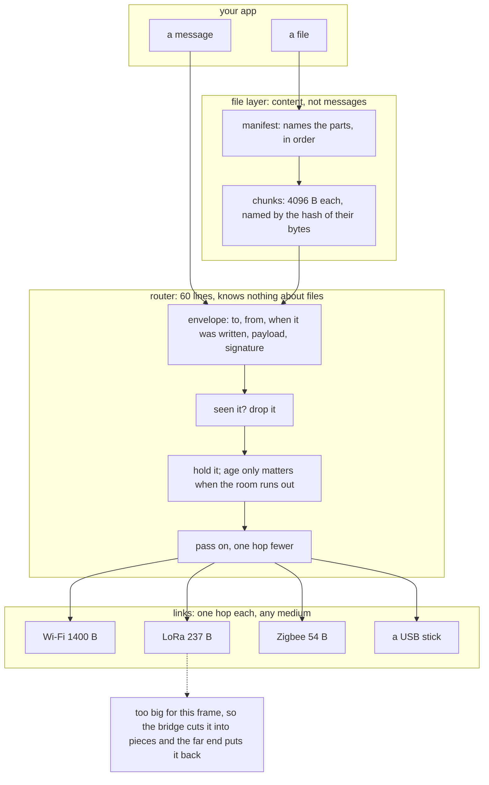
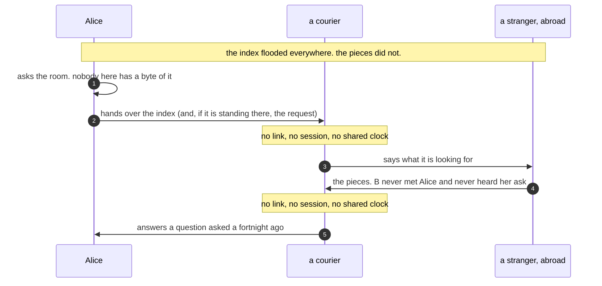

# How it works

SPORE nodes pass signed envelopes to each other whenever they can reach one
another — over Wi-Fi, a cable, a shared folder, Bluetooth, sound, or radio.
No node needs to be always-on, and no server sits in the middle.

<h2 class="text-h5">Your device is the address</h2>

An address is the hash of a public key, not an account.
There is nothing to sign up for and nothing a company can suspend.

<a href="spec.html#1-identity--addressing">Address format →</a>

<h2 class="text-h5">Delivery is store-and-forward</h2>

Devices hold envelopes they haven't delivered yet and
pass them on when they meet another node, so a message still arrives after
you've been offline.

Nobody plans the route. A node drops anything it has
already seen, keeps the rest until it needs the room, and passes each one on with a
hop count one lower — so copies spread outward and die out instead of looping.
Sending is how routes are found: the first copy to arrive teaches everyone
along the way which direction the sender lies in, and replies come back that
way until the path stops working, at which point it spreads out again.

Files work the other way round. Their index floods, but
the pieces are only ever sent to someone who asked — and a node asked for a
piece it does not have will go and fetch it, so wanting a file pulls it toward
you across nodes that never had it, without anyone routing a request back to
whoever published it.

<a href="spec.html#5-forwarding-rules-the-entire-router">The forwarding rules →</a>
· <a href="continuity.html">Why this survives outages →</a>

<h2 class="text-h5">Bridges are pluggable</h2>

The envelope format doesn't change between mediums —
the same message crosses Wi-Fi, a USB stick, Bluetooth, an audio modem, or a
radio link.

<a href="bridges.html">Full bridge list →</a>

<h2 class="text-h5">Private by default, public on purpose</h2>

A message to one person is sealed and only they can
read it. A post to an open group travels in the clear, deliberately — that's
what lets a stranger's device carry it forward.

<a href="spec.html#7-crypto--forward-secrecy">Privacy model →</a>

<h2 class="text-h5">Junk mail costs the sender something</h2>

Priority is proof-of-work, not a claim — anyone can mint a
high-priority envelope, but not for free. Congestion control caps how much of a
link any relayed traffic can use, and a node re-checks a stored copy against its
own content hash before trusting it, so tampering after the fact just makes the
copy disappear rather than serve corrupted.

<a href="threat-model.html#4-resources--storage-cpu-battery-bandwidth-spam">What stops flooding →</a>

<h2 class="text-h5">Radio networks become one interface</h2>

Meshtastic, Reticulum, Tor, WireGuard, plain IP — each
already moves bytes across many physical hops. SPORE hands one of them a frame
and treats the whole crossing as a single hop. They aren't rivals to replace;
they're transports it can ride.

<a href="spec.html#bindings--spore-on-everything">Every medium is one of five shapes →</a>

<h2 class="text-h5">A slow radio is still a hop</h2>

Links disagree wildly about how big a frame can be — a
Wi-Fi frame is 1400 bytes, a LoRa one 237, a Zigbee one 54. A bridge whose link
cannot carry a message splits it for that link alone and the far side puts it
back, so the sender never has to know what the far end of the path is made of.
Because a radio drops frames, a few repair pieces go with it: any complete-enough
subset rebuilds the message, and nothing has to be asked for again.

<a href="spec.html#link-fragmentation--crossing-a-hop-that-cannot-carry-the-frame">Link fragmentation →</a>

<h2 class="text-h5">Direct, when a path exists</h2>

For a live chat or file transfer, two nodes can open a
low-latency pipe straight to each other. When no path exists, the message
still gets there — just store-and-forward instead of instant.

<a href="direct.html">How Direct works →</a>

<h2 class="text-h5">One protocol, many runtimes</h2>

A phone, a browser tab, a daemon, or a cheap radio
board all speak the same wire format. Runtimes differ; what they say to each
other doesn't.

<a href="apps.html">Get a node →</a>

<h2>The shape of it</h2>

Four layers, and what each one is allowed to know. The
diagram is generated from the same text that is in the markdown, so it cannot
drift from the description.

Nothing above the router knows which medium it is on, and
nothing below it knows what a file is. That is the whole trick.

<h2>Walked through</h2>

The cards above are the shape. These are four things that
actually happen, with the real numbers — each one is a scenario in the
simulator, so if the behaviour changes the description fails with it.

<h3 class="text-h5">A 4 kB message, over Wi-Fi, then Wi-Fi, then LoRa</h3>

Ada sends Rae 4 kB. The path runs across two Wi-Fi hops
and then a LoRa radio, and Ada has no idea the radio is there.

<ol class="text-muted">
<li>The envelope is about 4 114 bytes signed. Ada's own link takes 1 400, so she
splits it into four pieces of roughly 1 362 and sends those.</li>
<li>Both Wi-Fi hops carry each piece whole.</li>
<li>The node holding the LoRa link cannot: its frames are 237 bytes. It cuts each
arriving piece into six, adds a couple of repair pieces, and sends those. The far
end reassembles before its router ever sees a fragment.</li>
<li>Rae's node puts the four pieces back and checks one signature.</li>
</ol>

54 frames, 25 kB on the wire, first delivery at 130 ms.
Before per-hop splitting existed the same send produced 18 frames, 25 kB, and
<strong>nothing arrived</strong> — the pieces were cut for a link three hops away
and no node on the path could re-cut them.

<h3 class="text-h5">A file three hops away, from someone who has gone home</h3>

Someone published a file. Its index flooded, so everyone
knows it exists; the pieces did not, so nobody between you and the publisher has
them.

<ol class="text-muted">
<li>You ask your neighbour for the pieces. It has none.</li>
<li>Rather than forward your request, it <em>adopts</em> it — it now wants those
pieces itself — and asks its own neighbours. That repeats, up to a depth limit.</li>
<li>Somewhere along the line a node has them. They come back the way the interest
went, and every node that carried them keeps a copy, so the next person on that
path is faster.</li>
</ol>

Nothing routed a request to the publisher, so it works when
the publisher is offline and ten caches are not. A node only ever adopts interest
in pieces some index it already holds names — otherwise "want this id" would be a
request to search the mesh on a stranger's behalf.

And if you close the app halfway through, those adopted
wants unwind: you tell your neighbour you have stopped, it stops, and it tells
the next one. A neighbour that watches you walk out of range does the same
without being told. Only a node that vanishes with no warning at all leaves
anything behind, and that lapses on its own — which is deliberate, because on a
sneakernet the person carrying the file really might be fifteen minutes away.

<h3 class="text-h5">A want that crosses an ocean in a pocket</h3>

Alice wants a file. She knows it exists — its index reached
her — but nobody within radio range has a single byte of it, and there is no
route to anyone who does. She asks anyway. Nothing answers.

A courier is flying out that week, and takes a copy of the
index with him on a USB key.

<ol class="text-muted">
<li>In another country he meets a mesh he has never seen before, full of people
who never met Alice and never heard her ask. His node says what it is looking
for.</li>
<li>Somebody there has the file. It has no idea who wants it or why — the index
names the pieces, the pieces match, so it hands them over.</li>
<li>He flies home and meets Alice. Now <em>he</em> is the one with the file, and
her original question — asked to an empty room two weeks earlier — is finally
answered by a neighbour.</li>
</ol>

<strong>What actually travelled was the index, not the
question.</strong> A request in SPORE is a one-hop thing: it is spoken to whoever
is present, answered or not, and forgotten. It cannot be saved to a USB key
because there is nothing to save. But the index <em>is</em> an ordinary stored
message, it is what makes a file's pieces legal to ask for, and anyone holding
one can ask anywhere. Carrying the index is carrying the demand — which is why
the small index floods and the large pieces do not.

<strong>Alice's actual request can travel too.</strong> If
the courier is standing there when she asks, his node can take the job: it
remembers the specific pieces she wanted, keeps that through a flat battery and a
border, and re-states it every few minutes wherever it happens to be. A stranger
abroad answers a question asked on another continent by someone who left. The
courier never wanted the file and never learns who did — it remembers
<em>what</em> was asked, not <em>who</em> asked, which is also why the memory is
safe to write to a disk that might be read later.

<strong>Being a courier is a setting, not a job.</strong>
Every node keeps what it is handed until it runs out of room, and only then does
it ask how old anything is. A node willing to carry a month of history simply
keeps things its neighbours have already thrown out, and hands them to whoever it
meets. Nothing in the message knows it is being couriered, and nothing on the wire
tells you which nodes are doing it.

It keeps that promise for as long as the file could still
turn up, and not a second longer. The pieces die on the publisher's schedule, so
a want that outlived them would be a search for bytes nobody will serve — the
kind of standing request that costs every node it touches and helps no one.

Nobody in this story needed a route, an account, or the
publisher, who may have been offline throughout. What the journey <em>does</em>
need is for somebody along the way to still be holding the pieces. Nothing
expires, but nothing is kept forever either: a node discards its oldest cargo
when it runs out of room, so sneakernet range is measured in
<strong>how much the people on the route are willing to carry</strong>, not in
distance. Travel slowly enough and the courier arrives holding an index for a
file nobody kept.

<h3 class="text-h5">A small file, with no round trip at all</h3>

A 2 kB note is published. The index goes out, and the first
few pieces go with it — enough that the whole file arrives in one shot. The
receiver has nothing left to ask for, so it asks for nothing.

How many pieces ride along is the sender's choice alone.
The receiver ignores what it already has and asks for the rest either way, so the
two ends never have to agree, and a node that would rather not spend the airtime
can send none.

<h3 class="text-h5">A message on a link that drops one frame in ten</h3>

A 900-byte envelope over a 237-byte radio is five pieces,
and all five have to arrive — so a link losing 10% of frames loses closer to half
of messages. Adding one repair piece takes that from 54% delivered to 66%, two to
88%, and four to nearly all of them. How many go out is decided by what the link
is actually losing rather than by a fixed fraction, so a clean link sends none.

Repair, rather than asking again, because asking needs a
way back. A one-way radio has none, and on a shared channel a complaint collides
with the traffic it is complaining about.

<a class="btn" href="developer.html">Developer docs</a>
<a class="btn btn-cancel" href="apps.html">Get a node</a>

