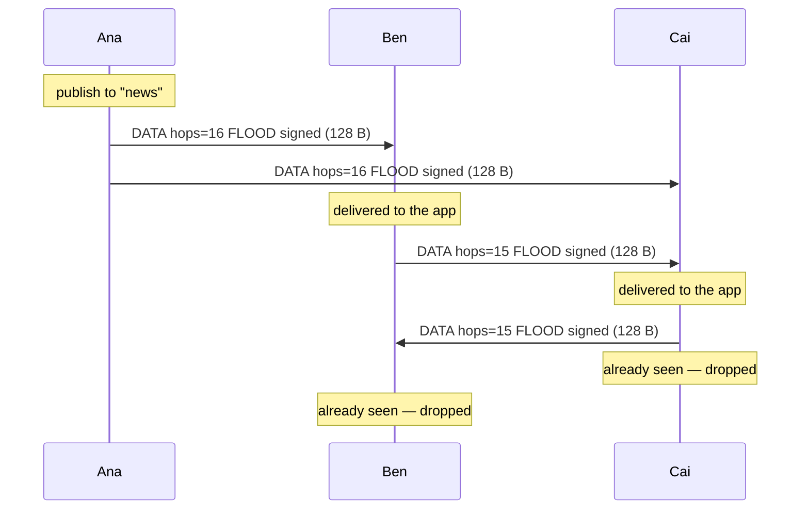
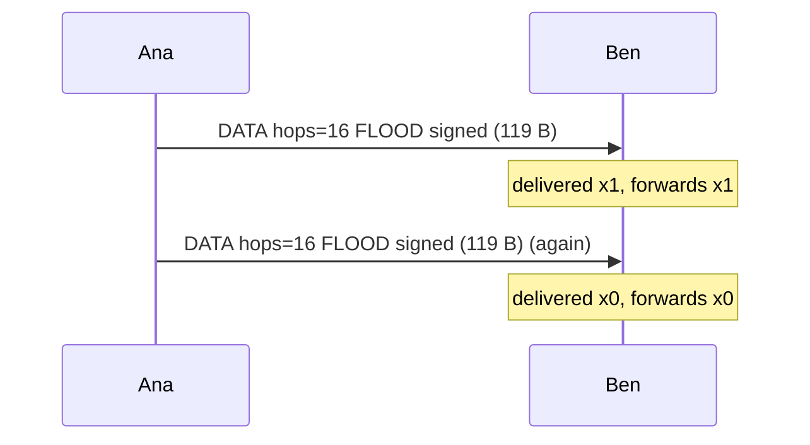
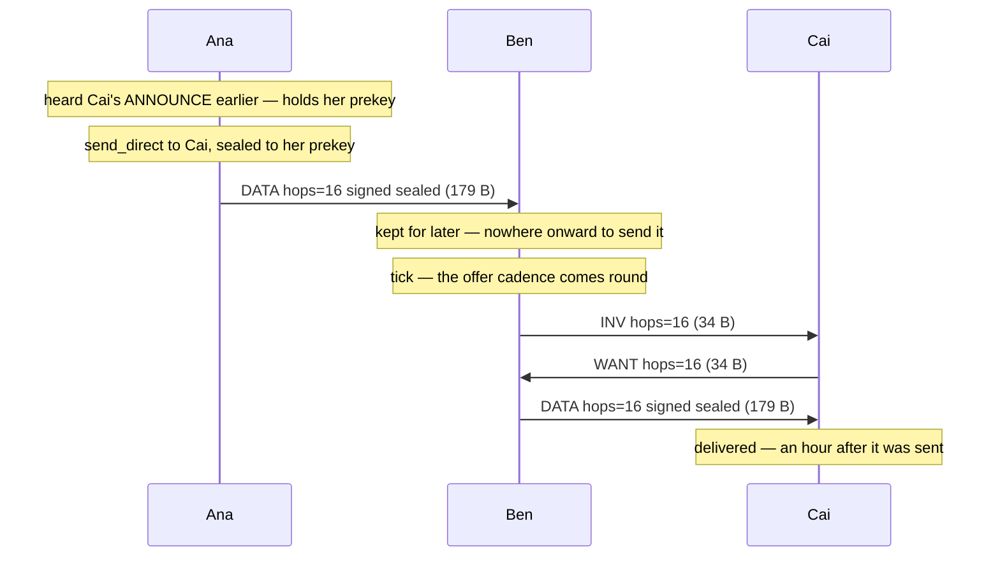
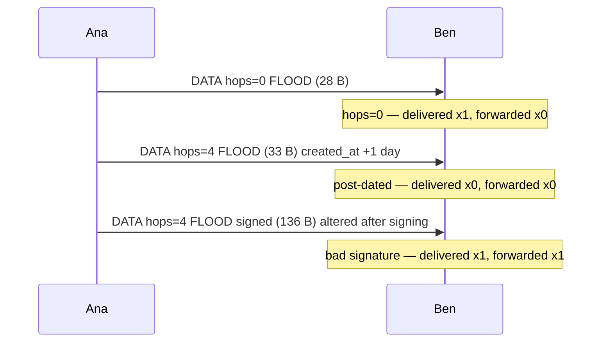

<!-- Generated by `cargo run --release --example kernel_flows`. Do not edit by hand. -->

# Kernel flows

A message moving, in four scenarios. **Every arrow was recorded from a real
`Node` call** — the frames, the byte counts and the decisions are what the
kernel did when this page was generated, not a description of what it should
do.

That distinction has already earned itself here. The forwarding table in
`reference/versioned_vectors.json` was prose until it was observed, and the
prose had `hops` counting the wrong way and claimed a failed signature stops a
relay. Both errors survived review and died on first contact with the code.

These are small and exact — three or four nodes, every frame accounted for.
For behaviour at scale, under loss and with adversaries, see
[Simulations](SIMULATIONS.md); for the crypto and concurrency state machines,
[State machines](STATE_MACHINES.md).

## A public message floods

The ordinary path, and the one every other scenario is a variation of. Worth drawing because the interesting part is not that it arrives — it is that it stops.

- 4 frames, 512 bytes on the wire

- 2 app deliveries, from one publish

- **`hops` counts down**, 16 to 15, and a relayed frame is a *different* frame with one fewer hop. It is still the same message, because the id that dedup uses is computed with `hops` zeroed — without that, every hop count would be a new id and the flood would never terminate.

- **No frame goes back the way it came.** `Forward::Flood` names the interface it arrived on and the transport skips it. The first version of this generator gave every link the same interface id, could not honour that, and drew an arrow straight back to the sender — an arrow no real transport would emit. The diagram was wrong in precisely the way a hand-drawn one would have been.

- The duplicate that *does* arrive is dropped as already seen. On a shared radio most of these never leave the antenna at all: the CSMA layer jitters and cancels when it overhears the same id.

## The same message, arriving twice

Dedup is by envelope id with `hops` zeroed, so two copies that travelled different distances are still one message. Without the zeroing, every hop count would be a different id and a flood would never terminate.

- First arrival: 1 delivered, 1 forwarded. Second: 0 delivered, 0 forwarded.

## Custody: mail for a node that is not on the network

The scenario that makes this a *store-and-forward* protocol rather than a router. Ben cannot read this message and is not its destination, and he carries it anyway.

- Ben is holding 1 sealed envelope he cannot open, for a node he has never met

- Nothing here is a route. Ana never knew where Cai was, Ben never learned, and the message crossed an hour of Cai being switched off.

- **Ben speaks first, and has to.** Cai cannot ask for an id she has never heard of, so custody only completes if the carrier offers. That offer comes from `tick` on a cadence rather than from an event, because "a neighbour has arrived" is not something a node can observe — an interface coming up does not mean anyone is listening, and on broadcast media there is no event at all.

## What the kernel refuses, and what it carries anyway

The decisions that are easiest to get backwards. Two of these were wrong in my own prose before they were observed.

- `hops` counts **down** and forwarding stops at zero — the frame is still for us, it just stops here.

- A post-dated envelope is refused at admission. Accepting one would let a sender outrank every honest envelope at eviction, which is a cheap way to evict a node's whole store.

- **A bad signature does not stop a relay**, and that is the rule rather than a gap (SPEC section 5: verify before binding trust state, do not verify to forward). What it costs the sender is attribution — the envelope binds no path and names no neighbour. An implementation that "hardened" by dropping it would also drop every envelope it merely lacks the key for, which is most of them.

