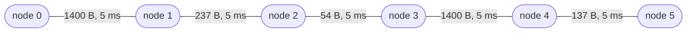
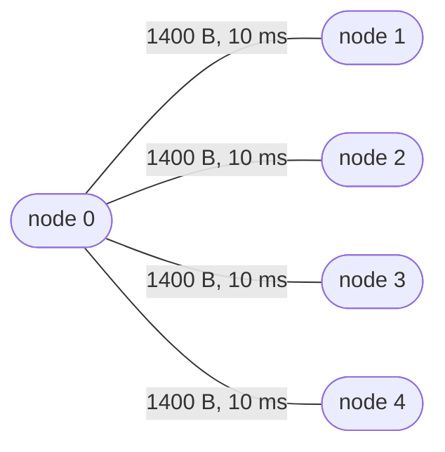
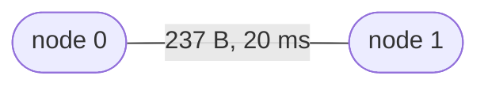

# Simulations

*This page is generated:* `cargo run --release --example spore_sim -- markdown > docs/SIMULATIONS.md`.
CI fails if it is stale, so every number below came out of the run that wrote it.

`examples/spore_sim.rs` drives the **real** crate — `Node::on_rx` and `Node::send`, exactly as a bridge
does — over a seeded event queue. What it measures is SPORE, not a model of SPORE. Every node is built
with `Node::from_seed`, every coin comes from one seeded LCG, and ties break on a monotonic sequence
number, so a run is reproducible from its seed and a metric that moves means the protocol moved.

**The scenario that matters most is the one that fails.** `mixed-mtu` is reported rather than asserted
because it *is* a bug, and failing the build on a known bug teaches people to ignore the build. If it
ever flips to delivered, that is a result.

Why generated at all: a hand-written page is a claim about numbers nobody re-checked. That is not
hypothetical here — "one repair symbol takes 10% loss to 90%" sat in three documents for months when
the measured figure was 66%, because the scenario behind it is reported rather than asserted and
nothing compared the prose to a run.

## At a glance

| scenario | result | what it measures |
|---|---|---|
| [`line`](#line) | 1 of 1 (100%) | Control: five nodes in a line, one MTU, no loss |
| [`mixed-mtu`](#mixed-mtu) | 0 of 1 (0%) | A Wi-Fi island bridged to a LoRa hop with no per-hop splitting — the case the old design silently could not serve, kept as a red line rather than deleted |
| [`mixed-mtu-clamped`](#mixed-mtu-clamped) | 0 of 1 (0%) | The same, with every node clamped to its own narrowest link: the fix that does not work, because the sender owns none of the narrow hop |
| [`mixed-mtu-linkfrag`](#mixed-mtu-linkfrag) | 1 of 1 (100%) | The same topology with link fragmentation on |
| [`mtu-staircase`](#mtu-staircase) | 1 of 1 (100%) | One envelope down a staircase of MTUs — 1400, 237, 54, 1400, 137 — with no node told what the rest of the path is made of |
| [`lossy-mesh-0pct`](#lossy-mesh-0pct) | 99 of 99 (100%) | A hundred nodes in a random graph |
| [`lossy-mesh-10pct`](#lossy-mesh-10pct) | 99 of 99 (100%) | A hundred nodes in a random graph |
| [`partition`](#partition) | 1 of 1 (100%) | Two clusters joined by a single node, with loss |
| [`file-multihop`](#file-multihop) | 1 of 1 (100%) | A file three hops from its only seeder, with no chunk in any store between |
| [`fetch-abandoned`](#fetch-abandoned) | 1 of 1 (100%) | A fetcher that stops wanting a file, three ways: it vanishes, it cancels, or its link drops |
| [`push-2chunk-budget2`](#push-2chunk-budget2) | 1 of 1 (100%) | A publisher with four neighbours, one of whom wants the file |
| [`push-10chunk-budget2`](#push-10chunk-budget2) | 1 of 1 (100%) | A publisher with four neighbours, one of whom wants the file |
| [`linkfrag-loss-0pct`](#linkfrag-loss-0pct) | 200 of 200 (100%) | A 900-byte envelope over a 237-byte radio, 200 trials |
| [`linkfrag-loss-10pct`](#linkfrag-loss-10pct) | 108 of 200 (54%) | A 900-byte envelope over a 237-byte radio, 200 trials |
| [`linkfrag-5pct-repair1`](#linkfrag-5pct-repair1) | 167 of 200 (83%) | The same link with erasure repair symbols added, to measure what they actually buy |
| [`linkfrag-10pct-repair1`](#linkfrag-10pct-repair1) | 132 of 200 (66%) | The same link with erasure repair symbols added, to measure what they actually buy |
| [`linkfrag-20pct-repair1`](#linkfrag-20pct-repair1) | 94 of 200 (47%) | The same link with erasure repair symbols added, to measure what they actually buy |
| [`linkfrag-10pct-repair2`](#linkfrag-10pct-repair2) | 175 of 200 (87%) | The same link with erasure repair symbols added, to measure what they actually buy |
| [`hop-limit-17`](#hop-limit-17) | 1 of 1 (100%) | A line of n nodes and one message end to end |
| [`hop-limit-19`](#hop-limit-19) | 0 of 1 (0%) | A line of n nodes and one message end to end |
| [`malicious-want-depth8`](#malicious-want-depth8) | 8 of 24 (33%) | One WANT forged with a deeper hop budget than policy allows, on a line longer than that policy |
| [`malicious-want-depth255`](#malicious-want-depth255) | 8 of 24 (33%) | One WANT forged with a deeper hop budget than policy allows, on a line longer than that policy |

## line

Control: five nodes in a line, one MTU, no loss. If this fails, nothing else means anything.

**5 nodes, 4 links** · no link fragmentation

| measured | |
|---|---|
| delivered | **1 of 1** |
| frames sent | 4 |
| bytes sent | 524 |
| dropped, frame too big for the link | 0 |
| dropped by link loss | 0 |
| first delivery | 40 ms |

control: 5-node line, uniform MTU

## mixed-mtu

A Wi-Fi island bridged to a LoRa hop with no per-hop splitting — the case the old design silently could not serve, kept as a red line rather than deleted.

**4 nodes, 3 links** · no link fragmentation

| measured | |
|---|---|
| delivered | **0 of 1** |
| frames sent | 1 |
| bytes sent | 4114 |
| dropped, frame too big for the link | 1 |
| dropped by link loss | 0 |

wifi island bridged to LoRa; M11-D must flip reached to 1

## mixed-mtu-clamped

The same, with every node clamped to its own narrowest link: the fix that does not work, because the sender owns none of the narrow hop.

**4 nodes, 3 links** · no link fragmentation

| measured | |
|---|---|
| delivered | **0 of 1** |
| frames sent | 1 |
| bytes sent | 4114 |
| dropped, frame too big for the link | 1 |
| dropped by link loss | 0 |

each node clamped to its own narrowest link; sender still owns none of the narrow hop

## mixed-mtu-linkfrag

The same topology with link fragmentation on. The M11-D acceptance test.

**4 nodes, 3 links** · link fragmentation on

| measured | |
|---|---|
| delivered | **1 of 1** |
| frames sent | 24 |
| bytes sent | 12489 |
| dropped, frame too big for the link | 0 |
| dropped by link loss | 0 |
| first delivery | 130 ms |

same topology and message, link fragmentation on

## mtu-staircase

One envelope down a staircase of MTUs — 1400, 237, 54, 1400, 137 — with no node told what the rest of the path is made of. Delivery must not depend on the order the links come in.

**6 nodes, 5 links** · link fragmentation on

| measured | |
|---|---|
| delivered | **1 of 1** |
| frames sent | 37 |
| bytes sent | 5294 |
| dropped, frame too big for the link | 0 |
| dropped by link loss | 0 |
| first delivery | 25 ms |

crossed five links of five different widths, splitting and reassembling at each

## lossy-mesh-0pct

A hundred nodes in a random graph. Does a damped flood still reach everyone when links drop frames?

**100 nodes, 198 links** · no link fragmentation

*Not drawn: 100 nodes in a random graph, 0 of 198 links dropping frames. The shape is not the
             point — that it is arbitrary is.*

| measured | |
|---|---|
| delivered | **99 of 99** |
| frames sent | 297 |
| bytes sent | 39798 |
| dropped, frame too big for the link | 0 |
| dropped by link loss | 0 |

100 nodes, no loss

## lossy-mesh-10pct

A hundred nodes in a random graph. Does a damped flood still reach everyone when links drop frames?

**100 nodes, 197 links** · no link fragmentation

*Not drawn: 100 nodes in a random graph, 197 of 197 links dropping frames. The shape is not the
             point — that it is arbitrary is.*

| measured | |
|---|---|
| delivered | **99 of 99** |
| frames sent | 295 |
| bytes sent | 39530 |
| dropped, frame too big for the link | 0 |
| dropped by link loss | 20 |

100 nodes, 10% loss

## partition

Two clusters joined by a single node, with loss. Does a partition heal through one bridge, and what does it cost?

**11 nodes, 10 links** · no link fragmentation

| measured | |
|---|---|
| delivered | **1 of 1** |
| frames sent | 10 |
| bytes sent | 1290 |
| dropped, frame too big for the link | 0 |
| dropped by link loss | 0 |
| first delivery | 144 ms |

two 5-node clusters joined by one bridge, 5% loss

## file-multihop

A file three hops from its only seeder, with no chunk in any store between. The recursive-pull acceptance test.

**4 nodes, 3 links** · link fragmentation on

| measured | |
|---|---|
| delivered | **1 of 1** |
| frames sent | 13 |
| bytes sent | 12269 |
| dropped, frame too big for the link | 0 |
| dropped by link loss | 0 |

a file crossed three hops; the middle nodes cached what they carried

## fetch-abandoned

A fetcher that stops wanting a file, three ways: it vanishes, it cancels, or its link drops. Measures what each leaves behind.

**4 nodes, 3 links** · link fragmentation on

| measured | |
|---|---|
| delivered | **1 of 1** |
| frames sent | 0 |
| bytes sent | 0 |
| dropped, frame too big for the link | 0 |
| dropped by link loss | 0 |

interests still open across the relays — vanished: 30, cancelled: 0, link dropped: 0

## push-2chunk-budget2

A publisher with four neighbours, one of whom wants the file. Weighs what a push saves the fetcher against what it costs everyone else.

**5 nodes, 4 links** · link fragmentation on

| measured | |
|---|---|
| delivered | **1 of 1** |
| frames sent | 28 |
| bytes sent | 33776 |
| dropped, frame too big for the link | 0 |
| dropped by link loss | 0 |

0 round trips for the one fetcher; 25248 B sitting in three neighbours who never asked

## push-10chunk-budget2

A publisher with four neighbours, one of whom wants the file. Weighs what a push saves the fetcher against what it costs everyone else.

**5 nodes, 4 links** · link fragmentation on

| measured | |
|---|---|
| delivered | **1 of 1** |
| frames sent | 36 |
| bytes sent | 42790 |
| dropped, frame too big for the link | 0 |
| dropped by link loss | 0 |

2 round trips for the one fetcher; 942 B sitting in three neighbours who never asked

## linkfrag-loss-0pct

A 900-byte envelope over a 237-byte radio, 200 trials. Five pieces, all of which must arrive, so a little frame loss costs a lot of envelopes.

**2 nodes, 1 links** · link fragmentation on

| measured | |
|---|---|
| delivered | **200 of 200** |
| frames sent | 1000 |
| bytes sent | 208400 |
| dropped, frame too big for the link | 0 |
| dropped by link loss | 0 |

900 B over a 237-byte link, no loss

## linkfrag-loss-10pct

A 900-byte envelope over a 237-byte radio, 200 trials. Five pieces, all of which must arrive, so a little frame loss costs a lot of envelopes.

**2 nodes, 1 links** · link fragmentation on

| measured | |
|---|---|
| delivered | **108 of 200** |
| frames sent | 1000 |
| bytes sent | 208400 |
| dropped, frame too big for the link | 0 |
| dropped by link loss | 103 |

900 B over a 237-byte link, 10% frame loss

## linkfrag-5pct-repair1

The same link with erasure repair symbols added, to measure what they actually buy.

**2 nodes, 1 links** · link fragmentation on · 1 forced repair symbols

| measured | |
|---|---|
| delivered | **167 of 200** |
| frames sent | 1200 |
| bytes sent | 209800 |
| dropped, frame too big for the link | 0 |
| dropped by link loss | 55 |

900 B over a 237-byte link, erasure-coded repair

## linkfrag-10pct-repair1

The same link with erasure repair symbols added, to measure what they actually buy.

**2 nodes, 1 links** · link fragmentation on · 1 forced repair symbols

| measured | |
|---|---|
| delivered | **132 of 200** |
| frames sent | 1200 |
| bytes sent | 209800 |
| dropped, frame too big for the link | 0 |
| dropped by link loss | 122 |

900 B over a 237-byte link, erasure-coded repair

## linkfrag-20pct-repair1

The same link with erasure repair symbols added, to measure what they actually buy.

**2 nodes, 1 links** · link fragmentation on · 1 forced repair symbols

| measured | |
|---|---|
| delivered | **94 of 200** |
| frames sent | 1200 |
| bytes sent | 209800 |
| dropped, frame too big for the link | 0 |
| dropped by link loss | 225 |

900 B over a 237-byte link, erasure-coded repair

## linkfrag-10pct-repair2

The same link with erasure repair symbols added, to measure what they actually buy.

**2 nodes, 1 links** · link fragmentation on · 2 forced repair symbols

| measured | |
|---|---|
| delivered | **175 of 200** |
| frames sent | 1400 |
| bytes sent | 211200 |
| dropped, frame too big for the link | 0 |
| dropped by link loss | 146 |

900 B over a 237-byte link, erasure-coded repair

## hop-limit-17

A line of n nodes and one message end to end. Measures how far flooding alone reaches.

**17 nodes, 16 links** · no link fragmentation

*Not drawn: 17 nodes in a random graph, 0 of 16 links dropping frames. The shape is not the
             point — that it is arbitrary is.*

| measured | |
|---|---|
| delivered | **1 of 1** |
| frames sent | 16 |
| bytes sent | 1936 |
| dropped, frame too big for the link | 0 |
| dropped by link loss | 0 |
| first delivery | 32 ms |

reached the far end

## hop-limit-19

A line of n nodes and one message end to end. Measures how far flooding alone reaches.

**19 nodes, 18 links** · no link fragmentation

*Not drawn: 19 nodes in a random graph, 0 of 18 links dropping frames. The shape is not the
             point — that it is arbitrary is.*

| measured | |
|---|---|
| delivered | **0 of 1** |
| frames sent | 17 |
| bytes sent | 2057 |
| dropped, frame too big for the link | 0 |
| dropped by link loss | 0 |

hop budget exhausted before the far end — by flooding. pull would still get there

## malicious-want-depth8

One WANT forged with a deeper hop budget than policy allows, on a line longer than that policy. Measures how far a stranger can make a mesh hunt.

**24 nodes, 23 links** · no link fragmentation

*Not drawn: 24 nodes in a random graph, 0 of 23 links dropping frames. The shape is not the
             point — that it is arbitrary is.*

| measured | |
|---|---|
| delivered | **8 of 24** |
| frames sent | 9 |
| bytes sent | 315 |
| dropped, frame too big for the link | 0 |
| dropped by link loss | 0 |

one WANT claiming depth 8: 8 of 24 nodes now hold an interest nobody can serve

## malicious-want-depth255

One WANT forged with a deeper hop budget than policy allows, on a line longer than that policy. Measures how far a stranger can make a mesh hunt.

**24 nodes, 23 links** · no link fragmentation

*Not drawn: 24 nodes in a random graph, 0 of 23 links dropping frames. The shape is not the
             point — that it is arbitrary is.*

| measured | |
|---|---|
| delivered | **8 of 24** |
| frames sent | 9 |
| bytes sent | 315 |
| dropped, frame too big for the link | 0 |
| dropped by link loss | 0 |

one WANT claiming depth 255: 8 of 24 nodes now hold an interest nobody can serve

