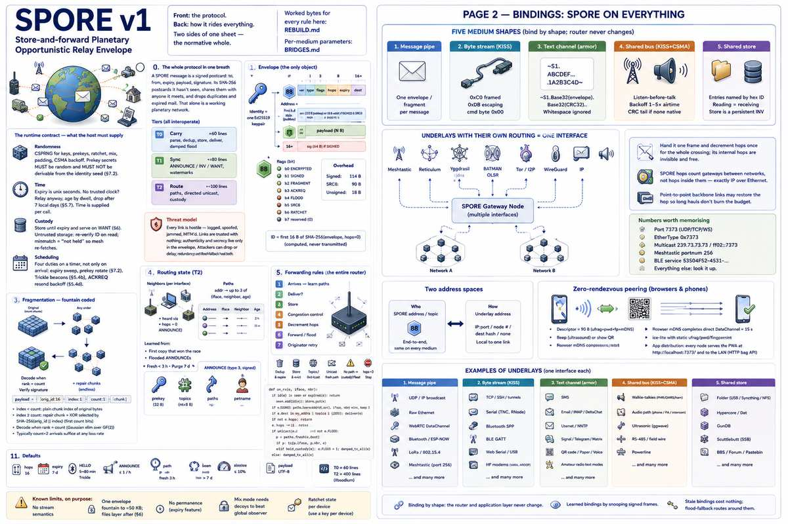
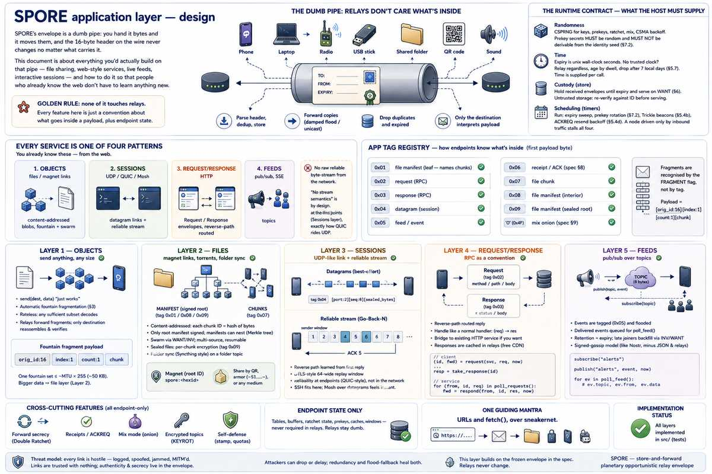

# SPORE v1 — the technical reference

One document: **the wire format** (normative, frozen), **the application layer**
built on it (conventions, no relay support required), and **where the core runs**
(the portable kernel and what a host owes it).

Worked bytes for every rule here: [Rebuild guide](REBUILD.md). Per-medium
parameters (≈70 media): [Bridges](BRIDGES.md). Adversaries in depth, with
residual risk stated per row: [Threat model](THREAT_MODEL.md).

Parts 1 and 2 are **normative** — implement them and you are wire-compatible.
Parts 3 and 4 are **conventions and architecture**: change them freely without
breaking a peer.

<p align="center"><a href="spore-v1.png"></a></p>

## 0. The whole protocol in one breath

A SPORE message is a **signed postcard**: to, from, expiry, payload, signature.
Its SHA-256 fingerprint is its identity. Every node keeps postcards it hasn't
seen, hands copies to anyone it meets who wants them, and drops duplicates and
expired mail. That alone is a working planetary network. Of the four hard
features — forward secrecy, fountain fragmentation, congestion control,
anonymity — only congestion control touches the router; the rest live inside
payloads.

**Tiers** (all interoperate): **T0 carry** ≈60 lines: parse, dedup, store,
deliver, damped flood · **T1 sync** +≈80: ANNOUNCE/INV/WANT, watermarks ·
**T2 route** +≈100: paths, directed unicast, custody. Endpoint extras (ratchet,
fountain, mix) never change relays.

**Threat model, stated once:** every link is hostile — logged, spoofed, jammed,
MITM'd. Links are trusted with *nothing*; authenticity and secrecy live only in
the envelope. Attackers can drop or delay; redundancy and flood-fallback heal
both.

## The runtime contract — what the host must supply

The protocol is pure; it holds no OS. A conformant node needs four things from
whatever runs it, and gets them wrong silently if it does not ask.

- **Randomness.** A CSPRNG for the signing seed, prekey secrets, ratchet keys,
  mix padding and decoys, and CSMA backoff. **Prekey secrets MUST be random and
  MUST NOT be derivable from the identity seed** (§7.2).
- **Time.** Expiry is wall-clock unix seconds. A node with no trusted clock MUST
  NOT drop on expiry: it relays regardless, ages by dwell, and drops after 7
  local days (§5.7). Time is supplied per call, never read by the protocol.
- **Custody.** Received envelopes are held until expiry and served on WANT (§6).
  The bytes may live anywhere — memory, disk, flash, remote store. Custody is
  untrusted storage: **an entry read back MUST be re-verified against its ID
  before it is served**, and a mismatch MUST read as "not held" so the mesh
  re-fetches. An ID is the hash of its bytes, so this is always checkable.
- **Scheduling.** Four duties MUST run on a timer, not only on arrival: expiry
  sweep, prekey rotation (§7.2), Trickle beacons (§5.4b), and ACKREQ resend
  backoff (§5.4d). **A node driven only by inbound traffic stalls all four** — it
  stops pruning, stops advancing forward secrecy, and never retries. Three are
  pure and belong to the protocol (here, `Node::tick`); **beaconing is the
  runtime's own timer**, because deciding to emit on an interface lives on the
  far side of the transport boundary. A runtime that drives only the core's tick
  never beacons, and is not conformant.

**Transport is not a fifth nutrient — it is the boundary the other four are
stated across.** The protocol names interfaces but never opens one; bytes in and
out are the edge. See Part 4 for the model and Page 2 for the shapes.

## 1. Identity & addressing

Identity = one Ed25519 keypair. **Address** = first 8 B of SHA-256(pubkey).
**Topic** = first 8 B of SHA-256(UTF-8 string). No global namespace; exchange
keys by QR/paper/voice. Petnames are local.

## 2. Envelope (the only object; big-endian; fixed part = 16 B)

```
off len field
0   1   ver    = 0x01  (exact match to decode; see "Versioning and unknown bits")
1   1   type   0=DATA 1=INV 2=WANT 3=ANNOUNCE
2   1   flags  b0 ENCRYPTED b1 SIGNED b2 FRAGMENT b3 ACKREQ b4 FLOOD b5 SRC8
               b6 RATCHET (0x40, §7)   b7 unassigned in v1
3   1   hops   remaining relays (default 16; relays clamp incoming to ≤ 16)
4   4   expiry unix seconds u32 (stores clamp horizon to 30 d)
8   8   dest   address | topic | 0x00×8 = public
-- if SIGNED: src = 32-B pubkey, or 8-B address if SRC8 --
    2   plen   u16
    N   payload
    64  sig    Ed25519 over all bytes above with hops zeroed
-- unsigned: no src, no sig; rides last everywhere --
```

**Versioning and unknown bits.** `ver` is an exact match: a decoder MUST reject
any `ver != 0x01` rather than guess, so v2 is a hard fork and not a negotiation.
**Flags are the extension point instead.** Bits defined in v1 MUST be interpreted
as named; a bit a node does not understand MUST be ignored, MUST be forwarded
unchanged, and MUST NOT cause a drop. That is what makes b7 usable later without
a version bump — and it is why the table above says *unassigned*, not *must be
zero*: forbidding the bit and relying on it as the agility hatch cannot both be
true, and the forwarding rule is the one the code implements.

**ID** = first 16 B of SHA-256(envelope, hops zeroed); computed, never
transmitted (except inside INV/WANT/frag/ack). Zeroing `hops` is what keeps the
ID stable while relays decrement the TTL.

Overhead: 114 B signed, 90 B SRC8, 18 B unsigned. **SRC8** only toward peers that
provably hold your key; relays never verify — endpoints do (see "Verify before
binding trust state", Part 3). **No priority field: priority is bought, not
claimed** (§10 stamp).

## 3. Fragmentation — fountain coded

payload = `[orig_id:16][index:1][count:1][chunk]`; all chunks equal size (pad the
original; the envelope self-delimits). Fragments are ordinary envelopes (own IDs,
same dest/expiry).

- **index < count**: plain chunk *index* of the original envelope's bytes.
- **index ≥ count**: **repair chunk** = XOR of the data chunks selected by the
  first *count* bits of SHA-256(orig_id ‖ index); empty selection → chunk
  (index mod count). The sender can mint endless distinct repair chunks.

Receiver decodes when any received set reaches rank *count* (Gaussian elimination
over GF(2)); typically *count*+2 arrivals suffice at any loss rate, in any order,
even one-way. Verify the reassembled signature; commit only what verifies.
Rateless: works on simplex radio, CW, paper tape.

## 4. Routing state (T2)

- **Neighbors** (per interface): point-to-point peers + anyone heard via hops=0
  ANNOUNCE.
- **Paths**: `addr → up to 3 of (iface, neighbor, age)`. Learned: (a) the **first
  copy** of any new signed envelope raced every path and won — its src is
  reachable via what delivered it; (b) flooded ANNOUNCEs. On broadcast media the
  interface *is* the direction. Fresh < 3 h; purge 7 d (stale entries still guide
  custody).

Path learning is **local and non-transitive**: a node believes only what it has
personally received. The reference build advertises no third-party paths
(`np=0`) and does not parse them on receipt, which bounds wormhole/eclipse to an
attacker's own direct neighbours ([Threat model](THREAT_MODEL.md) ch. 5).

**ANNOUNCE** (type 3, signed): payload =
`[prekey:32][nt:1][topic×8 ea][np:1][(addr:8, age_min:2) ea][petname…]` — your
current encryption prekey (§7), topics you collect, and a path list. Link HELLO =
hops 0; flooded = hops 16.

A node MUST accept any `np` the envelope can hold. A node MAY ignore the path
list, and **the reference build does**: it always sends `np = 0` and skips the
field when parsing, so paths here are learned only from the first copy of signed
traffic and from an ANNOUNCE's own `src`. Third-party path advertisement is
reserved rather than implemented — turning it on is a Sybil and wormhole
analysis, not a parser change.

## 5. Forwarding rules (the entire router)

1. Envelope arrives: ID seen or expired → drop. Add ID (keep ≥ until expiry).
   Learn paths (§4).
2. dest ∈ {my addresses, followed topics, 0×8} → deliver (verify/decrypt per
   flags).
3. Store until expiry. Evict: expired → lowest stamp → largest → oldest. TX
   order: local origin, then stamp, then FIFO.
4. **Congestion control**, four rules: **(a)** token bucket — relayed traffic
   ≤ 10% of each interface's capacity (law on ISM bands, courtesy elsewhere;
   dedup makes dropped relays harmless); **(b)** Trickle timers —
   HELLO/ANNOUNCE interval doubles 5→80 min while nothing new is heard, resets to
   5 on any novelty; **(c)** backpressure — HELLO carries one `busy` byte (queue
   fill); neighbors scale sending by (255−busy)/255 and defer unstamped relays to
   busy peers; **(d)** exponential backoff — FLOOD retries at 30 s ×2, cap 1 h,
   max 5.
5. hops = 0 → stop. Else decrement, then: **topic/0/FLOOD** → damped flood on all
   interfaces (on shared media wait random 1–5× airtime, cancel if the ID is
   overheard ≥ 2×; ≥ 1× for directed) · **unicast + fresh path** → that
   interface/neighbor only · **unicast, no path** → silent, unless you hold
   custody and the path died: set FLOOD, continue.
6. Originator: no receipt (§8) → resend with FLOOD per 4d. Flooding **is** route
   discovery; replies teach reverse paths and heal blackholes. A receipt is the
   only delivery signal: overhearing your own envelope rebroadcast means the mesh
   took it, not that anyone received it, and MUST NOT clear a pending resend.
7. Untrusted clock? Relay regardless of expiry; age by dwell, drop after 7 local
   days.

```
def on_rx(e, iface, nbr):
    if id(e) in seen or expired(e): return
    seen.add(id(e)); store.put(e)
    if e.SIGNED: paths.learn(addr(e.src), iface, nbr)   # first copy wins, keep 3
    if e.dest in my_addrs | topics | {ZERO}: deliver(e)
    if not e.hops: return
    e.hops -= 1
    if unicast(e.dest) and not e.FLOOD:
        p = paths.fresh(e.dest)
        if p: tx(p.iface, p.nbr, e)
        elif held_custody(e): e.FLOOD = 1; damped_tx_all(e)
    else: damped_tx_all(e)
```

## 6. Sync & custody (T1/T2)

On any meeting: ANNOUNCE, then **INV** (concatenated IDs, newest first, filtered
by peer's topics + carriable unicast + per-neighbor watermark), peer replies
**WANT**, send those. INV/WANT: hops=0, unsigned, consumed, never stored or
relayed. Serving WANT is budgeted per interface, or it is a reflection amplifier.

**Custody:** push stored unicast to any peer that *is* the destination or
announces a fresher path. A file or sheet of paper is concatenated envelopes;
import = receive. Every boat, cyclist, or HF skywave contact merges two regions.
That is the WAN.

**Files** are content-addressed: chunks `[0x07][file_id:16][index:4][bytes]`,
indexed by a signed **manifest** `[0x01]…[chunk_id:16 × count]` whose own ID is
the shareable **magnet**. A manifest that outgrows one envelope nests — interior
nodes `[0x08][depth:1]…` name manifests a level down, so the root stays one frame
and one signature at any file size, and only the root is signed (an ID is the
hash of its bytes, so the tree authenticates itself). Sealed to one recipient:
`[0x09][depth:1][hdr_len:2][hdr]…`, `hdr` = the file key + real name sealed to
their prekey, each chunk then encrypted under that key with the chunk index as
nonce. See Part 3 for the layer built on this.

## 7. Crypto & forward secrecy

- **Sign:** Ed25519 (§2).
- **Seal (baseline, one shot):** libsodium `crypto_box_seal` to the recipient's
  newest **prekey** (X25519, from ANNOUNCE, signed there). Zero per-message
  state. Implementations **MUST** hold a prekey ring (§7.2).
- **Sessions: Double Ratchet.** Set `RATCHET` (b6) on an ENCRYPTED DATA envelope
  whose payload is ratchet-shaped rather than one-shot-sealed.
  - *Bootstrap, no handshake:* when both sides know each other's current prekey
    (i.e. after ANNOUNCE), each derives the same root from a static-static X25519
    DH — own current prekey secret × peer's advertised prekey public. The
    numerically lower address is the pair's initiator, with a sending chain
    immediately; the higher is the responder and has no sending chain until it
    receives the initiator's first ratchet message, so its own earlier sends go
    as plain one-shot seals.
  - Bootstrapped once per peer, **never re-seeded** from a later ANNOUNCE.
    Implementations **MUST** settle a due prekey rotation *before* both building
    an ANNOUNCE and bootstrapping from one, or the two sides derive different
    roots.
  - Sessions are local state and need not persist; a restart may lose one and
    re-bootstrap from the next ANNOUNCE.
  - *Payload:* `[dh_pub:32][n:2][pn:2][ct]`, ct = ChaCha20-Poly1305(mk, nonce=n,
    ad=header). On a new `dh_pub`: root,ck_in = KDF(root, DH); on a fresh ratchet
    key: root,ck_out = KDF(root, DH). Each mk = KDF(ck), then dropped. KDF =
    BLAKE2b. A ratchet turn reseeds the chains with new entropy, which is what
    recovers from a compromise.
  - Skipped mks are cached for out-of-order arrival, bounded by **both** count
    (`MAX_SKIPPED_KEYS`) and age, and zeroised on drop. The age bound is the same
    configured value as the prekey lifetime (§7.2) — one knob, so the two windows
    cannot disagree.
  - Compromise leaks nothing older than one ratchet turn.
- **Encrypted topics:** pre-shared key, XChaCha20-Poly1305, 24-B nonce prefixed.
  **Rotation:** flood `KEYROT <newpub>` signed by the old key.

### 7.1 Topic key schedule

`rotate(k) = SHA-256(k ‖ "spore-keyrot-v1")` advances an epoch: forward secrecy,
but a stolen key follows the chain, so it never heals.

**Healing rotation:** draw 32 random bytes `c`, seal a copy to each member's
prekey, everyone folds it in with
`mix(k,c) = SHA-256("spore-topic-mix-v1" ‖ k ‖ c)`. Message =
`[0x01][count:2 BE][80-B sealed box]×count`, no recipient hints (so it does not
enumerate the group); a member trial-decrypts, ≤ 256 boxes. **Mix, never
replace** — so an attacker able to sign as a member cannot cancel an honest
contribution, only append steps to a chain one unreadable step has already made
unknowable. That is post-compromise security: the group heals by operating, with
no detection step.

`key_id(k) = SHA-256("spore-topic-keyid-v1" ‖ k)[..4]` names a key so a receiver
holding several candidates picks the right one. The group has no roster and no
arbiter: members can diverge, and `key_id` makes divergence readable rather than
fatal.

### 7.2 Prekey ring

Up to 16 prekeys, oldest first; the newest is advertised in ANNOUNCE. Mint one
every 24 h and **delete** any secret older than the configured lifetime (the
"offline window", default 7 d); the newest is never deleted, so a node is always
sealable. Opening tries every live entry newest-first, so a sender who last heard
an older ANNOUNCE still reaches you until that secret expires. The nonce mixes
the *recipient's* public key, so an entry stores both halves.

**The requirement that makes it mean anything: prekey secrets MUST be random and
MUST NOT be derivable from the identity seed.** Restoring from a seed recovers
the address, the signing key, and the ability to mint new prekeys — it MUST NOT
recover a deleted secret, or "delete" has no referent.

| Asset | What a restore recovers |
|---|---|
| identity seed | address, signing key, ability to mint *new* prekeys |
| prekey ring | ability to open mail sealed to prekeys that still exist |
| a deleted prekey secret | **nothing — by construction** |

Consequences, each a real cost: `seed()` alone is **not** a whole backup (persist
the ring beside it, or the restored node has no forward secrecy and cannot read
mail sealed to anything it had rotated to); mail sealed to an expired prekey is
unreadable by everyone, including you — that is the feature, not data loss; and a
**backup of the ring defeats the offline window**, as it would for any
forward-secret keystore.

## 8. Receipts (ACKREQ)

Recipient floods a signed DATA to src, payload = `0x06` + orig ID. ACKs also
teach reverse paths. A receipt **MUST** be verified as signed by the destination
it claims to come from: the ID it references is public (it rides in every INV),
so accepting on payload shape alone lets any stranger forge "delivered"
([S-032](SECURITY_FINDINGS.md#s-032)).

The sender re-floods an unacked message on the §5.4d backoff — flooding is route
discovery, so a resend can find a path a blackhole was hiding — and gives up
after the cap. Known simplification: a *lost receipt* is not re-requested, since
a duplicate of the original is deduped before it could re-trigger one.

## 9. Anonymity — mix mode

An **onion** is nested sealed envelopes. Sender picks 2–3 relays that follow topic
`mix` (learned from ANNOUNCEs) and wraps inside-out: each layer = an envelope
addressed to one mix, payload sealed to it = `'O'` + the next full envelope. A mix
decrypts, waits a random Poisson 1–30 s, batches ≥ 3, re-injects the inner
envelope as its own traffic.

- **Sender anonymity:** leave outer layers unsigned; sign only the innermost if at
  all.
- **Recipient anonymity:** innermost dest 0×8, payload sealed — everyone carries,
  one can open.
- **Unlinkability:** pad every onion payload to size classes 256 / 1024 / 4096 B
  so depth never shows; mixes SHOULD emit Poisson decoy onions at roughly their
  real rate.

Honest limit: beats local observers and any subset of mixes; a **global** passive
observer is only beaten while decoy traffic flows. Mix mode is opt-in and never
silent — confidential is not the same as anonymous.

## 10. Self-defense (local policy)

Everything here is **local policy**: a node's own choice, never negotiated, never
a wire change.

**Stamp — the only cross-node priority.** *n* leading zero bits of an envelope's
ID = class *n*, mined by grinding a nonce in the payload. Priority is therefore
**bought, not claimed**: there is no priority field to forge (§2), and the proof
*is* the ID, so any node verifies it with one hash, no state, on every medium.
Each class costs 2× the last. The stamp drives TX order and eviction order
(§5.3), and gates the §5.4c backpressure bypass — which requires at least 16
leading zero bits, not merely a non-zero stamp, since class 1 is about two hashes'
work and would let anyone ignore a busy peer for free.

**What the stamp does not do:** it prices *one envelope*. It is not bound to an
identity, so it says nothing about how many identities an attacker mints — it is
not Sybil resistance, and nothing here claims to be. It raises cost; it does not
cap it.

**Quotas.** Per-source and per-topic byte budgets, applied whether or not a frame
is signed. Unsigned mail rides last.

**Trust.** Prefer keys you have met or your operator vouches for; confirm a peer
out of band by address emoji-hash. No topic is privileged: there is no string a
sender can choose that buys priority, quota, or a relay it would not otherwise
get.

## 11. Defaults

hops 16 · expiry 7 d · HELLO 5→80 min Trickle · ANNOUNCE flood ≤ 1/h · path fresh
3 h · seen-set ≥ 30 d received · prekey mint 24 h, offline window 7 d · relay
airtime ≤ 10% · payload UTF-8. T0 ≈ 60 lines; full T2 ≈ 400 with libsodium.

**Known limits, on purpose:** no stream semantics; one envelope fountain-fragments
to ≈50 KB and larger objects ride the file layer (§6), bounded by storage and by
what each link agrees to carry, not by the format; no permanence (expiry is a
feature); mix-mode anonymity needs flowing decoys to beat a *global* observer;
ratchet state is per-device — give each device its own key.

## What stops what

Every mechanism above answers a specific adversary. This is the index; the full
analysis, with a residual-risk line on every row, is
[Threat model](THREAT_MODEL.md).

| Threat | What answers it | Where |
|---|---|---|
| Read the content | seal / ratchet / topic PSK | §7 |
| Forge a sender | Ed25519 over the envelope, hops zeroed | §2 |
| Replay an old frame | content-addressed ID + seen-set + expiry | §5.1 |
| Forge a path or neighbour binding | verify the signature *before* binding trust state | §4, Part 3 |
| Forge "delivered" | receipt must be signed by the destination | §8 |
| Flood cheaply | stamp PoW, per-source quotas | §10 |
| Crowd out a link | relayed traffic ≤ 10% airtime; backpressure byte | §5.4a, §5.4c |
| Amplify via WANT | per-interface service budget | §6 |
| Conscript a slow link into hauling files | per-interface bulk budget (chunks only) | Part 3 |
| Exhaust memory | every table bounded, eviction order stated | §5.3 |
| Serve tampered bytes from custody | re-verify each entry against its ID on read | §6 |
| Flatten a battery by beaconing | Trickle 5→80 min | §5.4b |
| Learn who talks to whom | mix mode, opt-in | §9 |
| Keep using a copied group key | healing rotation (`contribute`/`absorb`) | §7.1 |
| Read old mail after seizing a device | prekey ring deletion, 7 d | §7.2 |

**Not solved, stated plainly.** Identity-key revocation: none exists; a stolen
signing seed is trusted until people stop trusting the address out of band. Sybil
resistance: nothing counts identities today. A hostile relay simply *dropping*
traffic: bounded by redundancy, never prevented — you cannot cryptographically
force a relay to forward. Jamming and physical-layer denial: out of scope at this
layer.

---

# Page 2 — Bindings: SPORE on everything

**Every medium on Earth has one of five shapes.** Bind by shape; the router never
changes. This page is normative for the *shapes*; the per-medium parameter tables
(frequencies, port numbers, UUIDs, MTUs, firmware caveats) are the manual,
[Bridges](BRIDGES.md).

1. **Message pipe** → one envelope/fragment per message.
2. **Byte stream** → KISS: frames delimited `0xC0`, escape `0xC0`→`0xDB 0xDC`,
   `0xDB`→`0xDB 0xDD`, command byte `0x00`.
3. **Text channel** → armor: `~S1.` + Base32(envelope) + `.` +
   Base32(SHA-256[0:4]) + `~`, whitespace ignored.
4. **Shared bus** → KISS + CSMA: listen-before-talk, backoff 1–5× airtime; no
   native CRC → append SHA-256(envelope)[0:4], verify or drop.
5. **Shared store** → write envelopes as entries named by hex ID; reading =
   receiving; the store is a persistent INV.

In this implementation those five collapse to **three driver forms** — `dgram`,
`stream`, `store` — because a message pipe and a shared bus differ only in whether
you listen before talking, and a text channel is a byte stream with an armor codec.

**Underlays with their own routing = ONE interface.** Meshtastic, Reticulum,
Yggdrasil, cjdns, BATMAN/OLSR, Tor/I2P, WireGuard, plain IP — each already moves
bytes across many physical hops. Hand it one frame and decrement `hops` **once**
for the whole crossing; its internal hops are invisible and free. Point-to-point
backbone links may *restore* the hop so long hauls don't burn the budget. SPORE
hops therefore count **gateways between networks**, not hops inside them — exactly
IP over Ethernet. They are transports SPORE rides, not rivals.

**Numbers worth memorising.** Port **7373** (UDP/TCP/WS), the same value as
EtherType `0x7373` and multicast `239.73.73.73` / `ff02::7373`. Meshtastic
portnum **256**. BLE rides the **Nordic UART Service** (`6e400001-…`, RX `…0002`,
TX `…0003`) rather than a SPORE-specific UUID — it is what phones, hobby boards
and RNodes already expose. Everything else: look it up.

**Two address spaces.** *Who* = the SPORE address or topic — end-to-end,
cryptographic, identical on every medium. *How* = the underlay's own naming (a
node number, a destination hash, an `IP:port`, or nothing at all) — local to one
link. A bridge owns exactly one interface and translates between them; the router
never learns underlay addresses, the way an OS's ARP table maps IP→MAC. Bindings
are learned by **snooping signed frames** — a signed envelope proves its own
sender, so no handshake is needed — and a stale binding costs nothing, because
flood-fallback (§5.6) routes around it.

**A link may declare a bulk budget.** Since files are manifest trees they can be
arbitrarily large, so any link can be conscripted into hauling one. An interface
may cap bytes/second of *other people's file chunks* it will relay. Only chunks
count: messages, announces, receipts and manifests always pass, so a paced link
stays a full member of the mesh — it still carries the conversation and still
tells everyone what exists. It declines only to be the pipe, and because chunks
are named by content the fetch just asks again and another path answers.

**Zero-rendezvous peering (browsers & phones).** A WebRTC session reduces to
ufrag(4) + pwd(22) + DTLS fingerprint(32) + mDNS host candidate(16) ≈ **90 B**;
both sides rebuild full SDP from a hardcoded template. Beep that descriptor over
ultrasound or show it as a QR, answer, and the browser's own mDNS completes a
direct DataChannel — no server, no typed IP, ≈15 s. Native nodes run **ice-lite
with static ufrag/pwd/fingerprint**, so their descriptor is a constant you can
print on the box — specified, not built: WebRTC here is browser-only, so the
native half is a [Roadmap](ROADMAP.md) item.

**App distribution:** a native node's HTTP bridge exposes the bag API —
`POST /spore/push`, `GET /spore/inv`, `POST /spore/want`, MIME
`application/x-spore` — on port 7373, to localhost and to the LAN at its IP.
Serving the PWA itself from `/` is the intended end state (the app store is every
node) but is **not implemented**: `bridge::bag` routes the three bag paths and
404s everything else.

---

# Part 3 — The application layer

**The one rule this part is built on: nothing here touches relays.** Every
feature below is a payload convention plus endpoint state — never a change to
what a relay must understand. That is what keeps a 200-byte LoRa packet, a QR
code, or a human reading armor aloud a first-class peer: a relay parses the fixed
header, dedups, stores and forwards, and nothing else. A feature requiring relay
support would have to be rolled out to every medium in lockstep.

<p align="center"><a href="spore-design.png"></a></p>

## App tags — how endpoints tell payloads apart

The frozen header has no port or content-type field. The first payload byte is
the **app tag**, read only by the destination.

| Tag | Meaning |
|---|---|
| `0x01` | file manifest (leaf — names chunks) |
| `0x02` / `0x03` | RPC request / response |
| `0x04` | datagram (session) |
| `0x05` | feed event |
| `0x06` | receipt (§8) |
| `0x07` | file chunk |
| `0x08` | file manifest (interior — names manifests) |
| `0x09` | file manifest (sealed root — per-chunk encryption) |
| `'O'` (0x4F) | mix onion (§9) |

Fragments are the one exception: recognised by the `FRAGMENT` header flag rather
than a tag, and their chunk is a slice of an ordinary already-tagged inner
envelope, so tags and fragmentation compose cleanly.

Every service maps onto one of four patterns — **objects**, **sessions**,
**request/response**, **feeds** — each already a mechanism or a payload
convention. Note what is deliberately absent: a raw reliable byte-stream offered
*by the network*. A stream assumes a live, low-latency, bidirectional path, the
one thing an opportunistic network cannot promise. Reliability exists, but as an
**endpoint** concern — exactly how QUIC builds it on UDP without the network
knowing.

## Objects — send anything, any size

`send(dest, data)` takes any size. Under the MTU it is one envelope; over it,
fountain-fragmented (§3) and reassembled by the destination, signature-checked
before the app sees it. The sender can mint endless repair chunks, so the object
decodes from *any* sufficient subset — simplex radio, CW and paper tape work with
no back-channel. Relays stay dumb: each fragment is an ordinary flooded envelope
with its own ID, and only the destination reassembles. One fountain set is
≤ `mtu`×255 (≈50 KB at defaults); larger data is the file layer's job.

## Files — magnets, trees, swarming

A **manifest** is a signed envelope naming a file's size and its chunks' content
IDs; its own ID is the shareable **magnet** (`spore:<hexid>`, armor, or a QR).
Chunks are fetched from whoever has them and each verifies itself on arrival.

```
manifest = SIGNED [0x01][file_id:16][chunk_size:4][count:4][total_len:8][name][chunk_id:16 × count]
interior = UNSIGNED [0x08][depth:1][file_id:16][chunk_size:4][count:4][total_len:8][name_len:2][id:16 × count]
```

**Manifest trees.** One manifest is one envelope, so it can only name so many
chunks — about 93 KB of file at a 1400-byte MTU. Past that, chunk IDs are grouped
under interior manifests, and those grouped again, until what remains fits the
signed root. At `depth == 0` the IDs name chunks; at `depth > 0` they name
manifests of `depth - 1`. Capacity multiplies by the interior fan-out (~84) per
level, capped at `MAX_DEPTH = 4`:

| depth | capacity at MTU 1400 |
|---|---|
| 0 (one manifest) | 94 KB |
| 1 | 8.1 MB |
| 2 | 679 MB |
| 3 | 57 GB |
| 4 | 4.8 TB |

A file that fits one manifest encodes exactly as it did before trees existed, so
nothing that already works changes.

- **Integrity is free.** The root is signed, and every ID below it — chunk or
  sub-manifest — *is* the hash of the bytes it names, so a forged or corrupt part
  simply never matches. **Only the root is signed**: the hash chain covers the
  rest, which is why interior nodes need no signature and buy back ~96 bytes of
  fan-out each. The magnet is a genuine Merkle root.
- **Swarming is just WANT.** Only the small root floods; everything else is
  pulled. `fetch(magnet)` emits a WANT for the IDs it lacks and any peer holding
  them answers from its store — the existing §6 machinery, untouched.
  Multi-source and resumable, because parts are named by content, not by origin.
- **It resolves top-down.** A WANT frame holds ~86 IDs, and deeper levels are not
  even *nameable* until the levels above arrive, so `fetch` returns one frame's
  worth per call and is called until complete.

**Sealing to one recipient.** `[0x09]` roots encrypt **each chunk on its own**
under a per-file key and seal that key, with the real file name, into the root's
header. The key is fresh per file, so the chunk index is a safe nonce and costs
24 bytes less than a random one — leaving only the 16-byte tag, which the chunk
size already had room for, so **a sealed chunk rides exactly the frame an open
one does**. The recipient decrypts a chunk at a time straight to disk, so a
sealed file costs one chunk of memory rather than all of it. Relays learn neither
contents nor name; interior manifests carry only hashes and are never sealed.

**What bounds a file** is not the wire format: every chunk lives in the store, so
the ceiling is half the store budget (leaving the other half to relay with), and
beneath that whatever the slowest bridge on the path will carry.

**Folder sync** turns each file in a directory into a manifest on a folder-topic;
a subscriber fetches the chunks and materialises the completed files (newest
manifest per name wins, path-traversal guarded). An encrypted folder is sealed
manifests behind a pre-shared-key topic (§7).

**Custody and the store.** Parts live in the ordinary store, which evicts under
pressure; a file still being assembled is pinned — interior manifests included,
since losing one would hide its whole subtree. Given a spill directory the store
is **write-through**: every envelope lands on disk as it arrives and memory is a
cache in front of it, so a node carries what its *disk* holds rather than its RAM.
A restart resumes, and adoption is safe because an id *is* the hash of its bytes,
so a tampered spill directory cannot inject anything. With no directory, nothing
is written and the store behaves as the in-memory map it replaced — the right
answer in a browser.

## Sessions — a UDP-like link, and a reliable stream on it

A **datagram** (`0x04`) is an ordinary unicast envelope whose payload is
`[0x04][port:2][seq:8][sealed_bytes]`, signed by the sender and sealed to the
peer's prekey. `dial(peer, port)` returns a session — pure local state, no
handshake, because identity *is* the address. Receive verifies the sender (its key
must hash to the session peer), decrypts, and runs a DTLS-style 64-wide replay
window. The first datagram floods to discover a route; the signed reply teaches
the reverse path (§4), so the rest go directed. Because the address is a key
rather than an IP, roaming and NAT rebinding stop being special cases — the link
doesn't break when you switch Wi-Fi to cellular, the way Mosh survives roaming.

On top of that, an optional **Go-Back-N** reliable stream: the sender streams
`[F_DATA][offset:8][len:2][bytes]` within a fixed window and rewinds to the last
acked offset on timeout; the receiver accepts only in-order bytes and cumulatively
ACKs the next offset it needs. A fixed window and fixed timeout on purpose — it is
enough to carry an ordered byte stream, and it is **endpoint state only**, so it
never reintroduces stream semantics into relays.

**The honest limit:** interactivity tracks the real path RTT. On a LAN or direct
radio link it is Mosh-grade; over a multi-hop opportunistic path the datagrams
still flow but degrade to store-and-forward. The abstraction is uniform; the
experience follows the physics of the link. For a negotiated low-latency pipe that
skips the mesh entirely, see [Direct](DIRECT.md).

## Request/response — RPC as a convention

A **service** is a topic or address a node serves. A **request** (`0x02`) carries
`method`/`path`/`body`, sealed to the service's prekey with a request-id nonce; a
**response** (`0x03`) goes back along the reverse path the request taught (§4).
Large bodies ride the object layer. A service is an ordinary
`(request) -> response` function, so nobody learns a new programming model; to
reach the existing web, an HTTP bridge proxies to a local `http://…` service and
back.

**A free CDN falls out of it.** Responses are content-addressed envelopes every
relay stores, so a read-only response marked cacheable can be answered by any node
that carried it — the store *is* the cache, INV/WANT *is* the cache-fill.

## Feeds — pub/sub over topics

A feed is just a topic: publish a tagged event (`0x05`), subscribers get
everything. Retention is message expiry, and a late joiner backfills history from
any peer's store via INV/WANT. No special infrastructure — a feed is emergent from
topics plus the store-and-sync the router already does. It is the signed-gossip
model behind Nostr, minus the JSON, the dedicated relays and the always-on
internet.

## Groups, invites, and what "revoke" can mean

An encrypted topic (§7.1) is how a private group is built: members seal every
message under a shared key, the mesh carries it obliviously, only key-holders
read it. `invite::encode_group` renders one as a single line:

```
spore-group:<64 hex — the whole 32-byte key>?n=<name>&k=<checksum>
```

Deliberately **not** the `spore:` prefix an address invite uses, because the two
are not the same kind of object and must not be interchangeable when pasted. The
checksum covers key *and* name: a mistyped key would otherwise open a room that is
cryptographically fine and socially empty, which reads as "a group nobody has
posted to yet" rather than as an error.

**The invite string *is* the key.** In a group with no roster, holding the key is
what being a member means. Two consequences a client must surface rather than
bury: anyone who reads it joins (a screenshot works as well as being told, so show
it on request rather than beside the conversation), and **it cannot be recalled** —
a copy already taken keeps opening everything sealed under that key.

What *is* available is moving the group forward, and the three key changes are not
interchangeable:

| You want to | Use | What it achieves |
|---|---|---|
| Deny a leaked invite going forward | `rekey_seal` to the members you still want | New random key; whoever is not handed it cannot read *future* messages. Past ciphertext they hold is unaffected. |
| Limit the damage of a future leak | `rotate` (epoch) | Forward secrecy only. A holder of the current key computes every later key, so it evicts nobody. |
| Recover from a copied key | `contribute`/`absorb` | Post-compromise security — the group heals by operating. |

So "revoke" is real but narrower than the word suggests, and the honest phrasing is
*forward-only*. SPORE holds no member list, so **who** the remaining members are is
the application's knowledge and never the protocol's claim: a client must not render
a "remove member" control implying the protocol enforced it.

**Two things this does not solve**, neither of them a cryptography problem. There
is **no roster and no arbiter of one** — a partitioned mesh can leave two halves on
different keys, and `key_id` makes that divergence *visible* rather than silent, but
visible is not solved. And **a stolen prekey secret still follows along**: healing
contributions are sealed to members' prekeys, so someone holding a member's prekey
secret opens every contribution addressed to it until that prekey ages out (§7.2).

## Verify before binding trust state

§2 says relays never verify. That is about the cost of *forwarding* — a relay moves
bytes it cannot read toward a destination it is not, and checking a signature on
every envelope in transit would tax the smallest nodes for a guarantee the endpoint
provides anyway. It is **not** a licence to write unauthenticated claims into local
state. A relay keeps three tables an attacker would like to choose the contents of:

| Table | What a forged entry buys |
|---|---|
| Neighbour bindings | directed sends for a victim unicast to the attacker |
| Path table | a victim's address bound to the attacker's interface |
| Quota attribution | a victim's byte budget drained by an attacker's junk |

All three once accepted the `SIGNED` **flag** as proof — one bit chosen by whoever
wrote the frame — so all three were forgeable with a copied public key and 64 zero
bytes ([S-002](SECURITY_FINDINGS.md#s-002), [S-004](SECURITY_FINDINGS.md#s-004)).
The rule is therefore narrower than "relays verify" and wider than "relays never
verify":

> **Verify before binding trust state; do not verify to forward.**

The cost is bounded on purpose: one verify per newly-seen signed envelope, reused
across all three tables and run only *after* dedup and expiry, so replays and stale
mail are dropped before any crypto. On an ESP32 relaying LoRa that is a real
per-envelope cost, accepted knowingly — a relay that can be told a false address is
worse than a relay that is slower.

## Appendix — chat attachments

A UX convention that is not obvious from the code, kept so a later change doesn't
undo it by accident. An attachment travels as two envelopes: the file's
manifest+chunks (the ordinary publish path, sealed to the peer when known), and a
normal DATA body whose **trailing lines** carry one marker per attachment, in send
order:

```
📎 <filename> | spore:<hex-magnet> | <mime>
```

Matched by `(?m)^📎 (.+) \| spore:([0-9a-fA-F]{16,}) \| (\S+)$`, applied globally
rather than to the first match only. Application-level only: relays and non-SPORE
clients see opaque UTF-8, and a client that doesn't parse it shows the marker text —
a reasonable fallback. Distinct from the feed's image form
``, which has nowhere to carry a mime type and stays
single-file; chat needs the mime to choose image-preview vs file-chip.

Every file in a batch is size-checked *before* any is published, so a refusal never
leaves orphaned manifests behind. The sender stamps the full attachment list onto
its own message (local bytes are cached immediately — our own files never come back
through the mesh) and the receiver parses the markers onto the received one, so each
attachment is part of **one** bubble rather than a separate one per file. Only sealed
DM attachments get that merged bubble, because only they are guaranteed a marker
sender.

---

# Part 4 — Where the core runs

The **core** is one implementation of the protocol — the same bytes on every
machine, carrying nothing about where it landed. Anything that hosts it is a
**runtime**: a language binding, a daemon, a browser worker, a microcontroller
firmware. Runtimes vary enormously; what they must provide does not — the four
nutrients in the runtime contract above, and nothing else.

*The image, once, because it is the whole idea: the core is a **spore** and a
runtime is the **soil** it lands in. Past this paragraph the docs use the plain
words — core, runtime, nutrient — per the legend below.*

**One noun per concept**, because six words for "the thing that hosts the core" is
six chances to think they are different things:

| Word | Means | Retired synonyms |
|---|---|---|
| **core** | the protocol implementation (`src/`) — frozen wire, no OS in it | *seed*, *spore* (as a name for the code) |
| **runtime** | anything that hosts a core and supplies its nutrients | *soil*, *vessel*, *platform* |
| **daemon** | a runtime that is a long-running process | — a *kind* of runtime |
| **nutrient** | one of the four things a runtime provides | *supply*, *capability* |
| **bridge** | one transport implementation — how bytes reach a core and leave it | *transport* in prose |
| **façade** | an app-protocol layer on top: communicator, IMAP, SIP, `spore://` | *extension* |
| **binding** | a language binding — the thinnest runtime there is | — |

Two words are reserved: **seed** always means the 32-byte signing seed, never the
core; **spore** is the protocol's name.

**Runtimes vary; nutrients do not.** An ESP32 firmware, a desktop daemon and a
browser worker are not three architectures — they are three runtimes filling the
same four holes, richly or thinly. Where a runtime cannot supply one it says so
rather than pretending: no disk means no spill, and the honest consequence (a
smaller store) is surfaced, not hidden. A thin runtime is a profile, not a degraded
build.

| Runtime | What it supplies |
|---|---|
| **Language binding** | A Python or Go program *is* a runtime — the thinnest one. If the nutrient contract is awkward from Python, the contract is wrong. |
| **CLI daemon** | Config-driven bridges, disk store, OS clock |
| **Desktop app** | The same daemon plus a UI surface |
| **Android** | The same core under a foreground service |
| **Browser / worker** | wasm; no disk, and no background life once the last tab closes |
| **Embedded (ESP32)** | Little memory, no filesystem, one or two bridges |

**What keeps the core portable.** It must compile for ESP32, Android, Windows,
Linux, macOS and the browser — all six built on every PR, from the same crate. Four
rules follow, the first three enforced automatically because the wasm and ESP32 jobs
stop compiling if they break, and the fourth written down because nothing catches it:

1. **No filesystem** — reach storage only through the storage nutrient.
2. **No threads** — `wasm32-unknown-unknown` has none; the layer is driven by the
   host's tick, exactly as the core already is.
3. **No new dependencies** unless they build on Espressif's Xtensa Rust fork.
4. **No reading the clock.** `SystemTime::now()` *compiles* on wasm and then panics
   at runtime, so no compile guard catches it. Time arrives as a `now: u32`
   parameter; clock reads stay in the native-only layer.

**Bridges are open; nutrients are closed.** Anyone may add a bridge — it only moves
envelope bytes in and out, and every medium is one of the five shapes on Page 2. But
nothing may add a fifth nutrient, because that is the contract every runtime has to
satisfy. `Neighbors<U>` is the shared address resolver every bridge uses — SPORE's
ARP, where `U` is whatever the medium calls a peer.

**Façades attach to the runtime, not to the core.** A communicator — threads, rooms,
feed, library, public folder — is one client of the core, never part of it. That is
why the chat UI is replaceable and the protocol is not.

One place the metaphor lies, worth saying plainly: soil is passive and a runtime is
not. The runtime owns `main()`, drives the tick, and decides when to flush. It hosts
the core; it does not merely surround it.
