# SPORE v2 — the technical reference

One document: **the wire format** (normative, frozen), **the application layer**
built on it (conventions, no relay support required), and **where the core runs**
(the portable kernel and what a host owes it).

Worked bytes for every rule here: [Rebuild guide](REBUILD.md). Per-medium
parameters (≈70 media): [Bridges](BRIDGES.md). Adversaries in depth, with
residual risk stated per row: [Threat model](THREAT_MODEL.md).

**Four parts, and the headings below are them** — the previous text promised
"Parts 1 and 2" against a document that had no Part 1 and a *Page* 2, so the
claim could not be checked against anything.

| Part | Contains | Status | A peer that implements it |
|---|---|---|---|
| **I — Wire** | §§1–3 | Frozen at `ver 0x02` | is wire-compatible |
| **II — Relay** | §§4–6, bindings | Frozen behaviour; local constants MAY vary | is a SPORE router |
| **III — Endpoint profiles and local policy** | §§7–11, application layer | Versioned per profile; relays ignore | talks to other endpoints |
| **IV — Host contract** | runtime contract, where the core runs | Architecture, not wire | can embed the crate |

Parts I and II are **normative**: implement them and you interoperate. Part III
is what endpoints say to each other, and a relay MUST NOT require any of it.
Part IV is how the core is embedded, and changes nothing on the wire.

<p align="center"><a href="spore-v1.png"></a></p>

## 0. The whole protocol in one breath

A SPORE message is a **signed postcard**: to, from, when it was written, payload, signature.
Its SHA-256 fingerprint is its identity. Every node keeps postcards it hasn't
seen, hands copies to anyone it meets who wants them, and drops duplicates and
expired mail. That alone is a working planetary network. Of the four hard
features — forward secrecy, fragmentation, congestion control, anonymity — only
congestion control touches the router. Forward secrecy and anonymity live inside
payloads; fragmentation lives *below* the router, in the bridge, where a hop that
cannot carry a frame splits it and the far end puts it back.

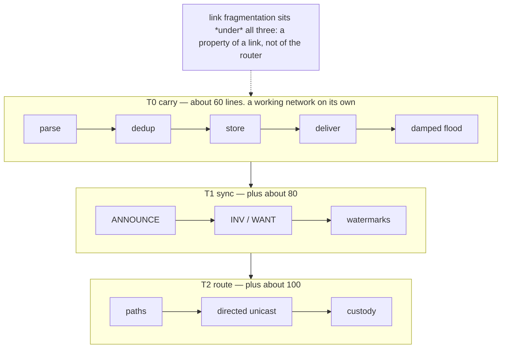

**Tiers** (all interoperate): **T0 carry** ≈60 lines: parse, dedup, store,
deliver, damped flood · **T1 sync** +≈80: ANNOUNCE/INV/WANT, watermarks ·
**T2 route** +≈100: paths, directed unicast, custody. Endpoint extras (ratchet,
mix) never change relays. Link fragmentation sits under all three: it is a
property of a *link*, not of the router, and a node that never meets a narrow
link never runs it.

**Threat model, stated once:** every link is hostile — logged, spoofed, jammed,
MITM'd. Links are trusted with *nothing*; authenticity and secrecy live only in
the envelope. Attackers can drop or delay; redundancy and flood-fallback heal
both.


---

# Part I — Wire (frozen at `ver 0x02`)

**Three kinds of rule, and which is which.** The audit that prompted this table
was right that the distinction was implied rather than stated, and that a reader
could not tell whether an unpinned behaviour was extensible or merely undocumented.

| | changes how? | what says so |
|---|---|---|
| **Frozen** — §1, §2, the file layer's content id | a `ver` bump, which is a hard fork | `reference/vectors.json`, and CI refuses to edit it |
| **Normative but versioned** — §3 link framing, INV/WANT payloads, file-layer tags | may change with a minor release; both ends of one link, or one fetch, must agree | this document, and the tests named beside each |
| **Local policy** — `max_relay_age`, push budget, repair sizing, interest lease, every `Limits` field | freely, per node, with no coordination at all | each node's own configuration |

The third row is the one that keeps growing, and deliberately: every time a
decision moves from the wire into a node's own hands — how long to carry
something, how much repair to send, how big a file to push — the protocol gets
smaller and the implementations get more room. A reader who finds a number in
this document and cannot tell which row it is in should treat that as a
documentation bug.

**What "frozen" covers, exactly.** `reference/vectors.json` is the compatibility
surface, and CI refuses to change it. It pins the seed → public key → address
derivation, topic derivation, the envelope's encoding, the ID that is the hash of
that encoding with hops zeroed, the signature over it, armor, and that a tampered
wire is detected. **That is §1 and §2.**

It does **not** pin §3's fragment payload, the INV/WANT payload shapes, the file
layer's tags, or link framing — none of which have ever appeared in the vectors.
Those are wire in the sense that bytes cross a link, and they have changed:
§3's index and count went from one byte to two, and a sealed root now names its
header rather than carrying it. Both were deliberate and neither needed a
major-version label, because the guard correctly did not consider them frozen.

Saying so matters more than it looks. A third-party T0 built against "Part I is
frozen" would have assumed the fragment header was stable. It was not: §3's
end-to-end form has since been **removed entirely**, replaced by Part II's link
fragmentation plus a stated envelope ceiling. Build against the vectors; treat
the rest of Part I as current, not permanent.

## 1. Identity & addressing

Identity = one Ed25519 keypair. **Address** = first 8 B of SHA-256(pubkey).
**Topic** = first 8 B of SHA-256(UTF-8 string). No global namespace; exchange
keys by QR/paper/voice. Petnames are local.

## 2. Envelope (the only object; big-endian; fixed part = 16 B)

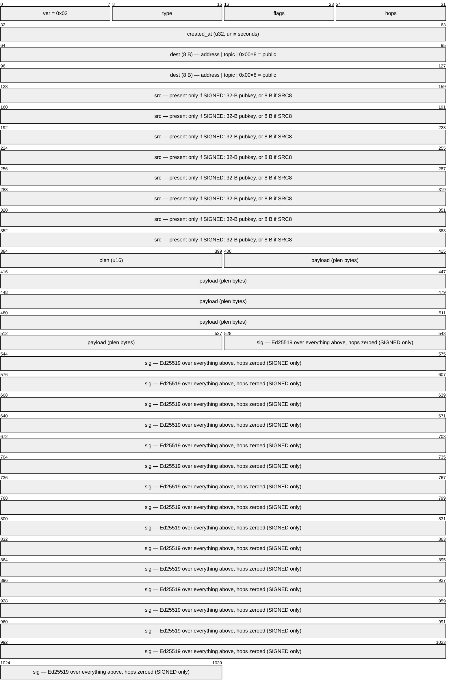

The fixed part is the first 16 bytes. Everything after `dest` is conditional:

```
off len field
0   1   ver    = 0x02  (exact match to decode; see "Versioning and unknown bits")
1   1   type   0=DATA 1=INV 2=WANT 3=ANNOUNCE
2   1   flags  b0 ENCRYPTED b1 SIGNED b2 FRAGMENT b3 ACKREQ b4 FLOOD b5 SRC8
               b6 RATCHET (0x40, §7)   b7 CANCEL (0x80, on WANT: §8)
3   1   hops   remaining relays (default 16; relays clamp incoming to ≤ 16)
4   4   created_at unix seconds u32 — when it was minted, not when it dies
8   8   dest   address | topic | 0x00×8 = public
-- if SIGNED: src = 32-B pubkey, or 8-B address if SRC8 --
    2   plen   u16
    N   payload
    64  sig    Ed25519 over all bytes above with hops zeroed
-- unsigned: no src, no sig; rides last everywhere --
```

The flags byte, bit by bit:

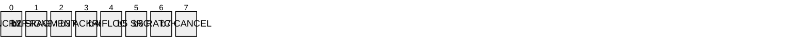

**Versioning and unknown bits.** `ver` is an exact match: a decoder MUST reject
any `ver != 0x02` rather than guess, so a version change is a hard fork and not a
negotiation. **0x02 is that fork.** The header kept its shape — the four bytes at
offset 4 are still four bytes at offset 4 — and changed their meaning, from a
deadline the sender chose to the moment the envelope was minted. Left at 0x01 the
two builds would still have refused each other, but by accident: a v1 `expiry`
read as a birth time lands in the future, and a v2 birth time read as a deadline
looks long expired. Both directions fail closed, which is luck rather than
design.
**Flags are the extension point instead.** Bits defined in v1 MUST be interpreted
as named; a bit a node does not understand MUST be ignored, MUST be forwarded
unchanged, and MUST NOT cause a drop. That rule is the agility hatch, and it has
now been used twice without a version bump: b6 `RATCHET` and b7 `CANCEL` were
both added to a shipped v1 wire. Forbidding unknown bits and relying on them for
extension cannot both be true, and the forwarding rule is the one the code
implements. **All eight bits are now assigned**, so the next extension needs
either a retired bit — b2 `FRAGMENT` is spent, but reusing it would collide with
envelopes older builds still emit — or a payload-level tag, which is where the
file layer and §7 already put theirs.

**ID** = first 16 B of SHA-256(envelope, hops zeroed); computed, never
transmitted (except inside INV/WANT/frag/ack). Zeroing `hops` is what keeps the
ID stable while relays decrement the TTL.

Overhead: 114 B signed, 90 B SRC8, 18 B unsigned. **SRC8** only toward peers that
provably hold your key; relays never verify — endpoints do (see "Verify before
binding trust state", Part II). **No priority field: priority is bought, not
claimed** (§10 stamp).

## 3. Fragmentation — retired from the mesh, alive under the link

**An envelope is never split end to end.** A node emits exactly one envelope per
message, and a hop too narrow to carry it splits it *below* the node and below
the signature — link fragmentation (Part II) — reassembling at the far end of
that same link. No fragment ever reaches the mesh, and no node other than the two
ends of one link ever sees one.

**There used to be a second, end-to-end form, and it is gone.** The sender split
once at its own MTU and only the destination reassembled. It could not repair the
case it existed for: a fragment carries no nesting, so frames cut for a
1400-byte link died at the first 237-byte hop they met and no node on the path
could fix it. It also flooded unsigned fragments across the mesh to solve a
problem that is local to one link. Nothing emits it and nothing parses it; `b2
FRAGMENT` stays named so the bit is not reused for something that would collide
with an envelope minted by an older build.

What replaced the size limit is a **stated ceiling** rather than a splitting
rule. `plen` is a `u16`, so a payload is at most 65,535 bytes and the largest
envelope on the wire is 65,649. Originating a message above that returns an error
rather than silently truncating — which is what the encoder used to do, wrapping
a 70,000-byte payload to a `plen` of 4,464 and producing a well-formed envelope
containing the wrong bytes.

The coding below is **retained, and still used** — but by the link, not by the
mesh: `src/fountain.rs` is what mints erasure-repair symbols for a hop-local
fragment set, which is what lets a lossy narrow link recover without a return
path. The payload shape described here is the historical end-to-end one.

payload = `[orig_id:16][index:2][count:2][chunk]`; all chunks equal size (pad the
original; the envelope self-delimits). Fragments were ordinary envelopes (own
IDs, same dest/created_at).

- **index < count**: plain chunk *index* of the original envelope's bytes.
- **index ≥ count**: **repair chunk** = XOR of the data chunks selected by the
  first *count* bits of SHA-256(orig_id ‖ index ‖ block), taken in 256-bit
  blocks numbered from zero; empty selection → chunk (index mod count). The
  sender can mint endless distinct repair chunks.

Both fields were one byte, which capped a set at 255 chunks. That bound the
*carrying* size — 51 kB at a 237-byte frame — but it bound **repair** harder:
one SHA-256 addresses 256 chunks, so a larger set had no repair at all and needed
every piece. 255 pieces is under 12 kB on a 54-byte Zigbee frame, which is
exactly where a lost piece is most likely. Hashing in numbered blocks lifts the
ceiling to what the field can name.

Receiver decodes when any received set reaches rank *count* (Gaussian elimination
over GF(2)); typically *count*+2 arrivals suffice at any loss rate, in any order,
even one-way. Verify the reassembled signature; commit only what verifies.

**Rateless — which is a property of the coding, not a promise about transfer.**
Nothing here needs a back-channel: a set can be received over a one-way link, off
a torn sheet of paper, out of a CW transcript. What that buys is that an *object
whose symbols reach you* decodes. It does not follow that a *transfer* completes
one-way, and for the file layer it plainly does not: fetching is receiver-driven
(§6), so a WANT needs a return path, and the sender never learns which symbols
landed. Claim the coding, not the transfer.


---

# Part II — Relay

## 4. Routing state (T2)

- **Neighbors** (per interface): point-to-point peers + anyone heard via hops=0
  ANNOUNCE.
- **Paths**: `addr → up to 3 of (iface, neighbor, age)`. Learned: (a) the **first
  copy** of any new signed envelope raced every path and won — its src is
  reachable via what delivered it; (b) flooded ANNOUNCEs. On broadcast media the
  interface *is* the direction. Fresh < 3 h; purge 7 d (stale entries still guide
  custody).

Path learning is **local and non-transitive**: a node believes only what it has
personally received. The reference build advertises no third-party paths
(`np=0`) and does not parse them on receipt, which bounds wormhole/eclipse to an
attacker's own direct neighbours ([Threat model](THREAT_MODEL.md) ch. 5).

**ANNOUNCE** (type 3, signed): payload =
`[prekey:32][nt:1][topic×8 ea][np:1][(addr:8, age_min:2) ea][petname…]` — your
current encryption prekey (§7), topics you collect, and a path list. Link HELLO =
hops 0; flooded = hops 16.

A node MUST accept any `np` the envelope can hold. A node MAY ignore the path
list, and **the reference build does**: it always sends `np = 0` and skips the
field when parsing, so paths here are learned only from the first copy of signed
traffic and from an ANNOUNCE's own `src`. Third-party path advertisement is
reserved rather than implemented — turning it on is a Sybil and wormhole
analysis, not a parser change.

## 5. Forwarding rules (the entire router)

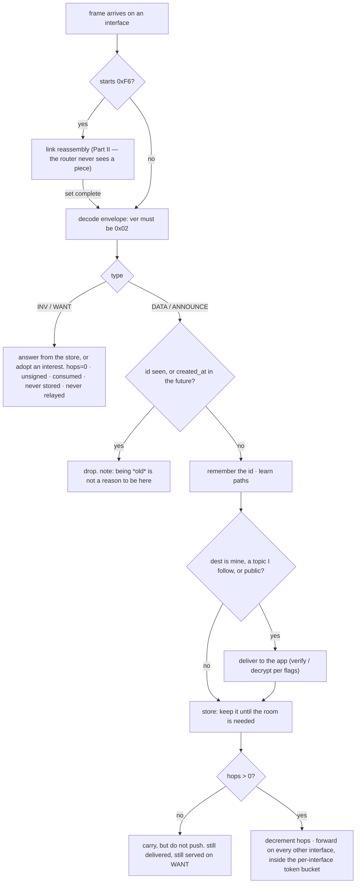

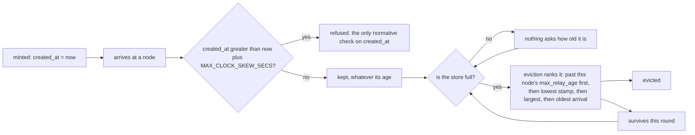

The only two moments `created_at` is read are the two boxes above: once on
arrival, to refuse the future, and once under memory pressure, to order the
victims. Between them an envelope's age is nobody's business.

1. Envelope arrives: ID seen, or `created_at` more than `MAX_CLOCK_SKEW_SECS`
   ahead of our clock → drop. **Age is not checked here.** Add ID.
   Learn paths (§4).
2. dest ∈ {my addresses, followed topics, 0×8} → deliver (verify/decrypt per
   flags).
**`hops` bounds push, not reach.** A spent hop budget stops an envelope being
*relayed* — sent onward unasked — and stops nothing else. The node still delivers
it if it is a destination, still holds it, still lists it in an INV, and still
serves it to a neighbour that WANTs it. That is deliberate and it is what
store-and-forward *is*: the flood is bounded because one send must not buy
unbounded transmission, while pull is bounded by demand instead, since every
further step requires somebody to ask for it.

So an envelope at `hops = 0` is not beyond reach, only beyond the flood. It is
also the normal state of a file chunk, which is minted at `hops = 0` (§8) and
therefore never relayed by anyone — a node that discarded what it could not relay
would never hold a chunk it had not published itself, and there would be no file
layer.

3. Store it. Nothing expires; entries leave only when the room is needed, and
   only then is age consulted. Evict: past this node's `max_relay_age` → lowest
   stamp → largest → oldest arrival. TX
   order: local origin, then stamp, then FIFO.
4. **Congestion control**, four rules: **(a)** token bucket — a node MUST rate
   limit what it relays per interface, and SHOULD default to ≈10% of that
   interface's capacity (dedup makes dropped relays harmless); **(b)** Trickle timers —
   HELLO/ANNOUNCE interval doubles 5→80 min while nothing new is heard, resets to
   5 on any novelty; **(c)** backpressure — HELLO carries one `busy` byte (queue
   fill); neighbors scale sending by (255−busy)/255 and defer unstamped relays to
   busy peers; **(d)** exponential backoff — FLOOD retries at 30 s ×2, cap 1 h,
   max 5.

> **The bucket is the rule; 10% is a default.** What a relay owes its neighbours
> is a *bound* it can state and honour, not one particular fraction. The right
> figure depends on measured capacity, queue depth, loss, battery and how much
> custody the node has taken on — a node relaying half of a fast idle link is
> impolite, not non-compliant, and one relaying 10% of a duty-cycle-limited radio
> may already be over. The exception is regulatory: on ISM bands a duty cycle is
> **law**, and there the number comes from the regulator rather than from this
> document. Implementations should expose the budget as per-transport policy and
> keep the mechanism — bucket, backpressure byte, bulk budget — as the part that
> is not negotiable.
5. hops = 0 → stop. Else decrement, then: **topic/0/FLOOD** → damped flood on all
   interfaces (on shared media wait random 1–5× airtime, cancel if the ID is
   overheard ≥ 2×; ≥ 1× for directed) · **unicast + fresh path** → that
   interface/neighbor only · **unicast, no path** → silent, unless you hold
   custody and the path died: set FLOOD, continue.
6. Originator: no receipt (§8) → resend with FLOOD per 4d. Flooding **is** route
   discovery; replies teach reverse paths and heal blackholes. A receipt is the
   only delivery signal: overhearing your own envelope rebroadcast means the mesh
   took it, not that anyone received it, and MUST NOT clear a pending resend.
7. A wrong clock misjudges rule 1, and that is accepted rather than solved: a
   clock far in the past rejects current traffic, one far in the future accepts
   anything. It is the same failure such a node already has for every other
   time-based decision, and both alternatives are worse — trusting the sender
   puts the decision back with the attacker, and a "my clock is unreliable" flag
   is a switch the platforms that most need it are least likely to set. Fix the
   clock.

```
def on_rx(e, iface, nbr):
    if id(e) in seen or expired(e): return
    seen.add(id(e)); store.put(e)
    if e.SIGNED: paths.learn(addr(e.src), iface, nbr)   # first copy wins, keep 3
    if e.dest in my_addrs | topics | {ZERO}: deliver(e)
    if not e.hops: return
    e.hops -= 1
    if unicast(e.dest) and not e.FLOOD:
        p = paths.fresh(e.dest)
        if p: tx(p.iface, p.nbr, e)
        elif held_custody(e): e.FLOOD = 1; damped_tx_all(e)
    else: damped_tx_all(e)
```

## 6. Sync & custody (T1/T2)

On any meeting: ANNOUNCE, then **INV** (concatenated IDs, newest first, filtered
by peer's topics + carriable unicast + per-neighbor watermark), peer replies
**WANT**, send those. INV/WANT: hops=0, unsigned, consumed, never stored or
relayed. Serving WANT is budgeted per interface, or it is a reflection amplifier.

A WANT payload is concatenated 16-byte ids, optionally followed by **one trailing
byte of remaining depth**. Ids are 16 bytes, so an odd byte on the end is
unambiguous; a WANT without one is a plain request and gets the default. That
byte is what bounds recursive pull (Part III) — the envelope itself is still
never forwarded.

**Custody:** push stored unicast to any peer that *is* the destination or
announces a fresher path. A file or sheet of paper is concatenated envelopes;
import = receive. Every boat, cyclist, or HF skywave contact merges two regions.
That is the WAN.

**Files** are content-addressed: chunks `[0x07][file_id:16][index:4][bytes]`,
indexed by a signed **manifest** `[0x01]…[chunk_id:16 × count]` whose own ID is
the shareable **magnet**. A manifest that outgrows one envelope nests — interior
nodes `[0x08][depth:1]…` name manifests a level down, so the root stays one frame
and one signature at any file size, and only the root is signed (an ID is the
hash of its bytes, so the tree authenticates itself). Sealed to one recipient:
`[0x09][depth:1][hdr_id:16]…`, where `hdr_id` names a separate object holding the
file key and real name sealed to their prekey; each chunk is then encrypted under
that key with the chunk index as nonce. The header is *named* rather than carried
so a sealed root fits a small frame — inside the root it pushed the floor past
256 bytes, which no LoRa profile clears. See Part III for the layer built on this.

## Link fragmentation — crossing a hop that cannot carry the frame

A bridge whose link has a smaller frame than the envelope splits it, and the far
end of that same link puts it back. **Below the node and below the signature**: a
fragment lives for one hop, is never relayed, and the router is never shown one.

    [0xF6][set:2][idx:2][count:2][piece …]        7 bytes

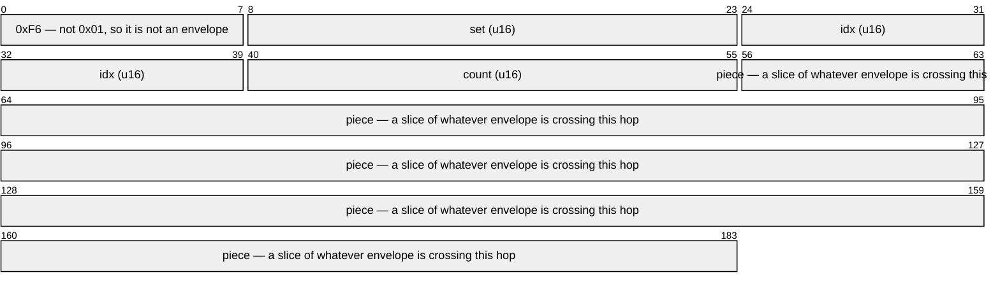

**This is link framing, not wire.** A fragment never leaves the link, so its
shape is a bridge's business the way KISS is, and it is not part of Part I. That
is what makes it cheap: seven bytes against the thirty-six §3's end-to-end header
costs, which on a 54-byte Zigbee frame is 47 usable bytes per fragment instead of
18. `0xF6` is the discriminator because an envelope's first byte is `VER` = 0x01,
so a receiver tells the two apart without being told and a peer that never
fragments is unaffected.

**Repair symbols.** An envelope cut into n pieces arrives only if all n do, so a
link dropping 10% of frames loses about 46% of fragmented envelopes. A sender MAY
therefore send `index ≥ count` repair symbols — the same erasure code as §3, so
any n of the n+r sent reconstruct. Measured over 200 trials of a 900-byte
envelope on a 237-byte frame — five pieces — one repair symbol takes 10% loss from
54% delivered to 66%, two to 87.5%, and four to 99.5%. **These supersede an
earlier set claiming 90% for one symbol and 96% for two**; those were recorded
once and never re-run, and the scenarios behind them are reported rather than
asserted, so the drift went unnoticed. Repair buys a great deal, but one symbol
is not enough at 10% loss, which is why the amount is now derived from the
measured loss rather than fixed at a quarter. Repetition instead of a code manages 70% for the
same redundancy, because a duplicate only helps if it lands on a gap.

How many is **local policy** — the sender picks, the receiver decodes whatever
arrives, and the two never agree on a number. The default is a quarter of the
set, which costs nothing on a link wide enough never to fragment. Repair needs no
return path, which is what makes it usable on a one-way radio or a shared channel
where a NACK would collide with the traffic it complains about.

**Bounds.** Reassembly is a place a neighbour allocates memory unasked, so it
obeys the resource invariant like everything else: a cap on open sets, a cap on
bytes, a timeout, and accounting **per key** so one loud peer cannot evict
another's half-finished frame. The key is the neighbour where the medium has
addresses and the interface where it does not — on a broadcast medium two senders
can collide on a set id, so a set that reassembles into something that is not an
envelope is dropped rather than parsed.

**Interaction with the node's own MTU: none.** A node keeps its MTU whatever its
links are. Clamping it to the narrowest attached link — which this implementation
did — only ever helps a node that *owns* the narrow link, and never a node
upstream of one.

## Bindings — SPORE on everything

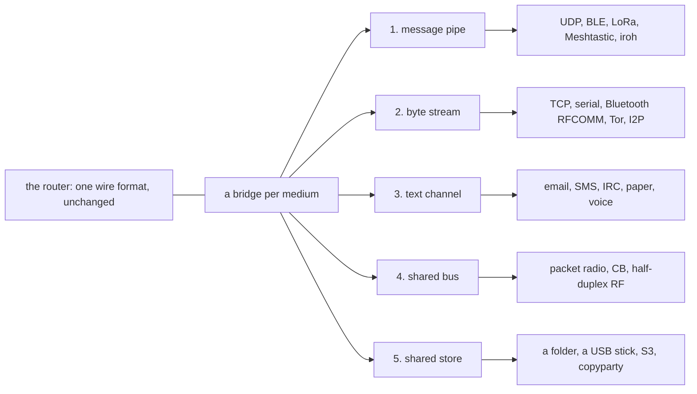

**Every medium on Earth has one of five shapes.** Bind by shape; the router never
changes. This section is normative for the *shapes*; the per-medium parameter tables
(frequencies, port numbers, UUIDs, MTUs, firmware caveats) are the manual,
[Bridges](BRIDGES.md).

1. **Message pipe** → one envelope/fragment per message.
2. **Byte stream** → KISS: frames delimited `0xC0`, escape `0xC0`→`0xDB 0xDC`,
   `0xDB`→`0xDB 0xDD`, command byte `0x00`.
3. **Text channel** → armor: `~S1.` + Base32(envelope) + `.` +
   Base32(SHA-256[0:4]) + `~`, whitespace ignored.
4. **Shared bus** → KISS + CSMA: listen-before-talk, backoff 1–5× airtime; no
   native CRC → append SHA-256(envelope)[0:4], verify or drop.
5. **Shared store** → write envelopes as entries named by hex ID; reading =
   receiving; the store is a persistent INV.

In this implementation those five collapse to **three driver forms** — `dgram`,
`stream`, `store` — because a message pipe and a shared bus differ only in whether
you listen before talking, and a text channel is a byte stream with an armor codec.

**Underlays with their own routing = ONE interface.** Meshtastic, Reticulum,
Yggdrasil, cjdns, BATMAN/OLSR, Tor/I2P, WireGuard, plain IP — each already moves
bytes across many physical hops. Hand it one frame and decrement `hops` **once**
for the whole crossing; its internal hops are invisible and free. Point-to-point
backbone links may *restore* the hop so long hauls don't burn the budget. SPORE
hops therefore count **gateways between networks**, not hops inside them — exactly
IP over Ethernet. They are transports SPORE rides, not rivals.

**Numbers worth memorising.** Port **7373** (UDP/TCP/WS), the same value as
EtherType `0x7373` and multicast `239.73.73.73` / `ff02::7373`. Meshtastic
portnum **256**. BLE rides the **Nordic UART Service** (`6e400001-…`, RX `…0002`,
TX `…0003`) rather than a SPORE-specific UUID — it is what phones, hobby boards
and RNodes already expose. Everything else: look it up.

**Two address spaces.** *Who* = the SPORE address or topic — end-to-end,
cryptographic, identical on every medium. *How* = the underlay's own naming (a
node number, a destination hash, an `IP:port`, or nothing at all) — local to one
link. A bridge owns exactly one interface and translates between them; the router
never learns underlay addresses, the way an OS's ARP table maps IP→MAC. Bindings
are learned by **snooping signed frames** — a signed envelope proves its own
sender, so no handshake is needed — and a stale binding costs nothing, because
flood-fallback (§5.6) routes around it.

**A link may declare a bulk budget.** Since files are manifest trees they can be
arbitrarily large, so any link can be conscripted into hauling one. An interface
may cap bytes/second of *other people's file chunks* it will relay. Only chunks
count: messages, announces, receipts and manifests always pass, so a paced link
stays a full member of the mesh — it still carries the conversation and still
tells everyone what exists. It declines only to be the pipe, and because chunks
are named by content the fetch just asks again and another path answers.

**Zero-rendezvous peering (browsers & phones).** A WebRTC session reduces to
ufrag(4) + pwd(22) + DTLS fingerprint(32) + mDNS host candidate(16) ≈ **90 B**;
both sides rebuild full SDP from a hardcoded template. Beep that descriptor over
ultrasound or show it as a QR, answer, and the browser's own mDNS completes a
direct DataChannel — no server, no typed IP, ≈15 s. Native nodes run **ice-lite
with static ufrag/pwd/fingerprint**, so their descriptor is a constant you can
print on the box — specified, not built: WebRTC here is browser-only, so the
native half is a [Roadmap](ROADMAP.md) item.

**App distribution:** a native node's HTTP bridge exposes the bag API —
`POST /spore/push`, `GET /spore/inv`, `POST /spore/want`, MIME
`application/x-spore` — on port 7373, to localhost and to the LAN at its IP.
Serving the PWA itself from `/` is the intended end state (the app store is every
node) but is **not implemented**: `bridge::bag` routes the three bag paths and
404s everything else.

---

## Verify before binding trust state

§2 says relays never verify. That is about the cost of *forwarding* — a relay moves
bytes it cannot read toward a destination it is not, and checking a signature on
every envelope in transit would tax the smallest nodes for a guarantee the endpoint
provides anyway. It is **not** a licence to write unauthenticated claims into local
state. A relay keeps three tables an attacker would like to choose the contents of:

| Table | What a forged entry buys |
|---|---|
| Neighbour bindings | directed sends for a victim unicast to the attacker |
| Path table | a victim's address bound to the attacker's interface |
| Quota attribution | a victim's byte budget drained by an attacker's junk |

All three once accepted the `SIGNED` **flag** as proof — one bit chosen by whoever
wrote the frame — so all three were forgeable with a copied public key and 64 zero
bytes (`S-002`, `S-004`).
The rule is therefore narrower than "relays verify" and wider than "relays never
verify":

> **Verify before binding trust state; do not verify to forward.**

The cost is bounded on purpose: one verify per newly-seen signed envelope, reused
across all three tables and run only *after* dedup and the post-dating check, so replays and stale
mail are dropped before any crypto. On an ESP32 relaying LoRa that is a real
per-envelope cost, accepted knowingly — a relay that can be told a false address is
worse than a relay that is slower.

## The resource invariant

Every bound in this part is one idea, applied in as many places as a stranger can
push on:

> **No remote node can cause another to transmit, store, or process an unbounded
> amount without continuing evidence of demand, or an explicit bounded local
> allowance.**

Both escape clauses are load-bearing. *Continuing evidence of demand* is why a
WANT names ids and is answered once rather than subscribing a peer to a stream:
the asking is the authorization, and it has to be repeated. *Explicit bounded
local allowance* is why a node may hold custody for strangers at all — the
operator set a budget, and a peer may fill it but never exceed it.

| Path a stranger can push on | What bounds it |
|---|---|
| Dedup table | `MAX_SEEN`, evicting nearest-to-forgetting first |
| Custody store | `max_store_bytes`; adoption additionally by `MAX_ADOPT_BYTES` |
| In-progress fetches | at most half the store, stalest transfer dropped first (M12-A) |
| Manifest parts | `count` must be backed by the payload's own bytes, checked before allocating |
| Tree depth | `MAX_DEPTH` = 4, and a child is read only at exactly `parent.depth - 1` |
| Chunk size | `CHUNK_BYTES`, and structurally an envelope — `MAX_PAYLOAD_BYTES` |
| File length | a leaf's `total_len` ≤ `count × CHUNK_BYTES`, refused on decode |
| Peer prekeys, busy bytes, names, sessions | `MAX_PEERS` on each |
| Learned paths | `MAX_PEERS`, plus a time purge |
| File manifests | `MAX_MANIFESTS` |
| Receipt ids | `MAX_ACKED` |
| Undrained RPC and feed inboxes | `MAX_INBOX`, oldest dropped first |
| Fragment reassembly | set count, byte budget, a timeout, and a per-interface share |
| Answering INV/WANT | `MAX_IDS_PER_GOSSIP` per request and a token bucket per link |
| Relaying | per-source quota, per-interface budget, hop count |

Three of these are the general form, and an implementation should be able to
point at all three: an object's **welcome** (this node's `max_relay_age` against
the envelope's `created_at` — a local opinion, consulted only when the store is
full), a **transfer allowance** (a bounded request, or a lease), and a **transport
budget** (the token bucket and backpressure of §5.4). Transmit only while all
three still hold.

The first of those used to be the sender's to set, and moving it is the point of
M12. A sender wrote a deadline and every relay honoured it, which let a stranger
reserve a week of somebody else's storage — precisely what the invariant above
forbids everywhere else. An envelope now states a fact about itself (when it was
minted) and each node decides what to do about it.

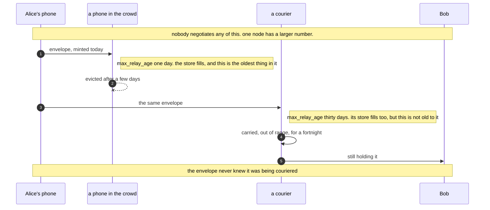

**A courier is a setting, not a feature.** Because age is a local preference
rather than a wire property, a node that raises `max_relay_age` simply keeps old
envelopes when others have thrown theirs out, and hands them on to whoever it
meets. Nothing new is negotiated, no envelope knows it is being couriered, and a
node that does this is not distinguishable on the wire from one that does not.
Measured: at one day's tolerance a carrier under storage pressure kept 1 of 30
ten-day-old envelopes; at a month's, 15 of 30.

Two rules that are easy to get wrong, and were:

- **Enforce after the write, not only before it.** A ceiling checked at the start
  of handling a frame leaves every table one entry over until the *next* frame
  arrives — which, on a link the attacker controls, is indefinitely.
- **Charge a shared budget to the interface that caused the growth**, never to a
  global pool, or the loudest link evicts the quietest one's work.

---

# Part III — Endpoint profiles and local policy

## 7. Crypto & forward secrecy

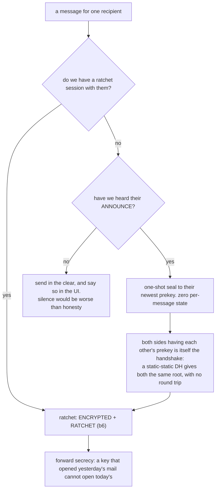

The path a message takes through this depends only on what the sender already
knows about the recipient, and never on a negotiation — there is nowhere to hold
one.

- **Sign:** Ed25519 (§2).
- **Seal (baseline, one shot):** libsodium `crypto_box_seal` to the recipient's
  newest **prekey** (X25519, from ANNOUNCE, signed there). Zero per-message
  state. Implementations **MUST** hold a prekey ring (§7.2).
- **Sessions: Double Ratchet.** Set `RATCHET` (b6) on an ENCRYPTED DATA envelope
  whose payload is ratchet-shaped rather than one-shot-sealed.
  - *Bootstrap, no handshake:* when both sides know each other's current prekey
    (i.e. after ANNOUNCE), each derives the same root from a static-static X25519
    DH — own current prekey secret × peer's advertised prekey public. The
    numerically lower address is the pair's initiator, with a sending chain
    immediately; the higher is the responder and has no sending chain until it
    receives the initiator's first ratchet message, so its own earlier sends go
    as plain one-shot seals.
  - Bootstrapped once per peer, **never re-seeded** from a later ANNOUNCE.
    Implementations **MUST** settle a due prekey rotation *before* both building
    an ANNOUNCE and bootstrapping from one, or the two sides derive different
    roots.
  - Sessions are local state and need not persist; a restart may lose one and
    re-bootstrap from the next ANNOUNCE.
  - *Payload:* `[dh_pub:32][n:2][pn:2][ct]`, ct = ChaCha20-Poly1305(mk, nonce=n,
    ad=header). On a new `dh_pub`: root,ck_in = KDF(root, DH); on a fresh ratchet
    key: root,ck_out = KDF(root, DH). Each mk = KDF(ck), then dropped. KDF =
    BLAKE2b. A ratchet turn reseeds the chains with new entropy, which is what
    recovers from a compromise.
  - Skipped mks are cached for out-of-order arrival, bounded by **both** count
    (`MAX_SKIPPED_KEYS`) and age, and zeroised on drop. The age bound is the same
    configured value as the prekey lifetime (§7.2) — one knob, so the two windows
    cannot disagree.
  - Compromise leaks nothing older than one ratchet turn.
- **Encrypted topics:** pre-shared key, XChaCha20-Poly1305, 24-B nonce prefixed.
  **Rotation:** flood `KEYROT <newpub>` signed by the old key.

### 7.1 Topic key schedule

`rotate(k) = SHA-256(k ‖ "spore-keyrot-v1")` advances an epoch: forward secrecy,
but a stolen key follows the chain, so it never heals.

**Healing rotation:** draw 32 random bytes `c`, seal a copy to each member's
prekey, everyone folds it in with
`mix(k,c) = SHA-256("spore-topic-mix-v1" ‖ k ‖ c)`. Message =
`[0x01][count:2 BE][80-B sealed box]×count`, no recipient hints (so it does not
enumerate the group); a member trial-decrypts, ≤ 256 boxes. **Mix, never
replace** — so an attacker able to sign as a member cannot cancel an honest
contribution, only append steps to a chain one unreadable step has already made
unknowable. That is post-compromise security: the group heals by operating, with
no detection step.

`key_id(k) = SHA-256("spore-topic-keyid-v1" ‖ k)[..4]` names a key so a receiver
holding several candidates picks the right one. The group has no roster and no
arbiter: members can diverge, and `key_id` makes divergence readable rather than
fatal.

### 7.2 Prekey ring

Up to 16 prekeys, oldest first; the newest is advertised in ANNOUNCE. Mint one
every 24 h and **delete** any secret older than the configured lifetime (the
"offline window", default 7 d); the newest is never deleted, so a node is always
sealable. Opening tries every live entry newest-first, so a sender who last heard
an older ANNOUNCE still reaches you until that secret expires. The nonce mixes
the *recipient's* public key, so an entry stores both halves.

**The requirement that makes it mean anything: prekey secrets MUST be random and
MUST NOT be derivable from the identity seed.** Restoring from a seed recovers
the address, the signing key, and the ability to mint new prekeys — it MUST NOT
recover a deleted secret, or "delete" has no referent.

| Asset | What a restore recovers |
|---|---|
| identity seed | address, signing key, ability to mint *new* prekeys |
| prekey ring | ability to open mail sealed to prekeys that still exist |
| a deleted prekey secret | **nothing — by construction** |

Consequences, each a real cost: `seed()` alone is **not** a whole backup (persist
the ring beside it, or the restored node has no forward secrecy and cannot read
mail sealed to anything it had rotated to); mail sealed to an expired prekey is
unreadable by everyone, including you — that is the feature, not data loss; and a
**backup of the ring defeats the offline window**, as it would for any
forward-secret keystore.

## 8. Receipts (ACKREQ)

Recipient floods a signed DATA to src, payload = `0x06` + orig ID. ACKs also
teach reverse paths. A receipt **MUST** be verified as signed by the destination
it claims to come from: the ID it references is public (it rides in every INV),
so accepting on payload shape alone lets any stranger forge "delivered"
(`S-032`).

The sender re-floods an unacked message on the §5.4d backoff — flooding is route
discovery, so a resend can find a path a blackhole was hiding — and gives up
after the cap. Known simplification: a *lost receipt* is not re-requested, since
a duplicate of the original is deduped before it could re-trigger one.

## 9. Anonymity — mix mode

An **onion** is nested sealed envelopes. Sender picks 2–3 relays that follow topic
`mix` (learned from ANNOUNCEs) and wraps inside-out: each layer = an envelope
addressed to one mix, payload sealed to it = `'O'` + the next full envelope. A mix
decrypts, waits a random Poisson 1–30 s, batches ≥ 3, re-injects the inner
envelope as its own traffic.

- **Sender anonymity:** leave outer layers unsigned; sign only the innermost if at
  all.
- **Recipient anonymity:** innermost dest 0×8, payload sealed — everyone carries,
  one can open.
- **Unlinkability:** pad every onion payload to size classes 256 / 1024 / 4096 B
  so depth never shows; mixes SHOULD emit Poisson decoy onions at roughly their
  real rate.

Honest limit: beats local observers and any subset of mixes; a **global** passive
observer is only beaten while decoy traffic flows. Mix mode is opt-in and never
silent — confidential is not the same as anonymous.

## 10. Self-defense (local policy)

Everything here is **local policy**: a node's own choice, never negotiated, never
a wire change.

**Stamp — the only cross-node priority.** *n* leading zero bits of an envelope's
ID = class *n*, mined by grinding a nonce in the payload. Priority is therefore
**bought, not claimed**: there is no priority field to forge (§2), and the proof
*is* the ID, so any node verifies it with one hash, no state, on every medium.
Each class costs 2× the last. The stamp drives TX order and eviction order
(§5.3), and gates the §5.4c backpressure bypass — which requires at least 16
leading zero bits, not merely a non-zero stamp, since class 1 is about two hashes'
work and would let anyone ignore a busy peer for free.

**What the stamp does not do:** it prices *one envelope*. It is not bound to an
identity, so it says nothing about how many identities an attacker mints — it is
not Sybil resistance, and nothing here claims to be. It raises cost; it does not
cap it.

**Quotas.** Per-source and per-topic byte budgets, applied whether or not a frame
is signed. Unsigned mail rides last.

**Trust.** Prefer keys you have met or your operator vouches for; confirm a peer
out of band by address emoji-hash. No topic is privileged: there is no string a
sender can choose that buys priority, quota, or a relay it would not otherwise
get.

## 11. Defaults

hops 16 · default max relay age 7 d · MTU 1400 · HELLO 5→80 min Trickle · ANNOUNCE flood ≤ 1/h ·
path fresh 3 h · seen-set ≥ 30 d received · prekey mint 24 h, offline window 7 d ·
relay airtime rate-limited, ≈10% default · payload UTF-8. T0 ≈ 60 lines; full T2
≈ 400 with libsodium.

**Link and file defaults, all local policy:** link fragment repair ¼ of the set
(min 1) · half-finished link set dropped after 30 s · chunks pushed with a
manifest 8 · adopted-interest lease 15 min (cancel is the fast path) · WANT
recursion depth 8.

**Known limits, on purpose:** no stream semantics; **an envelope is at most
65 535 payload bytes**, because `plen` is a `u16` — larger objects ride the file
layer (§6), bounded by storage and by what each link agrees to carry rather than
by a fragment count; no permanence (nodes discard their oldest cargo, by design); mix-mode anonymity
needs flowing decoys to beat a *global* observer; ratchet state is per-device —
give each device its own key.

That envelope ceiling used to be ≈50 KB, set by a one-byte fragment count. Both
fragment counts are `u16` now, so the payload length is what binds — and it binds
at the same place for every link, rather than at a different place for every
frame size.

## What stops what

Every mechanism above answers a specific adversary. This is the index; the full
analysis, with a residual-risk line on every row, is
[Threat model](THREAT_MODEL.md).

| Threat | What answers it | Where |
|---|---|---|
| Read the content | seal / ratchet / topic PSK | §7 |
| Forge a sender | Ed25519 over the envelope, hops zeroed | §2 |
| Replay an old frame | content-addressed ID + seen-set; a re-offered old frame is accepted but ranks first for eviction | §5.1 |
| Forge a path or neighbour binding | verify the signature *before* binding trust state | §4, Part II |
| Forge "delivered" | receipt must be signed by the destination | §8 |
| Flood cheaply | stamp PoW, per-source quotas | §10 |
| Crowd out a link | per-interface relay budget (≈10% by default); backpressure byte | §5.4a, §5.4c |
| Amplify via WANT | per-interface service budget | §6 |
| Conscript a slow link into hauling files | per-interface bulk budget (chunks only) | §6, Part II |
| Make the mesh hunt for an id nobody published | a node adopts a neighbour's WANT only for ids a manifest it holds names | Part III |
| Spread a file across links nobody asked | chunks are link-local: served to the asker, never relayed | Part III |
| Exhaust a bridge's reassembly buffer | set cap, byte cap, timeout, and per-key accounting so one peer cannot evict another | Part II |
| Exhaust memory | every table bounded, eviction order stated | §5.3 |
| Serve tampered bytes from custody | re-verify each entry against its ID on read | §6 |
| Flatten a battery by beaconing | Trickle 5→80 min | §5.4b |
| Learn who talks to whom | mix mode, opt-in | §9 |
| Keep using a copied group key | healing rotation (`contribute`/`absorb`) | §7.1 |
| Read old mail after seizing a device | prekey ring deletion, 7 d | §7.2 |

**Not solved, stated plainly.** Identity-key revocation: none exists; a stolen
signing seed is trusted until people stop trusting the address out of band. Sybil
resistance: nothing counts identities today. A hostile relay simply *dropping*
traffic: bounded by redundancy, never prevented — you cannot cryptographically
force a relay to forward. Jamming and physical-layer denial: out of scope at this
layer.

---

## Application layer

**The one rule this part is built on: nothing here touches relays.** Every
feature below is a payload convention plus endpoint state — never a change to
what a relay must understand. That is what keeps a 200-byte LoRa packet, a QR
code, or a human reading armor aloud a first-class peer: a relay parses the fixed
header, dedups, stores and forwards, and nothing else. A feature requiring relay
support would have to be rolled out to every medium in lockstep.

<p align="center"><a href="spore-design.png"></a></p>

## App tags — how endpoints tell payloads apart

The frozen header has no port or content-type field. The first payload byte is
the **app tag**, read only by the destination.

| Tag | Meaning |
|---|---|
| `0x01` | file manifest (leaf — names chunks) |
| `0x02` / `0x03` | RPC request / response |
| `0x04` | datagram (session) |
| `0x05` | feed event |
| `0x06` | receipt (§8) |
| `0x07` | file chunk |
| `0x08` | file manifest (interior — names manifests) |
| `0x09` | file manifest (sealed root — per-chunk encryption) |
| `'O'` (0x4F) | mix onion (§9) |

Fragments are the one exception: recognised by the `FRAGMENT` header flag rather
than a tag, and their chunk is a slice of an ordinary already-tagged inner
envelope, so tags and fragmentation compose cleanly.

Every service maps onto one of four patterns — **objects**, **sessions**,
**request/response**, **feeds** — each already a mechanism or a payload
convention. Note what is deliberately absent: a raw reliable byte-stream offered
*by the network*. A stream assumes a live, low-latency, bidirectional path, the
one thing an opportunistic network cannot promise. Reliability exists, but as an
**endpoint** concern — exactly how QUIC builds it on UDP without the network
knowing.

## Objects — send anything, any size

`send(dest, data)` takes any size, up to the 65 535 bytes `plen` can describe;
larger data is the file layer's job. Under the sender's MTU it is one envelope.

Over it, two things could happen and only one should. **What crosses a narrow hop
is link fragmentation** (Part II): the bridge splits for its own link, the far end
reassembles, and the router never sees a piece — so a frame reaches a 237-byte
radio three hops away without the sender knowing that radio exists. The
end-to-end form in §3 also still triggers here, splitting once at the sender's
MTU, and it is redundant: its fragments cannot be re-split, so on their own they
die at the first narrower hop. Retiring it is outstanding work.

**What survives a one-way link.** A fountain set does, because enough symbols
arriving is the whole condition. A *file* does not: its chunks are pulled with
WANT, so every hop needs a return path at some point — though not at the same
moment, since a request may be held and served at a later meeting. So a magnet
and a handful of chunks can travel one-way on paper; a swarm cannot. Carrying a
whole store one-way does move a file, because that is a push and needs no
request — but it is not the same claim, and the difference is exactly a
back-channel.

## Files — magnets, trees, swarming

A **manifest** is a signed envelope naming a file's size and its chunks' content
IDs; its own ID is the shareable **magnet** (`spore:<hexid>`, armor, or a QR).
Chunks are fetched from whoever has them and each verifies itself on arrival.

```
manifest = SIGNED [0x01][file_id:16][chunk_size:4][count:4][total_len:8][name][chunk_id:16 × count]
interior = UNSIGNED [0x08][depth:1][file_id:16][chunk_size:4][count:4][total_len:8][name_len:2][id:16 × count]
sealed   = SIGNED [0x09][depth:1][hdr_id:16][file_id:16][chunk_size:4][count:4][total_len:8][name][id:16 × count]
```

**Manifest trees.** One manifest is one envelope, so it can only name so many
chunks — about 93 KB of file at a 1400-byte MTU. Past that, chunk IDs are grouped
under interior manifests, and those grouped again, until what remains fits the
signed root. At `depth == 0` the IDs name chunks; at `depth > 0` they name
manifests of `depth - 1`. Capacity multiplies by the interior fan-out (~84) per
level, capped at `MAX_DEPTH = 4`:

| depth | capacity at MTU 1400 |
|---|---|
| 0 (one manifest) | 94 KB |
| 1 | 8.1 MB |
| 2 | 679 MB |
| 3 | 57 GB |
| 4 | 4.8 TB |

A file that fits one manifest encodes exactly as it did before trees existed, so
nothing that already works changes.

**A sealed root names its header rather than carrying it.** The header — an
ephemeral key, an AEAD tag, the file key and the real name — is about 82 bytes,
and inside the root it sat on top of the root's own 114 bytes of source key and
signature. That put a sealed root past 256 bytes before it could name a single
chunk, which made sealed publishing impossible on every LoRa profile: one byte
over raw LoRa's ~255-byte frame, nineteen over Meshtastic's 237. Naming it costs
16 bytes and brings the floor to **188**, which every LoRa profile clears.

The header is an ordinary object on the file's topic, link-local like a chunk,
and it travels with the root — it is small, and nothing else in the file is any
use without it. A recipient that holds the root but not the header is in the same
state as one missing a chunk, and asks for it the same way.

**Pushing the first chunks (local policy).** A publisher MAY send a few chunks
alongside the manifest, so a file small enough to fit that budget arrives
complete and costs no round trip. The receiver's behaviour is identical either
way — it ignores what it holds and WANTs the rest — so the two ends never agree
on a number and `0` is a legal setting. Counted in *chunks*, not bytes, so it
scales with the link: eight chunks is about 10 kB at a 1400-byte MTU and 1.4 kB
over LoRa, where a byte threshold would push 10 kB onto a radio and call it
small. Sealed files are not pushed; they are addressed to one recipient.

**Fetching across more than one hop (endpoint profile, not a wire rule).** A node
MAY adopt a neighbour's WANT as its own for ids named by a manifest it holds,
subject to depth, lease, fanout and bulk budget. It MUST NOT forward the WANT
envelope. Chunks return by the same one-hop serve path and MAY be cached.

That sentence is the whole of multi-hop file transfer, and every clause in it is
load-bearing. *Adopt, not forward* keeps §6's bound intact — WANT stays hops=0,
unsigned, consumed, never relayed — while still letting demand walk: the relay is
not carrying someone else's request, it has acquired an interest of its own.
*Named by a manifest it holds* is the authorization: the flooded root is what
made the file legitimate to ask about, and the tree names every legal child, so a
want-id nobody has a manifest for starts no hunt. *Cached, not pinned* keeps a
popular magnet from filling the mesh's stores.

*Depth* rides as one trailing byte on the WANT payload — ids are 16 bytes, so an
odd byte on the end is unambiguous, and a WANT without one is a plain request
getting the default budget. Each adopting hop decrements it; at zero a node
answers from its own store or says nothing.

A node **MUST clamp the incoming depth to its own default** rather than honour
what the frame claims. The byte arrives unsigned from anyone in range, and it is
the only one of this section's three bounds that the asker supplies: the manifest
gate and the interest table are both checked locally, but reach was whatever the
stranger wrote. Measured on a 24-node line: an honest depth of 8 leaves 8 nodes
holding an interest, a forged 255 leaves 23 — one frame, and every one of those
interests is a multi-day obligation that is re-stated on a cadence. Clamp rather
than reject, because a relayed WANT legitimately carries a *decremented* depth:
asking for less is normal and must keep working, and only claiming more is
refused.

*Fanout* is bounded by the interest table rather than by a neighbour count. A
node asks on every interface except the one that asked it, but a node that
already holds a live interest in an id records the new waiter and stays quiet —
so total traffic is linear in the nodes reached, not exponential in the paths to
them. That is the pending-interest-table argument, and it is what makes depth 8
safe on a node with several links.

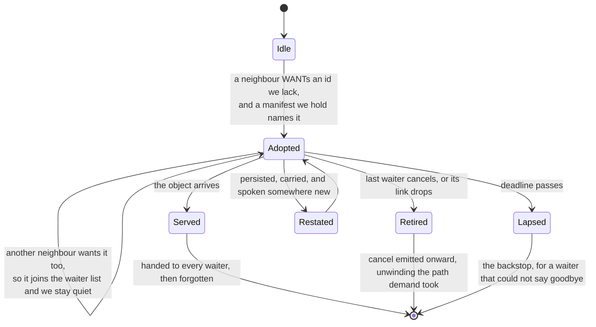

Five ways out and only one of them is the timer. *Served* is the ordinary case;
*Retired* is M11-K and is the fast one; *Lapsed* is the backstop; *Restated* is
M11-P, the interest that survived a journey.

*The lease is scoped to the object, not to a timer* (M11-P). An adopted interest
lives as long as this node would still be carrying the manifest that named the
id — its `created_at` plus our own `max_relay_age`, clamped into
`[now + 900 s, now + 7 days]` — because the chunks being hunted for die with the
the same pressure as everything else, and an interest that outlives them is hunting for bytes
nobody will serve. A fixed short lease made adopted interest an **online-only**
mechanism inside a store-and-forward protocol: a courier who takes a day to reach
the next mesh had forgotten what it was carrying long before arriving.

Lengthening a remote-caused commitment is safe only because three bounds hold it,
and an implementation MUST keep all three: the deadline is read from a *signed*
manifest whose birth time the asker does not control, and by a policy that is ours and not theirs;
the number of simultaneous interests is capped locally; and cancel retires one as
soon as its last waiter leaves.

An interest MAY be persisted and restored, which is what lets a request cross an
offline leg. Restored entries carry no waiters — an interface index means nothing
after a restart — and a node MUST drop any that are already expired or past the
ceiling it would have set itself, so a blob cannot mint a promise the node would
not have made. A node holding interests SHOULD re-state them on a slow cadence
(the reference build: every 5 minutes), since a WANT is otherwise only emitted
when a neighbour asks, and after a journey the neighbour who asked is gone.

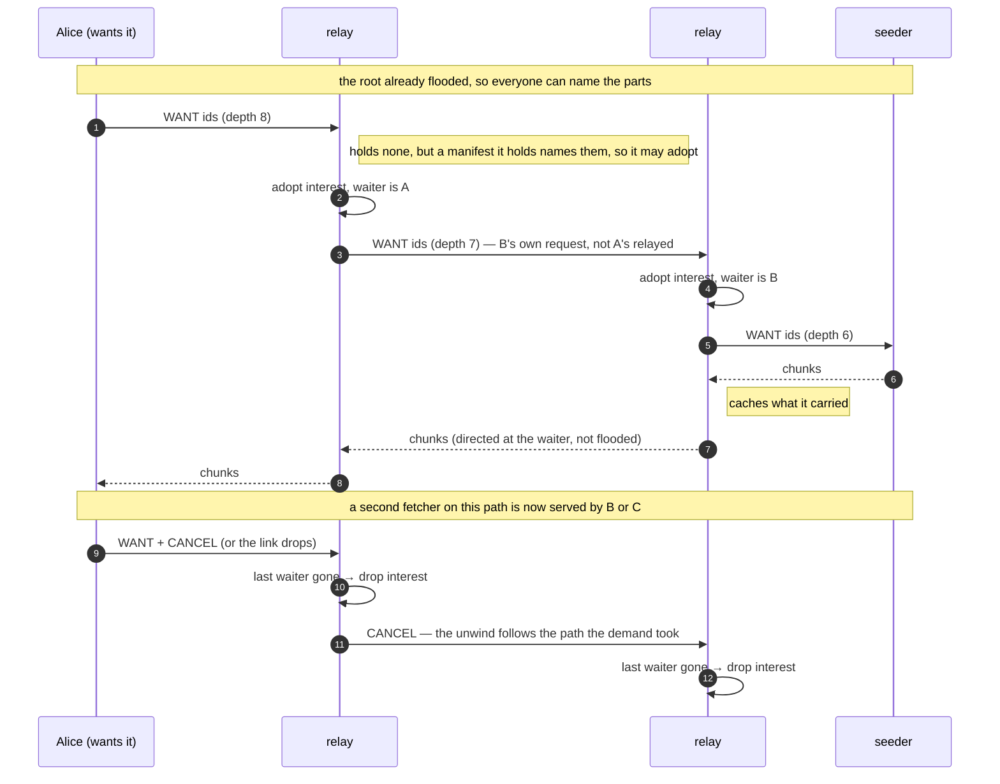

*Cancel* is the other end of the lease. An adopted interest is a standing
obligation, so a relay whose last waiter has gone keeps asking every seeder in
range until the lease runs out — fifteen minutes of load nobody wants. A node
that no longer wants an id SHOULD say so with a **WANT carrying `CANCEL` (b7)**,
and a node MUST treat that as removing only *the sender's own* waiter. When the
last waiter for an id leaves, the interest is dropped and the node SHOULD emit
its own cancel onward, so the unwind follows the same path the demand did. A
receiver that cannot say goodbye — out of range, powered off — is covered by the
lease as before, and by its neighbour retiring the interests that link was the
sole waiter for.

A flag rather than a new envelope type, deliberately: INV and WANT are consumed
before anything else, so a node that does not know b7 still treats the frame as
a WANT — consumed, never stored, never relayed. A new *type* would fall through
to the store-and-forward path, which is the one thing a one-hop control message
must never do. The cancel carries no depth byte, so its payload length stays a
multiple of 16.

Cancel cannot be turned into an attack. It only ever removes the sender's own
waiter, so a hostile neighbour cancelling ids it never asked for changes nothing
for anyone; the onward cancel is emitted only where an interest actually died,
so n ids in produce at most n out, once — a replayed cancel finds no interest and
stops. Unlike a WANT it can only shrink state, so it needs no admission check.

This is a Part III profile because it changes what an endpoint chooses to ask
for, not what any envelope looks like. T0 is unchanged: receive → dedup → store →
deliver → forward.

- **Chunks are a static size, fixed by the protocol** (M11-M): `CHUNK_BYTES`,
  4 KiB, the same for every publisher on every medium. It used to be `mtu - 64`,
  which was a leftover from before link fragmentation, when a sender had to cut
  for the narrowest hop it might meet because nothing downstream could re-cut.
  After M11-D the only thing publisher MTU still decided was that a Wi-Fi node
  and a LoRa node cut the same file differently and therefore shared no content
  ids — which defeats content addressing as thoroughly as a random `file_id`
  would. Identical bytes MUST produce identical chunks for everyone.

  ```mermaid
  flowchart TB
    subgraph FILE["file layer - Part III - travels the mesh"]
      direction LR
      F["a 10 KB file"] --> C1["chunk 0: 4096 B"] & C2["chunk 1: 4096 B"] & C3["chunk 2: 1808 B"]
      C1 -.-> M["manifest names the content ids, in order"]
      C2 -.-> M
      C3 -.-> M
    end
    subgraph LINK["link layer - Part II - never leaves one hop"]
      direction LR
      C1 ==> P1["piece 0"] & P2["piece 1"] & P3["piece n"] & PR["repair symbol"]
      P1 --> R["far end reassembles the envelope"]
      P2 --> R
      P3 --> R
      PR --> R
    end
    R ==> OK["router sees one envelope, and never saw a piece"]
  ```

  **A chunk is not a fragment, and neither is derived from the other.** A chunk
  is a file-layer object: content-addressed, one fixed size everywhere, the unit
  a manifest names and a WANT asks for. A fragment is a link-layer artefact:
  sized by one hop's MTU, carrying whatever will not fit that hop — a chunk, or
  any other envelope — and reassembled at the far end of that same link. Chunks
  are therefore routinely larger than a frame, which makes per-hop splitting a
  **dependency** of the file layer rather than an optimisation: a transport that
  cannot split cannot move files.

  4 KiB is chosen against the smallest node, not the largest file: a minimal
  profile floors link reassembly at 16 KiB, so four chunks fit its buffer at
  once, and a 1 MB file is 256 ids rather than the
  ~6000 an MTU-sized chunk needed on LoRa (chunk-fragment-ok: the rejected sizing).
  `chunk_size` in a manifest is exact — every chunk but the last
  is that size — so a reader may compute which chunk holds a given byte.

  *What this gives up:* boundaries are offsets from the start of the file, so
  inserting a byte shifts all of them and an edited file shares nothing with its
  predecessor. Appending shares everything. Content-*defined* boundaries would
  fix the insert case at the cost of variable-length chunks and losing the offset
  property; the choice here is static.
- **Every field a stranger can set has a ceiling** (M11-N), and the interesting
  part is which of them needed one. `count` was already checked against the bytes
  that follow, so a manifest cannot make a decoder reserve for parts it did not
  send. Depth was already capped at `MAX_DEPTH`, and a child is read only if it
  decodes at exactly `parent.depth - 1` — so a tree cannot walk sideways, and
  cannot walk in circles at all, since naming a cycle would require a manifest to
  contain its own hash.

  `total_len` was the one taken on trust. At depth 0 it is exactly checkable —
  every chunk but the last is `CHUNK_BYTES` — so a leaf claiming more than its
  chunks could hold is now refused. That is not cosmetic: assembly compares bytes
  written against it, so a file claiming more than it can ever deliver is a file
  that is *permanently incomplete*, and an incomplete file reserves pinned store
  (M12-A) and keeps an adopted interest alive (M11-P). One forged field otherwise
  bought a permanent resident.

  Interior nodes cannot be checked on arrival — the subtree their `total_len`
  covers is not in the payload — and inherit the bound transitively instead,
  because every leaf beneath them is checked as it arrives.

  **What a relay does with an oversized envelope is split it, not drop it.** That
  is worth stating because the obvious ceiling to add here would be "relays drop
  what is too big", and it is precisely the M11-D bug: a relay's own frame size
  is not a property of the envelope crossing it.
- **Content ids, not envelope ids** (M11-M). A manifest names the **content id**
  of each part: the first 16 bytes of SHA-256 over the part's payload, and
  nothing else. This is deliberately *not* the envelope id, which hashes the
  whole envelope and so covers `created_at` and `dest` — right for a message, wrong
  for bytes. Conflating them meant a byte-identical file published twice shared
  **zero of sixteen** envelopes with itself, because a chunk carried a random
  per-publish `file_id`. A chunk payload is therefore `[CHUNK_TAG][bytes]` with
  no file or index field: the manifest already says which parts are this file and
  in what order, and a sealed part's AEAD nonce is its **position in that order**,
  which the reader counts while walking rather than trusting the payload to
  state. A node MUST be able to resolve a named content id to whichever stored
  envelope carries it, and a WANT may name either kind.
- **Integrity is free.** The root is signed, and every ID below it — chunk or
  sub-manifest — *is* the hash of the bytes it names, so a forged or corrupt part
  simply never matches. **Only the root is signed**: the hash chain covers the
  rest, which is why interior nodes need no signature and buy back ~96 bytes of
  fan-out each. The magnet is a genuine Merkle root.
- **Swarming is just WANT.** Only the small root floods; everything else is
  pulled. `fetch(magnet)` emits a WANT for the IDs it lacks and any peer holding
  them answers from its store — the existing §6 machinery, untouched.
  Multi-source and resumable, because parts are named by content, not by origin.
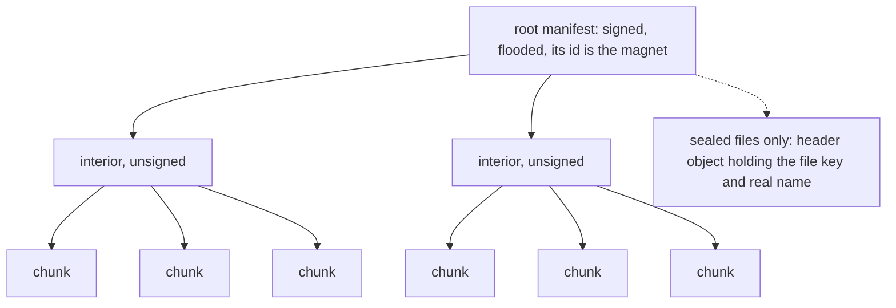

Only the root is signed and only the root floods. Every id beneath it *is* the
hash of the bytes it names, so a parent authenticates its children and interior
nodes need no signature — which buys back ~96 bytes of fan-out each.

- **It resolves top-down.** A WANT frame holds ~86 IDs, and deeper levels are not
  even *nameable* until the levels above arrive, so `fetch` returns one frame's
  worth per call and is called until complete.

**Sealing to one recipient.** `[0x09]` roots encrypt **each chunk on its own**
under a per-file key and seal that key, with the real file name, into the root's
header. The key is fresh per file, so the chunk index is a safe nonce and costs
24 bytes less than a random one — leaving only the 16-byte tag, which the chunk
size already had room for, so **a sealed chunk rides exactly the frame an open
one does**. The recipient decrypts a chunk at a time straight to disk, so a
sealed file costs one chunk of memory rather than all of it. Relays learn neither
contents nor name; interior manifests carry only hashes and are never sealed.

**What bounds a file** is not the wire format: every chunk lives in the store, so
the ceiling is half the store budget (leaving the other half to relay with), and
beneath that whatever the slowest bridge on the path will carry.

**Folder sync** turns each file in a directory into a manifest on a folder-topic;
a subscriber fetches the chunks and materialises the completed files (newest
manifest per name wins, path-traversal guarded). An encrypted folder is sealed
manifests behind a pre-shared-key topic (§7).

**Custody and the store.** Parts live in the ordinary store, which evicts under
pressure; a file still being assembled is pinned — interior manifests included,
since losing one would hide its whole subtree. Given a spill directory the store
is **write-through**: every envelope lands on disk as it arrives and memory is a
cache in front of it, so a node carries what its *disk* holds rather than its RAM.
A restart resumes, and adoption is safe because an id *is* the hash of its bytes,
so a tampered spill directory cannot inject anything. With no directory, nothing
is written and the store behaves as the in-memory map it replaced — the right
answer in a browser.

## Sessions — a UDP-like link, and a reliable stream on it

A **datagram** (`0x04`) is an ordinary unicast envelope whose payload is
`[0x04][port:2][seq:8][sealed_bytes]`, signed by the sender and sealed to the
peer's prekey. `dial(peer, port)` returns a session — pure local state, no
handshake, because identity *is* the address. Receive verifies the sender (its key
must hash to the session peer), decrypts, and runs a DTLS-style 64-wide replay
window. The first datagram floods to discover a route; the signed reply teaches
the reverse path (§4), so the rest go directed. Because the address is a key
rather than an IP, roaming and NAT rebinding stop being special cases — the link
doesn't break when you switch Wi-Fi to cellular, the way Mosh survives roaming.

On top of that, an optional **Go-Back-N** reliable stream: the sender streams
`[F_DATA][offset:8][len:2][bytes]` within a fixed window and rewinds to the last
acked offset on timeout; the receiver accepts only in-order bytes and cumulatively
ACKs the next offset it needs. A fixed window and fixed timeout on purpose — it is
enough to carry an ordered byte stream, and it is **endpoint state only**, so it
never reintroduces stream semantics into relays.

**The honest limit:** interactivity tracks the real path RTT. On a LAN or direct
radio link it is Mosh-grade; over a multi-hop opportunistic path the datagrams
still flow but degrade to store-and-forward. The abstraction is uniform; the
experience follows the physics of the link. For a negotiated low-latency pipe that
skips the mesh entirely, see [Direct](DIRECT.md).

## Request/response — RPC as a convention

A **service** is a topic or address a node serves. A **request** (`0x02`) carries
`method`/`path`/`body`, sealed to the service's prekey with a request-id nonce; a
**response** (`0x03`) goes back along the reverse path the request taught (§4).
Large bodies ride the object layer. A service is an ordinary
`(request) -> response` function, so nobody learns a new programming model; to
reach the existing web, an HTTP bridge proxies to a local `http://…` service and
back.

**A free CDN falls out of it.** Responses are content-addressed envelopes every
relay stores, so a read-only response marked cacheable can be answered by any node
that carried it — the store *is* the cache, INV/WANT *is* the cache-fill.

## Feeds — pub/sub over topics

A feed is just a topic: publish a tagged event (`0x05`), subscribers get
everything. Retention is whatever the nodes on hand are willing to carry, and a late joiner backfills history from
any peer's store via INV/WANT. No special infrastructure — a feed is emergent from
topics plus the store-and-sync the router already does. It is the signed-gossip
model behind Nostr, minus the JSON, the dedicated relays and the always-on
internet.

## Groups, invites, and what "revoke" can mean

An encrypted topic (§7.1) is how a private group is built: members seal every
message under a shared key, the mesh carries it obliviously, only key-holders
read it. `invite::encode_group` renders one as a single line:

```
spore-group:<64 hex — the whole 32-byte key>?n=<name>&k=<checksum>
```

Deliberately **not** the `spore:` prefix an address invite uses, because the two
are not the same kind of object and must not be interchangeable when pasted. The
checksum covers key *and* name: a mistyped key would otherwise open a room that is
cryptographically fine and socially empty, which reads as "a group nobody has
posted to yet" rather than as an error.

**The invite string *is* the key.** In a group with no roster, holding the key is
what being a member means. Two consequences a client must surface rather than
bury: anyone who reads it joins (a screenshot works as well as being told, so show
it on request rather than beside the conversation), and **it cannot be recalled** —
a copy already taken keeps opening everything sealed under that key.

What *is* available is moving the group forward, and the three key changes are not
interchangeable:

| You want to | Use | What it achieves |
|---|---|---|
| Deny a leaked invite going forward | `rekey_seal` to the members you still want | New random key; whoever is not handed it cannot read *future* messages. Past ciphertext they hold is unaffected. |
| Limit the damage of a future leak | `rotate` (epoch) | Forward secrecy only. A holder of the current key computes every later key, so it evicts nobody. |
| Recover from a copied key | `contribute`/`absorb` | Post-compromise security — the group heals by operating. |

So "revoke" is real but narrower than the word suggests, and the honest phrasing is
*forward-only*. SPORE holds no member list, so **who** the remaining members are is
the application's knowledge and never the protocol's claim: a client must not render
a "remove member" control implying the protocol enforced it.

**Two things this does not solve**, neither of them a cryptography problem. There
is **no roster and no arbiter of one** — a partitioned mesh can leave two halves on
different keys, and `key_id` makes that divergence *visible* rather than silent, but
visible is not solved. And **a stolen prekey secret still follows along**: healing
contributions are sealed to members' prekeys, so someone holding a member's prekey
secret opens every contribution addressed to it until that prekey ages out (§7.2).

## Appendix — chat attachments

A UX convention that is not obvious from the code, kept so a later change doesn't
undo it by accident. An attachment travels as two envelopes: the file's
manifest+chunks (the ordinary publish path, sealed to the peer when known), and a
normal DATA body whose **trailing lines** carry one marker per attachment, in send
order:

```
📎 <filename> | spore:<hex-magnet> | <mime>
```

Matched by `(?m)^📎 (.+) \| spore:([0-9a-fA-F]{16,}) \| (\S+)$`, applied globally
rather than to the first match only. Application-level only: relays and non-SPORE
clients see opaque UTF-8, and a client that doesn't parse it shows the marker text —
a reasonable fallback. Distinct from the feed's image form
``, which has nowhere to carry a mime type and stays
single-file; chat needs the mime to choose image-preview vs file-chip.

Every file in a batch is size-checked *before* any is published, so a refusal never
leaves orphaned manifests behind. The sender stamps the full attachment list onto
its own message (local bytes are cached immediately — our own files never come back
through the mesh) and the receiver parses the markers onto the received one, so each
attachment is part of **one** bubble rather than a separate one per file. Only sealed
DM attachments get that merged bubble, because only they are guaranteed a marker
sender.

---


---

# Part IV — Host contract

## The runtime contract — what the host must supply

The protocol is pure; it holds no OS. A conformant node needs four things from
whatever runs it, and gets them wrong silently if it does not ask.

- **Randomness.** A CSPRNG for the signing seed, prekey secrets, ratchet keys,
  mix padding and decoys, and CSMA backoff. **Prekey secrets MUST be random and
  MUST NOT be derivable from the identity seed** (§7.2).
- **Time.** Expiry is wall-clock unix seconds. A node with no trusted clock MUST
  NOT infer age from a clock it does not have: it relays regardless, ages by dwell, and drops after 7
  local days (§5.7). Time is supplied per call, never read by the protocol.
- **Custody.** Received envelopes are held until the room is needed and served on WANT (§6).
  The bytes may live anywhere — memory, disk, flash, remote store. Custody is
  untrusted storage: **an entry read back MUST be re-verified against its ID
  before it is served**, and a mismatch MUST read as "not held" so the mesh
  re-fetches. An ID is the hash of its bytes, so this is always checkable.
- **Scheduling.** Four duties MUST run on a timer, not only on arrival: the
  sweep, prekey rotation (§7.2), Trickle beacons (§5.4b), and ACKREQ resend
  backoff (§5.4d). **A node driven only by inbound traffic stalls all four** — it
  stops pruning, stops advancing forward secrecy, and never retries. Three are
  pure and belong to the protocol (here, `Node::tick`); **beaconing is the
  runtime's own timer**, because deciding to emit on an interface lives on the
  far side of the transport boundary. A runtime that drives only the core's tick
  never beacons, and is not conformant.

**Transport is not a fifth nutrient — it is the boundary the other four are
stated across.** The protocol names interfaces but never opens one; bytes in and
out are the edge. See Part IV for the model and Part II's bindings for the shapes.

## Where the core runs

The **core** is one implementation of the protocol — the same bytes on every
machine, carrying nothing about where it landed. Anything that hosts it is a
**runtime**: a language binding, a daemon, a browser worker, a microcontroller
firmware. Runtimes vary enormously; what they must provide does not — the four
nutrients in the runtime contract above, and nothing else.

*The image, once, because it is the whole idea: the core is a **spore** and a
runtime is the **soil** it lands in. Past this paragraph the docs use the plain
words — core, runtime, nutrient — per the legend below.*

**One noun per concept**, because six words for "the thing that hosts the core" is
six chances to think they are different things:

| Word | Means | Retired synonyms |
|---|---|---|
| **core** | the protocol implementation (`src/`) — frozen wire, no OS in it | *seed*, *spore* (as a name for the code) |
| **runtime** | anything that hosts a core and supplies its nutrients | *soil*, *vessel*, *platform* |
| **daemon** | a runtime that is a long-running process | — a *kind* of runtime |
| **nutrient** | one of the four things a runtime provides | *supply*, *capability* |
| **bridge** | one transport implementation — how bytes reach a core and leave it | *transport* in prose |
| **façade** | an app-protocol layer on top: communicator, IMAP, SIP, `spore://` | *extension* |
| **binding** | a language binding — the thinnest runtime there is | — |

Two words are reserved: **seed** always means the 32-byte signing seed, never the
core; **spore** is the protocol's name.

**Runtimes vary; nutrients do not.** An ESP32 firmware, a desktop daemon and a
browser worker are not three architectures — they are three runtimes filling the
same four holes, richly or thinly. Where a runtime cannot supply one it says so
rather than pretending: no disk means no spill, and the honest consequence (a
smaller store) is surfaced, not hidden. A thin runtime is a profile, not a degraded
build.

| Runtime | What it supplies |
|---|---|
| **Language binding** | A Python or Go program *is* a runtime — the thinnest one. If the nutrient contract is awkward from Python, the contract is wrong. |
| **CLI daemon** | Config-driven bridges, disk store, OS clock |
| **Desktop app** | The same daemon plus a UI surface |
| **Android** | The same core under a foreground service |
| **Browser / worker** | wasm; no disk, and no background life once the last tab closes |
| **Embedded (ESP32)** | Little memory, no filesystem, one or two bridges |

**What keeps the core portable.** It must compile for ESP32, Android, Windows,
Linux, macOS and the browser — all six built on every PR, from the same crate. Four
rules follow, the first three enforced automatically because the wasm and ESP32 jobs
stop compiling if they break, and the fourth written down because nothing catches it:

1. **No filesystem** — reach storage only through the storage nutrient.
2. **No threads** — `wasm32-unknown-unknown` has none; the layer is driven by the
   host's tick, exactly as the core already is.
3. **No new dependencies** unless they build on Espressif's Xtensa Rust fork.
4. **No reading the clock.** `SystemTime::now()` *compiles* on wasm and then panics
   at runtime, so no compile guard catches it. Time arrives as a `now: u32`
   parameter; clock reads stay in the native-only layer.

**Bridges are open; nutrients are closed.** Anyone may add a bridge — it only moves
envelope bytes in and out, and every medium is one of the five shapes in Part II's bindings. But
nothing may add a fifth nutrient, because that is the contract every runtime has to
satisfy. `Neighbors<U>` is the shared address resolver every bridge uses — SPORE's
ARP, where `U` is whatever the medium calls a peer.

**Façades attach to the runtime, not to the core.** A communicator — threads, rooms,
feed, library, public folder — is one client of the core, never part of it. That is
why the chat UI is replaceable and the protocol is not.

One place the metaphor lies, worth saying plainly: soil is passive and a runtime is
not. The runtime owns `main()`, drives the tick, and decides when to flush. It hosts
the core; it does not merely surround it.
