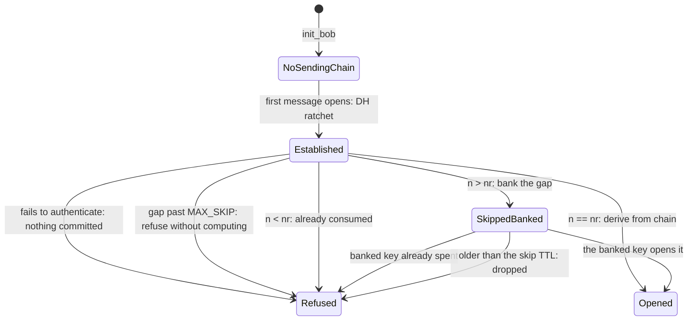
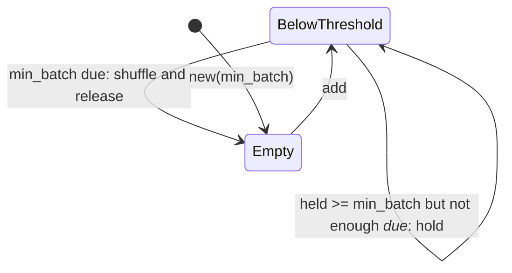

# State machines

*This page is generated:* `cargo run --release --example state_machines > docs/STATE_MACHINES.md`.
CI fails if it is stale.

Every edge below was **observed** — `examples/state_machines.rs` drives the real types and
records the transitions they take, so an edge the code can no longer take disappears from the
page. A hand-drawn diagram is a claim nobody re-checks, and this repository has shipped one of
those before: the router flow said "id seen, or expired?" for months after expiry stopped
existing.

These are the two machines the [September audit](ROADMAP.md) named as unreviewed, and writing
the tests that produce them turned up a live fault in each.

## Double Ratchet — what happens to a received frame

- A responder has no sending chain until it has received: `can_send()` is false, and its own earlier messages go as one-shot seals instead.

- Receiving one message is what gives the responder a sending chain.

- `Refused` is a dead end by design: **no path out of it changes state**. That is the whole of the M1 fix — the machine used to commit the DH step and the chain advance on the way to `Refused`, so one forged frame moved the session somewhere no genuine message could reach.

- The TTL edge is forward secrecy doing its job: a key banked for a straggler is deleted once the window closes, so a message that arrives too late is unreadable *by design* rather than by failure.

## Mix — the release queue

- The second self-loop is the bug this machine used to have. The threshold was checked against how many were *held* rather than how many were *due*, so three held with one due released that one alone — a singleton an observer can follow straight through, which is exactly what a batch exists to prevent.

- Release shuffles. A mix that emits in arrival order lets an observer correlate by position without needing any timing at all — the delays hide *when* a message left, the batch hides *which* one it was, and without the shuffle the second buys nothing.

