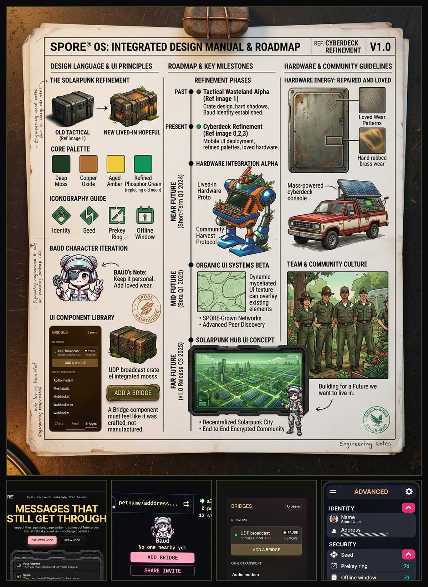

# Visual design — HARDBRUT (neubrutalist)

Normative for every SPORE surface: the web node, the Pages site, the Android app.
Every value here is meant to be pasted into a stylesheet or a Compose theme, and
every rule is one an implementer can check they followed.

The language, once, because the tokens below encode it: **HARDBRUT**
(`supernihil/hardbrut` v0.6) — an opinionated neubrutalist system, light-first.
Cream paper `#fdfaf2`, black ink, one yellow accent `#ffd23f` for actions and
highlights. **Zero border-radius** everywhere except true circles (radio, avatar).
**Hard no-blur shadows** (`5px 5px 0 #000`) stay on every element and vanish only
during a press. **Two button kinds and no more** — default (yellow) and cancel
(white). Auto dark mode inverts ink and paper; the yellow accent is the one
colour that does not change.

**The primary icon is Antenna + Seed** — a short, sturdy radio antenna rising
from a simple seed/soil form. It reads as "mesh + living network" at a glance,
stays sharp at 16 px, and is the *only* mark that stands for SPORE as a brand.
There are **no mushrooms anywhere** in the icon system; the old spore-cap mark
is retired. Rendered ink antenna on a yellow seed, mono (single-colour) where a
favicon or status bar requires it.

<p align="center"><em>The mascot is <strong>Baud</strong> — a flat black-ink and
yellow face with hard outlines, holding an antenna. Baud appears only at empty
states and completions, never in the way of work.</em></p>

## Implementation status

Which surfaces actually consume these tokens:

| Surface | Tokens | Chrome (hard shadows, reduced-motion) |

|---|---|---|
| `site/style.css` — the Pages site | ✅ | ✅ |
| `web/spore-standalone.html` — the browser node | ✅ own token set, same values | ✅ hard shadows, zero radius, Impact headings |
| Android — `Chrome.kt` + `MainActivity.kt` | ✅ | ✅ crate, hard shadow, two button kinds, zero radius |

**Icon adoption is tracked in the roadmap's Design Language milestone** — every
surface replaces the old mushroom icon with Antenna + Seed. Until a surface
ships the new mark it still carries whatever it had; the rule is the destination,
not a claim that the work is done.

**Found and fixed by the C1 audit:** this table's `web/spore-standalone.html` row
used to say "inherits the stylesheet," which was never true — the standalone
generator (`web/build-standalone.mjs`) has always carried its own inline
`<style>` block (it must, being a single offline file with zero external
requests), and that block's tokens were a generic, ungoverned dark scheme with
no relation to §1 — the exact "claims with no implementation behind them"
shape this project has found before. Fixed by giving it the real token
*values* under the same variable names, plus the cyan focus ring and
kevlar-faced disabled state §3/§7 require and it was missing outright.

**Three places Android cannot match this document exactly.** Recorded here rather
than left for someone to discover as a bug:

- **No Impact.** §2 names Impact/Haettenschweiler; neither ships on Android and
  constraint 1 forbids downloading one. `FontFamily.SansSerif` at
  `FontWeight.Black` stands in. The weight and the tracking carry over; the
  condensed width does not.
- **The hard shadow is drawn by hand.** Compose's `Modifier.shadow` is a *blurred*
  elevation shadow — the Material look this language exists to replace. `Chrome.kt`
  paints the 4 dp offset rect itself, into reserved padding so a crate never bleeds
  over its neighbour.
- **Reduced motion is inferred.** Android has no `prefers-reduced-motion`. The
  platform signal is `ANIMATOR_DURATION_SCALE == 0`, which the accessibility
  "remove animations" toggle sets. Scanlines, the CRT bloom and the mascot sparkle
  are all gated on it.

The **clack and particle burst** in §3 are deliberately absent: §8 requires sound
off until the user enables it, there is no such setting yet, and shipping it
on-by-default is not a thing to get wrong once.

Keep this table honest. A design language whose spec is ahead of its
implementation is a document describing an appearance nothing has, and this
repository has enough findings about claims with no code behind them.

## 0. Three constraints that outrank taste

These are not preferences. Break them and CI fails, or someone cannot use the app.

1. **Zero network requests.** `web/spore-standalone.html` is a single file that must
   make no external requests — CI greps for `src=`/`href=` pointing at `http`, and
   the whole continuity story rests on it. **So: no Google Fonts, no CDN, no remote
   images.** VT323 and Fira Code cannot be linked. Use the system stacks in §2, or
   embed a subset as a `data:` URI and accept the bytes.
2. **Motion is opt-out by default.** Scanlines, glitch, chromatic aberration and
   particle bursts are all gated behind `prefers-reduced-motion: no-preference`.
   Under `reduce`, the interface must be *completely* static — no shimmer, no
   flicker. A CRT flicker is a photosensitivity trigger, not a decoration.
3. **Contrast is measured, not eyeballed.** §1 carries real WCAG ratios. One pairing
   is forbidden outright.

## 1. Colour — cream paper, black ink, one yellow

<!-- >>> design tokens: generated by design/generate.py — do not edit <<< -->
### Tokens

| Token | Hex | Role |
|---|---|---|
| `--ink` | `#000000` | Ink — text, borders, chrome |
| `--paper` | `#ffffff` | Paper — cards on paper |
| `--yellow` | `#ffd23f` | Yellow — primary actions, highlights |
| `--muted` | `#666666` | Muted — de-emphasised text |

### Measured contrast

Ratios against each base (light theme). **OK** = passes 4.5:1 for body text; **lg**
= 3:1, large text and UI chrome only; **XX** = fails both. Computed from the hexes
above by `design/generate.py`, which fails the build if any of them stops matching
the grade `design/tokens.json` claims for it.

| | on `--bg` | on `--paper` | on `--ink` |
|---|---|---|---|
| `--ink` | **OK** 20.13 | **OK** 21.00 | **XX** 1.00 |
| `--yellow` | **XX** 1.38 | **XX** 1.44 | **OK** 14.54 |
| `--muted` | **OK** 5.50 | **OK** 5.74 | lg 3.66 |

**Never put yellow on cream.** 1.38:1 — the one combination the palette
invites, and the one nobody can read. Yellow always sits on black ink or owns
its own solid block, never on the paper base.

**Never signal failure by colour alone.** HARDBRUT has no red; failure is an
icon plus words, always.

### Controls, spacing and shape (C5)

| Token | Value | CSS | Kotlin | Role |
|---|---|---|---|---|
| `control-h` | 48 | `var(--control-h)` | `Metrics.ControlH` | primary and secondary buttons, and text fields — one height for all three |
| `control-px` | 14 | `var(--control-px)` | `Metrics.ControlPX` | horizontal padding |
| `control-py` | 9 | `var(--control-py)` | `Metrics.ControlPY` | vertical padding |
| `chip-h` | 32 | `var(--chip-h)` | `Metrics.ChipH` | compact presets and toggles (offline-window, topics). Must still carry a 48dp touch target |
| `chip-px` | 10 | `var(--chip-px)` | `Metrics.ChipPX` | horizontal padding |
| `chip-py` | 4 | `var(--chip-py)` | `Metrics.ChipPY` | vertical padding |
| `row-h` | 56 | `var(--row-h)` | `Metrics.RowH` | list rows — the unit the Bridges/Advanced restructure is built from |
| `row-px` | 12 | `var(--row-px)` | `Metrics.RowPX` | horizontal padding |
| `row-py` | 8 | `var(--row-py)` | `Metrics.RowPY` | vertical padding |
| `radius` | 0 | `var(--radius)` | `Metrics.Radius` | corner radius — zero. Always. True circles (radio, avatar) are the only exception |
| `border` | 3 | `var(--border)` | `Metrics.Border` | border width — the HARDBRUT outline |
| `throw` | 5 | `var(--throw)` | `Metrics.Throw` | the hard no-blur drop-shadow offset (5px 5px 0) |
| `space-tight` | 12 | `var(--space-tight)` | `Metrics.Tight` | tighter internal padding (the 12dp step) |
| `space-gap` | 12 | `var(--space-gap)` | `Metrics.Gap` | between controls |
| `space-pad` | 24 | `var(--space-pad)` | `Metrics.Pad` | inside a card / crate (the 24dp step) |
| `space-section` | 40 | `var(--space-section)` | `Metrics.Section` | between sections (the 40dp step) |
| `touch-min` | 48 | `var(--touch-min)` | `Metrics.TouchMin` | WCAG/Material floor. control and row clear it by height; chip must be padded out to it. |
<!-- >>> end design tokens <<< -->

**`--prose` is not a contrast fix — `--amber` already clears 10.80:1, well past the
4.5:1 floor.** It exists because a WCAG ratio doesn't capture *comfort* over a long
read: a fully saturated, high-luminance amber on near-black is fine for a heading or
a button glanced at once, but tiring across paragraphs — the kind of glare a real CRT
didn't have to contend with because nobody read a novel off one. `--prose` is the
same hue at roughly 60% saturation (`hsl(41, 60%, 60%)`), still comfortably clearing
7:1 (AAA) on both `--void` and `--asphalt`, so nothing is traded for the calmer read.
**Site-only, decided by the C1 audit.** `--prose` exists for `site/style.css`'s
long-form `<p>`/`<li>`/`<td>` inside `main.doc` — doc pages read start-to-finish
for minutes at a stretch, which is exactly the fatigue this token trades against.
Android's `Chrome.kt` Palette keeps full amber deliberately: its body text is chat
bubbles, captions and single-line status rows, never a multi-paragraph read, so
there is no comfort problem to solve and adding a second amber-family token would be
complexity without a payoff. `web/spore-standalone.html`'s longest text is the
one `.tag` paragraph under the header — reviewed and left on full `--ink` for the
same reason. Revisit only if a surface grows genuinely long-form body copy.

### Semantic mapping

Surfaces name their *role*, so a screen can be re-skinned without hunting hex codes:

```
--bg          = --void        page
--panel       = --asphalt     cards, crates, inputs
--edge        = #2a2f1c       borders — olive shifted dark, reads as machined metal
--ink         = --amber       headings, UI chrome, code, LEDs, badges — short text
--prose       = #d6af5c       long-form body copy (site only) — amber at ~60% saturation
--dim         = #8a7a4a       de-emphasised text — amber desaturated, 4.6:1 on void
--accent      = --pink        primary action, cursor, the kawaii
--accent2     = --cyan        focus, selection, secondary action
--ok          = --phosphor    success, verified, delivered
--warn        = --amber       caution
--bad         = --pink         failure — pink does double duty; rely on the icon too
```

`--bad` and `--accent` share a hue on purpose: this palette has no red. Failure is
therefore **never signalled by colour alone** — pair it with an icon and words.

### Colour hierarchy in practice

1. **Phosphor green** → live status, peer counts, active nav, success, "alive"
2. **Amber** → all primary text, headings, labels
3. **Pink** → *only* primary actions and critical focus moments
4. **Moss / Kevlar** → surfaces, secondary buttons, inert chrome
5. **Copper** → rare, reserved for continuity / seed / offline-window moments

### Light mode

The bunker is dark. There is no light variant of a CRT in a ruined basement, and
inventing one produces neither aesthetic. Where a light theme is required — the
Pages site honours `prefers-color-scheme` today — use the **Field Notes** variant:
paper base `#f4f1e8`, ink `#1a1c20`, and the same four accents darkened to hold 4.5:1
(`--amber` → `#8a5f00`, `--phosphor` → `#1f7a0c`, `--pink` → `#c2185b`, `--cyan` →
`#00707a`). No scanlines, no vignette. It reads as the printed manual rather than
the terminal, which is a coherent second voice for the same project.

`--prose` aliases straight back to `--ink` in light mode. The fatigue it exists to
avoid is specific to a saturated light color glowing on near-black — dark ink
(`#1a1c20`) on cream paper is already the most conventional, comfortable reading
pairing there is, so there is nothing to desaturate there.

## 2. Typography

**System stacks only** — see constraint 1.

```css
--font-mono: ui-monospace, "Cascadia Mono", "Fira Code", Menlo, Consolas, monospace;
--font-display: "Impact", "Haettenschweiler", "Arial Narrow Bold", system-ui, sans-serif;
```

- **Body and code:** `--font-mono`. Everything is monospace; this is a terminal.
- **Headers:** `--font-display`, uppercase, `letter-spacing: -0.02em`, heavy.
- **CRT bloom** on amber/phosphor text, and only there:
  `text-shadow: 0 0 2px currentColor;` — 2px. More turns body copy to mush.
  Drop it entirely under `prefers-reduced-motion: reduce`, where it reads as blur.

A project wanting true VT323 MUST embed a subsetted WOFF2 as a `data:` URI. It MUST
NOT link one — see constraint 1.

### Micro-copy

Tactical jargon fused with kaomoji: `[UPLINK_SECURE] (ﾉ◕ヮ◕)ﾉ*:･ﾟ✧`.

**Tone zones — this is the part that needs discipline.** The register-and-kaomoji
voice is excellent on surfaces where the reader has already opted in, and actively
harmful on the one surface designed to explain SPORE to someone who has never heard
of it.

| Zone | Voice |
|---|---|
| Node UI, Android app, logs, status | Full flavour. `[PEER_ACQUIRED] ヽ(・∀・)ﾉ` |
| Builder docs — Spec, Bridges, Rebuild | Restrained. Styling yes, jargon no; these are read under pressure |
| **Pages front page / first-run** | **Plain language.** `site/home.md` is deliberately written for people who do not build software. It gets the palette, the crates and Baud — it does not get `TACTICAL REPO-SQUISH INITIATED` |

Kaomoji are punctuation, not content: they follow a message that already made sense
without them. Never put one where a screen reader will read it aloud as garbage —
`aria-hidden="true"` on the decorative ones.

## 3. Components

### Three control sizes, and no fourth

Every interactive control is one of exactly three sizes. The values are generated
into §1's table from `design/tokens.json`; this is what they mean and when to reach
for each.

| Size | Height | Use |
|---|---|---|
| **CONTROL** | `control-h` (48) | Primary and secondary buttons, **and text fields**. One height for all three — a field that does not line up with the button beside it is the most visible way a form looks unsystematic. |
| **CHIP** | `chip-h` (32) | Compact presets and toggles: offline-window 7D/14D/30D, topic pills. Not a small button — a chip is a *choice among a set*. |
| **ROW** | `row-h` (56) | List rows. The unit the Bridges and Advanced restructure is built from. |

Three rules that go with them:

1. **A chip is shorter than the touch floor and must still be reachable.** `chip-h`
   is deliberately under `touch-min`; padding or `minimumInteractiveComponentSize`
   has to make up the difference. `design/generate.py` refuses to emit a control
   below the floor whose role does not say how it clears it — so the gap cannot be
   forgotten silently, only argued with deliberately.
2. **No one-off sizes.** If a control needs a fourth height, the design is wrong or
   the scale is. Change `tokens.json` and let it propagate; do not hand-type a `dp`
   or a `px` into a screen. It is a CI failure for the same reason a hand-typed hex is.
3. **Spacing comes from the scale too** — `space-tight` within a control,
   `space-gap` between controls, `space-pad` inside a crate, `space-section`
   between sections. Four steps is enough; a fifth is usually two things that
   should have been the same.

`design/generate.py` enforces the count as well as the values: exactly these
three names, each within the range this document allows it, or the build fails.
Adding a fourth means editing `CONTROL_SIZES` in the generator with a reason —
not typing a number into a screen where nobody will see it again.

### What each control is for

Normative. The left column is the *purpose*; picking an element for any other
reason is how the variation came back last time.

| Purpose | Element | Rule |
|---|---|---|
| Send · Post · Confirm public · Download copy | **Primary** radio-switch, pink or phosphor face | **One visible primary per context.** Two primaries means neither is one |
| Pause · Resume · Copy · Share · Add | **Secondary** radio-switch, kevlar/asphalt face, amber label | Same height as primary — that is what makes them read as one system |
| Remove · Forget · Reveal seed | Secondary **plus a confirm dialog**, always | Never signalled by colour alone (§0.3, and B7) |
| Major navigation | Persistent tab bar or side nav | Android/web node: Chats · Feed · Bridges. Site: Try it · How it works · Get a node · Spec · Mission |
| Live status — peers, envelopes, bridge state | Segmented LED + short mono text | `0 peers · 65 stored`. **No sentences** |
| Long explanation, security detail | Expander or a secondary screen | **Never open by default on a working screen** |
| Lists — bridges, chats, topics | Uniform `row` inside a crate | icon · title · status · overflow, one row height throughout |
| Empty state | Baud + one short line + one or two actions | "No one nearby yet" → ADD BRIDGE / SHARE INVITE |
| Identity | Header crate | avatar/petname · address · copy · compact status |

### Density

Also normative, and the rule the app currently breaks most often:

- **A working screen shows at most one short instructional sentence by default.**
  Everything else lives behind an expander, an info affordance, or first run.
- **Empty states and status chrome are one line.** Keep the honesty, drop the lecture.
- **A returning user must find the primary action in under three seconds of
  scanning.** This is the test the other rules exist to pass.
- **The front page is plain language only.** No tactical jargon on the way in —
  the aesthetic is in the pixels, not the vocabulary. Someone deciding whether
  SPORE is for them should not have to decode it first.

None of this removes information. It moves it: the security copy, the bridge
explanations and the "what is a topic" text all still exist, one tap away, where
someone who wants them will look. What changes is that the app stops explaining
itself to the person who already knows.

**Container — the crate.** Paper fill, 3px ink border, hard no-blur offset shadow
(`5px 5px 0 var(--ink)`), zero rounding. The shadow stays on every crate; it
vanishes only during a press.

**Input.** Paper field, 3px ink border, hard shadow. Focus *thickens* the border:
do not remove the outline, thicken it.

**Cursor.** Solid ink block, no blink. No glyphs, no decoration.

**Button — two kinds, no more.** Default is a yellow face with ink label; cancel
is a white-paper face with the same size, border and shadow. Both translate
3px down/right on press and drop the shadow to zero — a physical throw. No
sound, no particles.

**Progress — segmented blocks.** Discrete blocks, ink filled, muted empty.
Never a smooth bar; this machine counts. The real percentage sits in text beside
it.

**Code-copy button.** Every `<pre>` in the docs gets a small top-right "Copy"
button. Paper face, muted label, ink border; hover brightens to a yellow face.
On click the label flashes \"Copied ✓\" for 1.6s, or \"Select + copy\" if the
Clipboard API is unavailable — no dialogs, no external requests. Hidden under
`@media print`, same as the share bar.

## 4. Ambient VFX

None. HARDBRUT is static by construction: no scanlines, no vignette, no bloom,
no glitch. The only motion is the button press, and it is disabled under
`prefers-reduced-motion`:

```css
@media (prefers-reduced-motion: reduce) {
  * { animation: none !important; transition: none !important; }
}
```

## 5. Platform mapping

One source of truth, three consumers.

| Surface | How it consumes the tokens |
|---|---|
| `site/style.css` | CSS custom properties on `:root`, names exactly as §1 |
| `web/spore-standalone.html` | Same properties, inlined — no external stylesheet |
| Android (Compose) | [`Chrome.kt`](../android/app/src/main/kotlin/org/spore/node/Chrome.kt) — a generated `Palette` object, then `SporeLightColors` / `SporeDarkColors` mapping it onto Material 3. `--edge` → `outline`, `--panel` → `surfaceVariant`, `--accent` → `primary`, `--accent2` → `secondary` |

When a token changes, it changes in all three or in none. A screenshot in one place
and a hex code in another is how design languages rot.

## 6. Icon system — Antenna + Seed (normative)

**Primary mark:** a short, sturdy radio antenna rising directly from a simplified
seed/soil form.

- Reads as "mesh + living network" at a glance.
- Geometric enough to stay sharp at 16 px.
- Phosphor green + amber on dark surfaces; ink on paper.
- A **mono (single-colour) variant** is required for favicon and status bar.
- **Never replace with a mushroom, spore-cap, or literal fungus.** The old
  mushroom mark is retired; no literal mushrooms appear anywhere in the icon system.

**Secondary mark (optional, very small sizes only):** a condensed "S" monogram
that can incorporate a tiny antenna detail if needed.

### Placement rules

- App icon / PWA icon / site favicon → Antenna + Seed
- Top bar / header of Android & web node → Antenna + Seed + wordmark "SPORE"
- Empty states and loading → may appear small beside Baud, never as the main character
- Do not decorate random UI elements with the icon

### Feature vocabulary

Consistent names for recurring ideas, so the same thing is called the same thing
everywhere:

| Feature | Name | Visual |
|---|---|---|
| Fragmentation / fountain | **Micro-Packing Protocol** | A pastel hydraulic press crushing data into glowing rations |
| Sealed mail, encrypted topics | **Stealth-Camo Encryption** | A steel blast door with a glowing pink padlock |
| Dedup, expiry, quotas | **Targeting: TRASH_FILES** | A cute, heavily-armed sentry turret zapping bloat |
| Prekey ring, forward secrecy | **Burn-After-Reading Keys** | Key cards dissolving into pink ash on a seven-day timer |

Keep these to UI and marketing. `SPEC.md` says "fountain code"; it is a
specification and other people implement from it.

## 6b. Inspiration — **not normative**

Everything above this heading is a rule. Everything in it is a reference. The
distinction is the point: this section exists so directional work has somewhere
to live that is *not* §1, because a mood board filed as a specification is how a
design language acquires two conflicting palettes and nobody can say which one
ships.

<p align="center"><a href="spore-inspiration.jpg"></a></p>

<p align="center"><em>The integrated design manual, over the four directional
mockups it summarises. Directional, not pixel-perfect — and not the spec.</em></p>

**The references, named.** Pikuniku, Akira, Meshtastic, Dragon Ball, pastel UI,
utilitarian field equipment. They agree on more than they disagree: flat
saturated colour over gradients, heavy confident line weight, hardware that looks
used rather than styled, and cuteness that is not softness. That combination is
what §1 encodes.

**The Solarpunk Cyberdeck direction is adopted.** The tactical wasteland now
weathers *hopefully* rather than bleakly — moss on the crate, copper oxide on
the brass, hardware that has been repaired and kept rather than merely survived.
It is no longer a "proposed refinement" held outside §1; it is the feeling the
tokens and component system already encode, and the mockups in
`docs/design_ideas/` are the directional reference for it. The one thing the
directional sketches *do not* override is the contrast table: the §1 palette and
its "never pink on kevlar" rule stay normative, and any sketch that drops pink or
cyan entirely remains a reference, not a spec change — adopting that would
re-grade every pair and retire Baud's pink chibi, and that cost has to be paid
deliberately, not absorbed by filing a mood board.

**Handle with the same honesty as everything else.** If a reference here starts
describing something the app does, promote it into a numbered section with real
values and a contrast check. Until then it is inspiration, and this document says
so out loud rather than leaving a reader to guess which half is binding.

## 7. Screen structures

Concrete targets for the design-language milestone, so the work is implemented
against a shape rather than a taste. Directional mockups exist in
`docs/design_ideas/` and follow the current tokens; these are the structures they
encode.

### Bridges — Android and web node

Replaces the vertical stack of differently sized full-width buttons.

```
[ BRIDGES                                        0 peers ]

NETWORK
┌──────────────────────────────────────────────────────┐
│ ● UDP broadcast          primary subnet  →  on       │
│                                  [PAUSE]  [REMOVE]   │
└──────────────────────────────────────────────────────┘

[ ADD A BRIDGE ]   ← secondary, full width; opens a sheet with the
                     previous options (audio, Meshtastic, RNode,
                     Wi-Fi Direct, WebSocket, Nostr, …)

(optional, collapsed) More transports
```

Every active bridge is a uniform `row`. The heterogeneous olive button stack goes
away entirely — the transports it listed move into the sheet behind **ADD A
BRIDGE**, which is one secondary control rather than eight.

### Advanced — three crates of uniform rows

- **IDENTITY** — name, photo, address
- **SECURITY** — Seed (reveal behind a confirm), Prekey ring (export behind a
  confirm), Offline window (`chip` presets 7D/14D/30D plus custom)
- **NODE** — peers, envelopes, store budget, as segmented LEDs

The long About text becomes a single **Security model** row that expands or
navigates. Nothing on this screen is expanded by default.

### Android / Web node header (persistent identity)

```
┌──────────────────────────────────────────────────────────┐
│ [Antenna+Seed] SPORE                    [3 peers]        │
│ [avatar] Petname   address…  [COPY]                       │
│ alive · 3 peers · 28 stored                    [SHARE]   │
└──────────────────────────────────────────────────────────┘
```

Always visible. The status line is the §3 form — segmented LED plus short mono
text, never a sentence.

### Site homepage

- **Persistent top nav:** Try it · How it works · Get a node · Spec · Mission.
  Today it renders Home · Spec · Apps · Design · Bridges · Rebuild · Continuity ·
  Roadmap · Changelog — nine items, different vocabulary, and `MISSION.md` has a
  `null` nav label so *Mission* is reachable only by direct link. Promoting it
  means deciding what happens to Design/Bridges/Rebuild/Continuity.
- **Hero:** bold amber display headline, one short plain sentence, primary pink
  **OPEN WEB NODE**, secondary **GET A NODE**. The headline and copy already
  match (`site/home.md` opens *"Messages that still get through"*); the CTA labels
  and the nav do not.
- **Three story crates maximum above the fold** — Postcard · Any link · Honest
  privacy. Everything else in crates behind progressive disclosure.

## 8. Checklist

Before shipping a screen:

- [ ] Every colour pair checked against §1. No pink on olive.
- [ ] No failure signalled by colour alone.
- [ ] `prefers-reduced-motion: reduce` renders it completely static.
- [ ] No external font, image or stylesheet request.
- [ ] Focus visible on every interactive element, 2px `--cyan` minimum.
- [ ] Decorative kaomoji and mascots are `aria-hidden`.
- [ ] Sound off by default.
- [ ] Voice matches the zone in §2 — plain language on the front page.
- [ ] The only brand icon is Antenna + Seed; no mushroom anywhere.
- [ ] Exactly three control sizes used; no one-off heights.

## Appendix A — chat attachments

A UX convention that isn't obvious from the code, kept here so a later change doesn't
undo it by accident (absorbed from the retired `android/UX-ISSUES.md`). Implemented on
Android and on the web reference node; both parse the same two markers.

**The problem it fixed.** The release APK published a file the instant it was picked —
no staging, so a mis-tap sent a file with no message; it then arrived as its own
contextless bubble with no preview and no way to open it.

**The marker (application convention).** An attachment travels as two envelopes: the
file's manifest+chunks (the existing publish path, sealed to the peer when known), and a
normal DATA body whose **last line** is the canonical marker:

```
📎 <filename> | spore:<hex-magnet> | <mime>
```

- Matched by `Markdown.parseAttach`, regex **`(?m)^📎 (.+) \| spore:([0-9a-fA-F]{16,}) \| (\S+)$`**.
- Application-level only: relays and non-SPORE clients see opaque UTF-8, and a client
  that doesn't parse it just shows the marker text — a reasonable fallback.
- Distinct from the feed's image form ``, which has nowhere to
  carry a mime type; chat needs the mime to choose image-preview vs file-chip.

**One bubble, both sides.** The sender's `sendTextWithAttachment` publishes the file then
sends the marker body via the shared `sendBody`, stamping `magnet`+`mime` onto its own
`Msg` (local bytes are cached immediately — our own file never comes back through the
mesh). The receiver's `route()` parses the marker and stamps `magnet`+`mime` onto the
received `Msg`; the manifest envelope's "incoming file…" bubble is suppressed for sealed
files, and `pumpFiles`' "received…" bubble is suppressed when a message already
references the magnet — so the attachment is **one** bubble, not three.

**Preview & Open.** Images decode with `inSampleSize` (cap 1080 px) on `Dispatchers.IO`
via `produceState` — a phone photo decoded whole for a 220 dp row costs ~100 MB of heap.
Open copies the bytes into `cacheDir/attachments/<magnet>` (reclaimable) and shares a
`FileProvider` `content://` URI with a one-shot read grant — **never** a `file://` path
and never the private store directly (`res/xml/file_paths.xml` lists exactly
`attachments/`).

**Scope.** Only sealed DM attachments get the single merged bubble, because only they are
guaranteed a marker sender; a **public/unsealed** file with no marker still shows the
legacy "incoming/received" status bubbles. Non-goals (v1): multiple files per send,
ExoPlayer audio/video playback, editing after send. Opening an *arbitrary received file*
(vs a cached attachment) is still open — see the ROADMAP.
